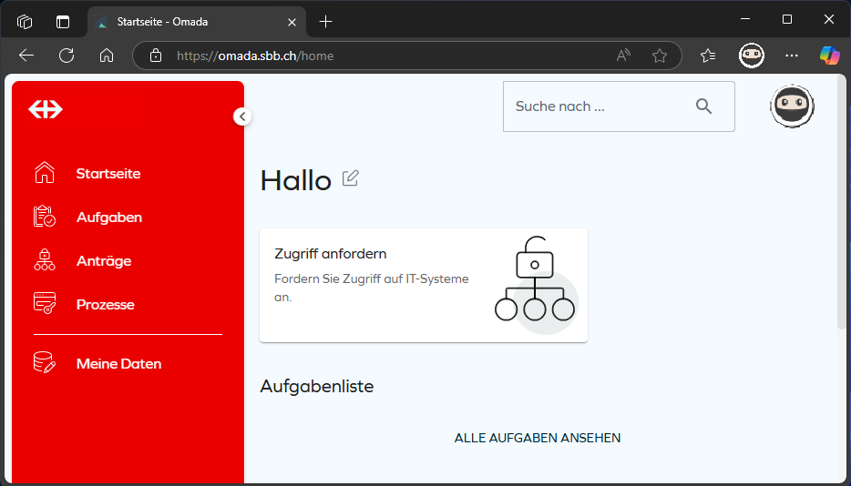
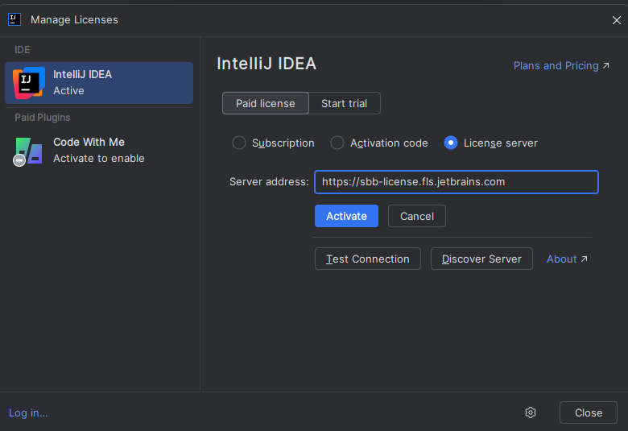

## Ziel

- IntelliJ IDEA ist auf deinem Rechner installiert.
- Du kannst ein einfaches Projekt laden und ausführen.

---

## IntelliJ IDEA installieren

### Schritt 1: Download

1. Öffne [https://www.jetbrains.com/idea/download](https://www.jetbrains.com/idea/download).
2. Wähle die **Community Edition** für dein Betriebssystem.


Alternativ kannst du auch die **Ultimate Edition** herunterladen.  
Wie du diese Version aktivierst, erfährst du weiter unten.


### Schritt 2: Installation



1. Lade die `.exe`-Datei herunter und starte sie.
2. Wähle:
   - Installationsverzeichnis
   - Optional: `Add launchers dir to the PATH`
   - Optional: `.java`-Dateien mit IntelliJ verknüpfen
3. Klicke auf **Install**.
4. Starte IntelliJ IDEA nach Abschluss der Installation.





1. Lade die `.dmg`-Datei herunter und öffne sie.
2. Ziehe das IntelliJ-Icon in den Ordner `Applications`.
3. Starte IntelliJ IDEA.





1. Lade das `.tar.gz`-Archiv herunter.
2. Entpacke das Archiv (z. B. in `~/apps`).
3. Führe das Startskript `bin/idea.sh` aus.



### Schritt 3: Erststart

Beim ersten Start:

- Frühere Einstellungen übernehmen? → Optional
- UI-Stil wählen (hell/dunkel)
- Plugins konfigurieren

Diese Einstellungen kannst du später jederzeit anpassen.


Nach der Installation beginnt ein 30-tägiger Testzeitraum der **Ultimate Edition**.  
Nutze diesen Zeitraum und fordere eine Lizenz an:

1. Besuche [https://omada.sbb.ch/home](https://omada.sbb.ch/home)
2. Suche nach der Gruppe `DG_RBT_INTELLIJ-LICENSE`
3. Klicke auf **Zugriff anfordern**  
     
   
4. Sobald du Zugriff hast, registriere IntelliJ:

   - Wähle **Activate (another) License**
   - Wähle **License Server**
   - Gib die Adresse `https://sbb-license.fls.jetbrains.com` ein
   - Klicke auf **Activate**  
       
     

Danach ist IntelliJ Ultimate aktiviert.


### Schritt 4: JDK einrichten

Beim Erstellen des ersten Projekts prüft IntelliJ, ob ein Java Development Kit (JDK) vorhanden ist. Falls nicht, erscheint ein Hinweis zum Download.

**Empfohlener Weg:**

1. Klicke auf **Download JDK**
2. Wähle:
   - Version: **17** oder neuer
   - Anbieter: z. B. **JetBrains Runtime** oder **Oracle OpenJDK**
3. IntelliJ lädt und installiert das JDK automatisch.
4. Das JDK wird automatisch dem Projekt zugewiesen.


Ein manuelles Herunterladen und Installieren eines JDKs ist nicht nötig – IntelliJ übernimmt das für dich.


**Empfohlen:** Java 17 oder neuer.

### Schritt 5: Projekt anlegen

1. Klicke auf **New Project**
2. Wähle:
   - Projekttyp: **Java**
   - JDK: auswählen
3. Projektname und Speicherort definieren
4. IntelliJ erstellt ein leeres Projekt


Du kannst auch direkt mit der **Hello World**-Applikation von it-ninja starten:  
Die Einführung findest du [hier](../../../02_java/03_java-grundlagen/01_java_intro)  
Das Beispielprojekt findest du [hier](../../../../labs/02_Java/03_java-grundlagen/01_BasicExercises/01_Einfaches-Hello-World)

