## Ziele

- Ich kann Git direkt in IntelliJ IDEA nutzen, ohne das Terminal öffnen zu müssen.
- Ich verstehe die wichtigsten Funktionen von Git in IntelliJ.
- Ich weiss, wie ich meine Änderungen kontrolliere, zurücknehme und veröffentliche.

---

## Voraussetzungen

Damit du Git in IntelliJ nutzen kannst:

- Git ist auf deinem System installiert (kann bei Bedarf über IntelliJ automatisch installiert werden).
- Ein Projekt ist als Git-Repository initialisiert oder bereits mit einem Repository verbunden.

---

### Git Repository erstellen / initialisieren

Falls du noch kein Git-Repository erstellt hast, kannst du das direkt in IntelliJ IDEA tun.

Gehe dazu oben im Projektfenster auf **Version Control** (beim Fenstertitel) und wähle **Create Git Repository...** aus.  
Wähle danach das Projektverzeichnis aus, das versioniert werden soll.

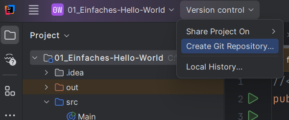


Nach dem Erstellen siehst du unten den neuen Git-Tab und kannst mit dem ersten Commit starten.


### Git Repository mit einem Remote Repository (Server) verbinden

Wenn Du ein Git Repository selber erstellt hast, ist dieses nur lokal vorhanden. Beim ersten **Push** wirst du darum von
IntelliJ nach der URL für das Remote Repository gefragt. Wie du die URL für dein Remote Repository bekommst erfährst du
unter [Source Repositories](../../02_source-repositories/).


Screenshot Remote Repository hinzufügen...


#### .gitignore anpassen ####

IntelliJ erstellt im Projektverzeichnis eigene Dateien, welche nichts mit dem eigentlichen Projekt zu tun haben und
deshalb im Git Repository nichts verloren haben. Aus diesem Grund empfiehlt es sich, gleich am Anfang eine .gitignore
Datei zu erstellen, welche Verzeichnisse und Dateien enthält, welche ignoriert werden sollen.

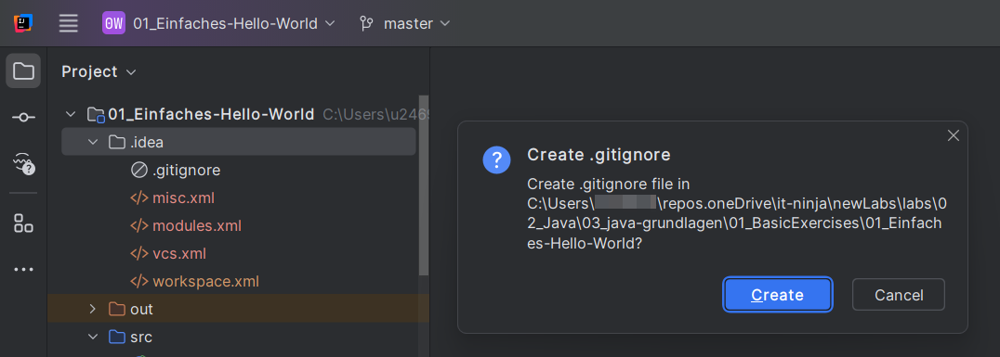

Die .gitignore Datei selber muss zum Git Repository hinzugefügt werden, damit Git sich daran erinnern kann.

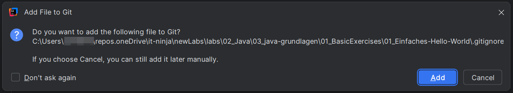

Öffne die Datei .gitignore und füge folgende Zeilen hinzu (.idea/ sollte schon vorhanden sein):

```
*.iml
.idea/
out/
target/
build/
```


Die Verzeichnisse `target/` und `build/` haben nichts mit IntelliJ zu tun sondern sind Verzeichnisse welche erstellt
werden, wenn man Maven oder Gradle nutzt (das sind Build-Mamangement Tools, mehr über Maven erfährst Du
[hier](../../../02_java/05_maven/)).


Die Datei sollte am ende etwa so aussehen:

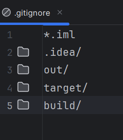

---

## Git-Funktionen in IntelliJ IDEA

Die folgenden Funktionen sind direkt in die Oberfläche von IntelliJ integriert und erleichtern dir die tägliche Arbeit
mit Git:

---

### 2. Änderungen verfolgen

> Ansicht öffnen: `View → Tool Windows → Commit` oder `Alt+0`  
> Oder über die linke Leiste: **Commit**

Du siehst sofort, welche Dateien geändert wurden.

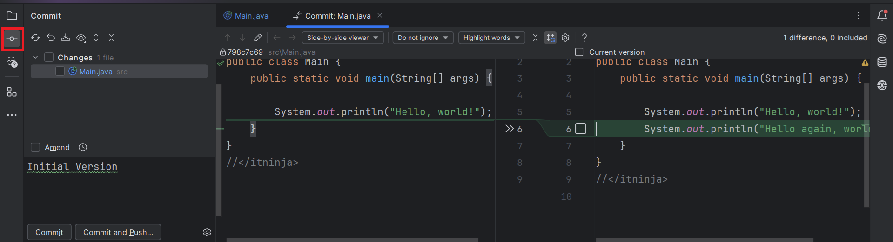

---

### 3. Commits erstellen

> Ansicht öffnen: `View → Tool Windows → Commit…` oder `Alt+0`

Du gibst deine Commit-Nachricht direkt im Dialog ein.  
Optional kannst du Tests ausführen oder eine Code-Analyse aktivieren.

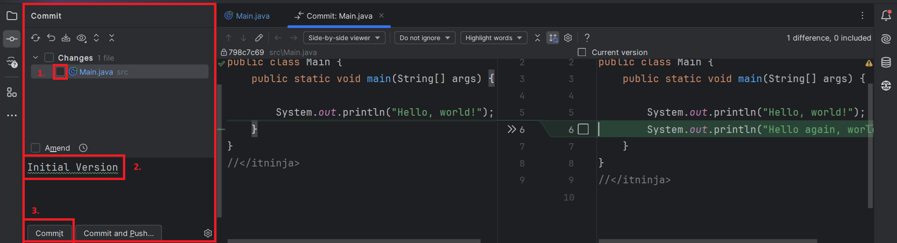

Du kannst einzelne Änderungen (sogenannte *Hunks*) selektiv in den Commit übernehmen.

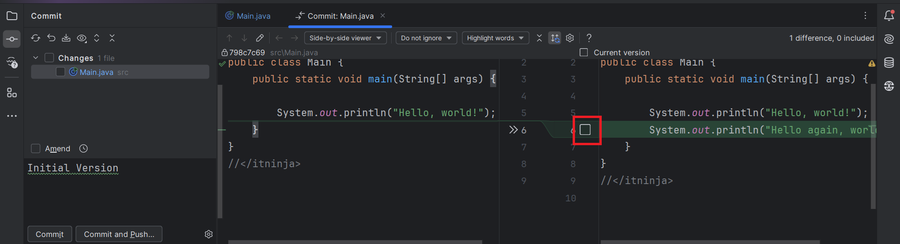


Du kannst das Häkchen bei Dateien nutzen, um gezielt auszuwählen, was du aus der Datei committen möchtest (git selbst
commited immer die ganze Datei).


---

### 4. Änderungen rückgängig machen

> Rechtsklick auf eine Datei → **Git → Rollback**  
> Oder über die linke Leiste: **Commit** und dort Rechtsclick auf Datei und **Rollback** 

Solange die Datei nicht 'commited ' ist, kannst du Änderungen zurücknehmen. Auch gelöschte Dateien lassen sich so
wiederherstellen.


„Revert“ in IntelliJ betrifft lokale Änderungen – nicht zu verwechseln mit `git revert`, das einen Commit rückgängig
macht.


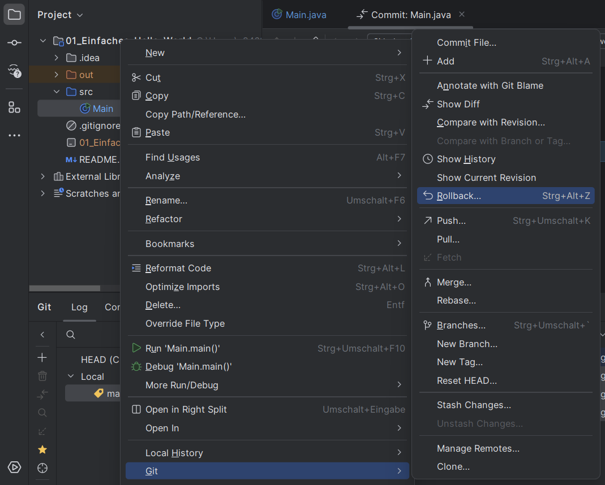

---

### 5. Branches verwalten

> Ansicht öffnen: `View → Tool Windows → Git` oder `Alt+9`  
> Oder über die linke Leiste: **Git**

Auf den Branch-Namen mit rechter Maustaste klicken oder `Git → Branches`

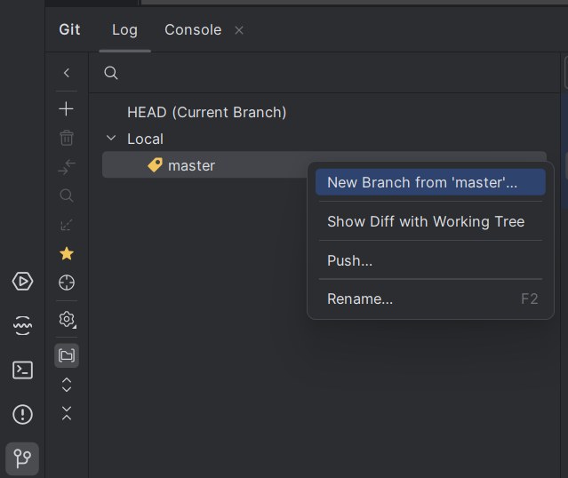

Weitere Funktionen stehen dir Oben im Projektfenster zur Verfügung. Dort siehst du den jeweils **aktuellen Branch** und
kannst Du unter anderem:
- Ebenfalls neue Branches erstellen
- Zwischen Branches wechseln
- Branches zusammenführen (merge) oder löschen
- Konflikte visuell auflösen

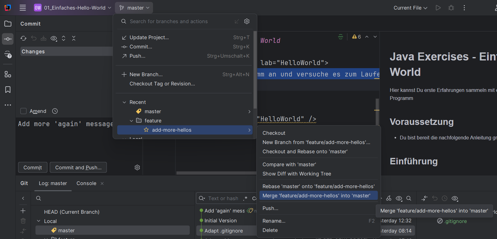

---

### 6. Push und Pull

> Oben im Projektfenster beim **Branch** `Update Project...` / `Push...`

- Push: Lokale Commits zum Remote-Server übertragen  
- Update Project: Änderungen vom Remote-Server abrufen (Pull)

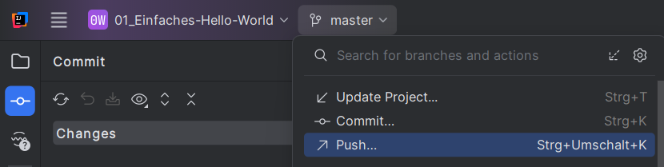

---

### 7. Log und History

> `Git → Show Git Log` oder `Alt+9 → Log`

Du siehst alle bisherigen Commits, Autoren und Änderungen.  
Perfekt, um gezielt frühere Versionen anzuschauen oder zurückzusetzen.

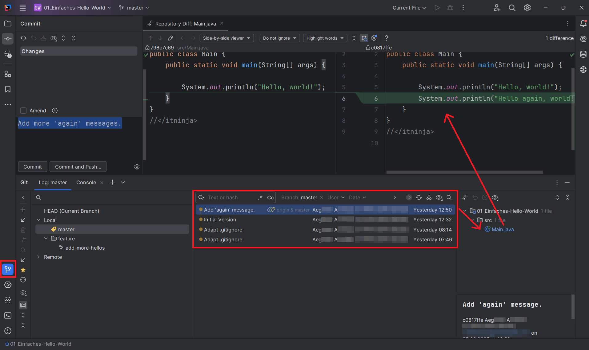

---

### 8. Konflikte lösen

Bei Merge-Konflikten öffnet IntelliJ automatisch den Vergleichsdialog:

- **Left** = deine Änderungen  
- **Right** = Änderungen vom Remote oder anderen Branch  
- **Result** = zusammengeführte Datei

Du kannst Zeilen einzeln übernehmen.

---

## Was du nicht vergessen solltest

Auch wenn vieles visuell möglich ist: Ein Grundverständnis von Git hilft, Probleme besser zu erkennen und zu lösen.  
Im [Git-Modul](../../../04_git/) lernst du die Befehle und Konzepte im Detail.


Die `Console` im `Git`-Tab zeigt dir oft auch den einer Aktion zugrunde liegenden Git-Befehl – ideal zum Lernen.

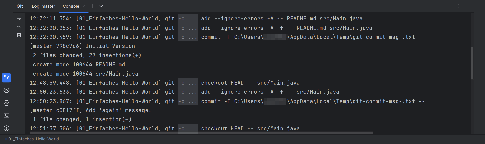

