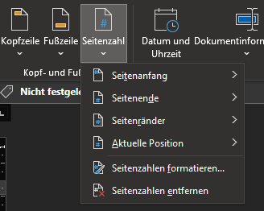
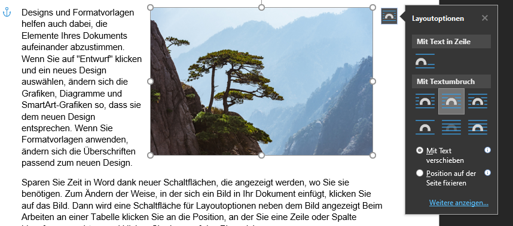
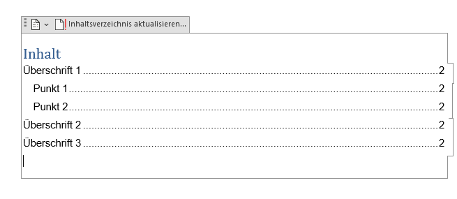

#### Ziele

- Ich weiss, wie man mit Microsoft Word eine einfache Dokumentation erstellt
- Ich weiss, wie man ein Deckblatt einfügt
- Ich weiss, wie man eine Kopf- und Fusszeile einfügt und bearbeitet
- Ich weiss, wie man Bilder einfügt und bearbeitet
- Ich weiss, wie man die Formatvorlagen benutzt
- Ich weiss, wie man ein Inhaltsverzeichnis generieren und aktualisieren kann

---

### Deckblatt einfügen

Um einen guten Einstieg in eine Dokumentation zu erhalten, kann man ein Deckblatt einfügen. Dies geht ganz simpel über
das Register **Einfügen** und dann die Option Deckblatt auswählen. Dort gibt es einige Vorlagen, welche man aber auch
anpassen kann. Es dient als gute Vorlage um wichtige Informationen wie den Autor oder den Titel des Dokuments darzustellen.

---

### Kopf- und Fusszeile

In den Kopf- und Fusszeilen werden Texte eingegeben (oder auch Bilder eingefügt), die im gesamten Dokument oder einem gewissen Bereich des Dokuments
am oberen oder unteren Seitenrand dargestellt werden. Typische Anwendungen sind zum Beispiel ein Firmenlogo in der Kopfzeile
und die Seitenzahl oder der Dateiname in der Fusszeile.

Um für das Dokument Kopf- und Fusszeile zu erstellen kann man in der Menüleiste auf das Register **Einfügen** wechseln.
Im Abschnitt **Kopfzeile** oder **Fusszeile** können wir nun diese einfügen. Word hat schon einige Vorlagen, die wir benutzen können, aber es
ist auch möglich eigene Formatvorlagen zu erstellen. Sobald man eine Kopf- oder Fusszeile erstellt hat, wechselt Word
automatisch das Register. Nun können wir einige Einstellungen anpassen.

Die wichtigsten Anpassungen sind folgende:

**Seitenzahl**

Um die Seitenzahl automatisch generieren zu lassen, kann man diese direkt einfügen lassen. Auch dort ist uns Word sehr
behilflich und bietet uns einige Vorlagen an.

**Optionen**

In den meisten Fällen ist die erste Seite eines Dokuments ein Titelblatt. Dort werden die Kopf- und Fusszeilen nicht dargestellt.
Um das einzustellen, kann man unter **Optionen** den Punkt **Erste Seite anders** auswählen. Damit bekommt die erste
Seite eine eigene Kopf- und Fusszeile.

---

### Bilder einfügen

Um ein Bild einzufügen, kann man entweder über das Register **Einfügen** ein Bild über einen Dateipfad einfügen oder
man kann das Bild auch direkt in das Dokument kopieren. Das Bild können wir nun bearbeiten. Zum Beispiel können wir es
zuschneiden, die Grösse anpassen, eine Formatvorlage hinzufügen oder verschiedene Effekte hinzufügen.

Damit man in einer Dokumentation die Bilder zusammen mit Text darstellen kann, gibt es für die Bilder Layoutoptionen.
Mit diesen Optionen kann man den Textumbruch verändern und somit das Bild in den Text integrieren.

---

### Formatvorlagen

Formatvorlagen vereinheitlichen das Dokument und lassen es professioneller wirken.
Diese sind direkt im Register **Start** zu finden. Die verschiedenen Formatvorlagen kann man anpassen oder auch selbst
neue Formatvorlagen erstellen. Um eine Vorlage zu bearbeiten, macht man einfach einen Rechtsklick auf die Vorlage und
wählt dort **Ändern** aus. Nun kann man alle Optionen individuell anpassen.

---

### Inhaltsverzeichnis

Um eine Übersicht über das Dokument zu erhalten, kann man ein Inhaltsverzeichnis generieren lassen. Dafür ist unter dem
Register **Referenzen** die Option Inhaltsverzeichnis. Dort finden wir Vorlagen für integrierte Inhaltsverzeichnisse,
die von Word selber bearbeitet werden. Wenn wir mit Inhaltsverzeichnissen arbeiten, müssen wir auch mit dem Formatvorlagen
für die Titel arbeiten. So können Titel und Untertitel im Inhaltsverzeichnis erkannt und abgebildet werden. Zum Beispiel
die Formatvorlage Überschrift 2 wird im Inhaltsverzeichnis eingerückt, da sie als Untertitel verwendet wird.

Nimmt man nach dem Einfügen vom Inhaltsverzeichnis noch weitere Änderungen am Dokument vor, muss man das Verzeichnis
aktualisieren. Dafür klickt man einfach auf das Inhaltsverzeichnis im Dokument und kann dann oberhalb vom Verzeichnis
auf **Inhaltsverzeichnis aktualisieren** klicken. Damit werden die Titel und Seitenzahlen aktualisiert.

