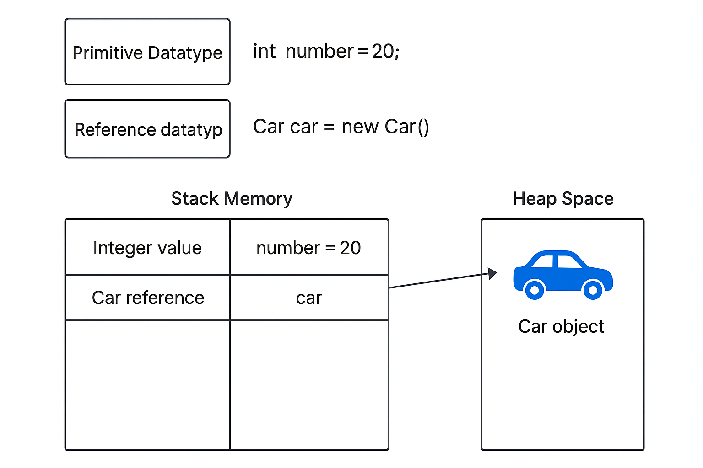



## Ziele

- Ich weiss, was Datentypen sind.



## Datentypen

In Java sind Variablen **stark typisiert**. Das bedeutet, dass jede Variable beim Erstellen mit einem **Datentyp** versehen werden muss.

Um zum Beispiel die Zahl `3` als `int`-Wert in der Variable `sum` zu speichern, schreibst du:

```java
int sum = 3;
```

Seit Java 10 gibt es eine vereinfachte Schreibweise mit **Typinferenz**. Du kannst den Datentyp bei lokalen Variablen weglassen – Java erkennt den Typ automatisch. Verwende dazu das Schlüsselwort `var`:

```java
var sum = 20;
```

### Zwei Arten von Datentypen

In Java unterscheidet man zwischen:

- **Primitiven Datentypen**
- **Referenztypen**

Der Unterschied ist grundlegend:

- Ein **primitiver Typ** speichert direkt den Wert (z. B. `3` oder `true`).
- Ein **Referenztyp** speichert eine Adresse – also den Ort im Speicher, wo das eigentliche Objekt liegt.

Das hängt mit dem **Java Memory Model** zusammen. Die folgende Grafik zeigt das vereinfacht:



### Stack und Heap

Java arbeitet intern mit zwei Speicherbereichen:

- **Stack Memory**: Hier liegen primitive Werte und Referenzen.
- **Heap Space**: Hier werden alle Objekte gespeichert, z. B. ein `Car`-Objekt.

Im Bild siehst du: Die Variable `car` liegt auf dem Stack und zeigt auf ein Objekt im Heap.

Der Grund für diese Aufteilung liegt darin, wie ein Programm Daten verarbeitet:

Wenn eine Methode aufgerufen wird, werden die Parameter, die du ihr übergibst, auf den Stack kopiert. Danach „springt“
das Programm in die Methode. Dort greift es auf die Werte auf dem Stack zu.

Bei primitiven Werten geht das sehr schnell – sie sind klein (nur ein paar Bytes) und lassen sich effizient kopieren.

Objekte hingegen können viel Speicher benötigen – oft hunderte oder tausende Bytes. Wenn bei jedem Methodenaufruf das
ganze Objekt kopiert würde, würde das das Programm stark verlangsamen. Deshalb wird das Objekt im **Heap** abgelegt, und
**nur eine Referenz** (also die Adresse im Speicher) wird über den Stack an die Methode übergeben.

Das spart Zeit und Speicher – und ist der Grund, warum Java primitive Typen und Referenztypen unterschiedlich behandelt.

### Vergleiche von Werten

Dieser Unterschied ist entscheidend, wenn du zwei Werte vergleichst:

- Mit `==` vergleichst du **Stack-Inhalte**.
  - Bei primitiven Typen also den Wert selbst.
  - Bei Referenzen hingegen die Speicheradresse – also ob es **dasselbe Objekt** ist.
- Um den **Inhalt zweier Objekte** zu vergleichen, brauchst du die Methode `equals()`:

```java
car1.equals(car2)
```

Das prüft, ob die Objekte **inhaltlich gleich** sind, nicht ob sie identisch im Speicher sind.
