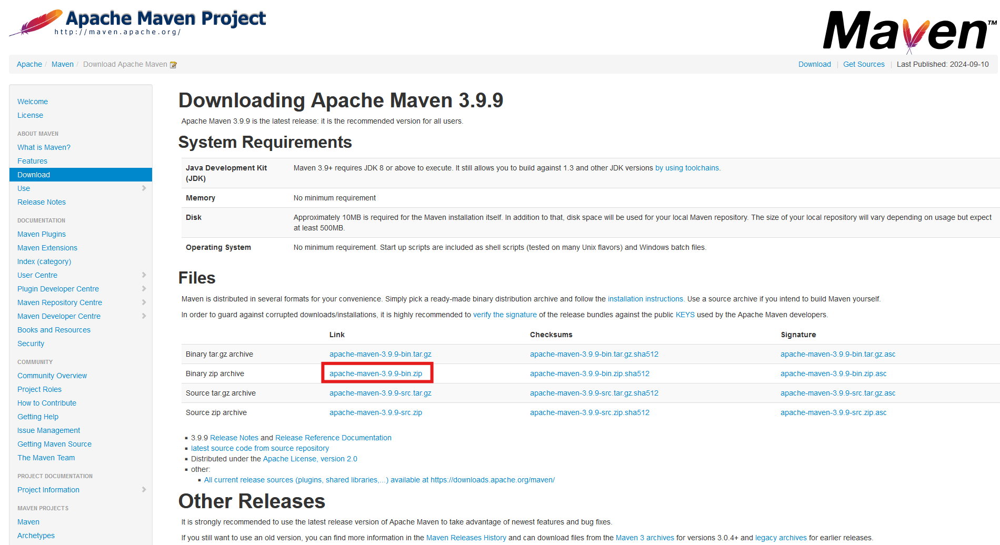
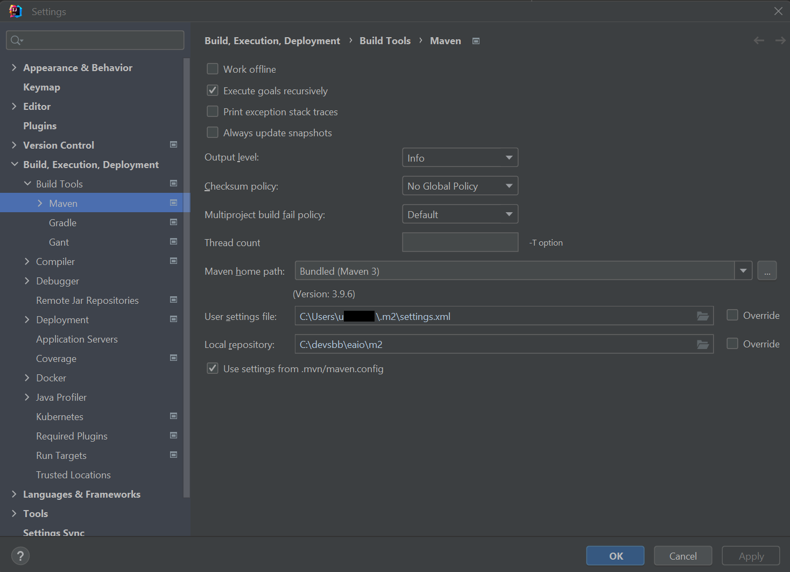
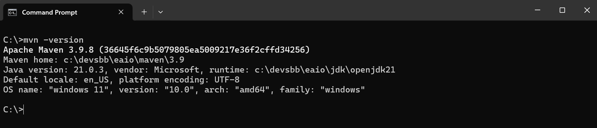
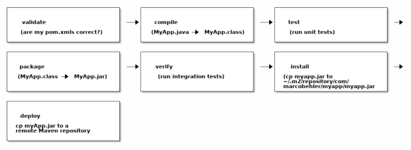

#### Ziele

- Ich kenne die Grundlagen von Maven.
- Ich kann Maven lokal konfigurieren.
- Ich kann im Artifactory Abhängigkeiten suchen und diese verwenden.
- Ich kenne die Grundlagen von Project Object Models (POM).
- Ich kenne die wichtigsten Maven Befehle und kann diese auf der Kommandozeile anwenden.
- Ich kann die Abhängigkeiten meiner Applikationen mit Maven verwalten.
- Ich kann Maven Plugins konfigurieren und damit meinen Maven-Build steuern.
- (Optional): Ich habe erste Erfahrungen gesammelt mit dem alternativen Build-Tool Gradle.

## Maven

### Allgemeine Informationen

Apache Maven ist ein Build-Management Tool. Das heisst, Maven kann den Build eines Projekts von einer einzigen Datei aus
steuern. Diese zentrale Datei ist das Project Object Model, kurz auch POM genannt. Ein Build ist der Prozess, bei dem
der Quellcode eines Programms in eine ausführbare Form gebracht wird, häufig durch Kompilieren und Paketieren.
Der Build eines Projekts kann dabei von einfacher Kompilierung bis zur Auslieferung einer Anwendung auf eine bestimmte
Plattform reichen.

Damit Maven funktionieren kann, benötigt ein Projekt die folgenden Dinge:

- Eine Maven-Installation, entweder separat oder Built-In wie beispielsweise mit IntelliJ
- Eine Project Object Model Datei pro Projekt oder Modul (es handelt sich um eine XML-Datei)
- Ein zentrales Maven-Repository
- Ein lokales Maven-Repository
- Eine Konfigurationsdatei mit dem Namen settings.xml

---

### Installation

#### Manuelle Installation

Idealerweise wurde Apache Maven bereits mit IntelliJ installiert. Alternativ kannst du Maven auch hier herunterladen:
[https://maven.apache.org/download.cgi](https://maven.apache.org/download.cgi). Verwende die Binary anstelle der Source,
und zwar am besten die Datei im `Binary zip archive` Format.

Klicke dazu auf den folgenden Link, wie hier im Beispiel:


Nachdem du die Datei heruntergeladen hast, kannst du den folgenden Ordner erstellen:\
`C:\Program Files\Apache\Maven\`.

Entpacke die heruntergeladene Datei dort. Du kannst danach die Umgebungsvariablen auf dieses Verzeichnis setzen.

---

#### IntelliJ IDEA

Ist IntelliJ installiert, findet man in den allgemeinen Einstellungen auch die Einstellungen für Maven. Normalerweise
sind diese Einstellungen bereits korrekt.



Die wichtigsten Einstellungen sind:

| Einstellung          | Beschreibung                                                                                                                                        |
| -------------------- | --------------------------------------------------------------------------------------------------------------------------------------------------- |
| Maven home directory | Zeigt auf das Verzeichnis einer Maven-Installation. Das IntelliJ verfügt bereits über eine Maven-Installation, diese wird als "Bundled" bezeichnet. |
| User settings file   | Die XML-Datei, welche bei der Installation angelegt wurde.                                                                                          |
| Local repository     | Der Ablageort für das lokale Repository, dieser ist normalerweise unter C:\Users\\\<Personalnummer>\\.m2.\\repository zu finden.                    |

Bei diesen Einstellungen muss überprüft werden, dass die Pfad-Angaben für die XML-Datei und das lokale Repository
korrekt sind.

---

### Umgebungsvariablen setzen

Damit Maven auch auf der Command-Line funktioniert, muss eine Umgebungsvariable gesetzt werden.
Unter Windows muss also der Pfad zu deiner installierten Maven-Version hinzugefügt werden. Dadurch weiss Windows, wo die
Binary für Maven zu finden ist, wenn du Maven aus dem Terminal ausführst. Die folgenden Schritte sind dazu notwendig:

1. Anwendung "Systemumgebungsvariablen bearbeiten" aus der Systemsteuerung starten. Falls das nicht geht, musst du dir
   (temporär) lokale Admin-Rechte aktivieren.

2. Unten rechts auf den Button "Umgebungsvariablen" klicken.

3. Im unteren Teil "Benutzervariablen" die Variable "Path" suchen und anklicken.

4. Auf den Button "Bearbeiten..." klicken.

5. Oben rechts auf den Button "Neu" klicken, es erscheint eine neue Zeile ganz unten.

6. Den Pfad zu deinem installierten Maven einfügen. Hier kannst du das erstellte Verzeichnis verwenden. Der Pfad sollte
   auf das Verzeichnis bin zeigen, also zum Beispiel:

   - manuelle Installation: **C:\Program Files\Apache\Maven\apache-maven-3.9.9\bin**
   - IntelliJ installiert: **C:\Users\u......\AppData\Local\Programs\IntelliJ IDEA Ultimate\plugins\maven\lib\maven3\bin**

7. Alle offenen Windows-Fenster mit "OK" schliessen.

Um die Installation zu überprüfen, führen den folgenden Befehl in deinem Terminal (du findest es unter
_Eingabeaufforderung_ oder _cmd_ in der Windows Suche) aus:

`mvn -version`

Falls es korrekt installiert ist, wird dir Maven die Version liefern, also zum Beispiel:

`Apache Maven 3.9.6 (bc0240f3c744dd6b6ec2920b3cd08dcc295161ae)`



Die Version muss nicht mit deiner übereinstimmen.

<details>
<summary>JAVA_HOME Troubleshoot</summary>

Es kann sein, dass du folgende Fehlermeldung siehst:

```
The JAVA_HOME environment variable is not defined correctly,
this environment variable is needed to run this program.
```

Das bedeutet, dass die Java-Installation nicht gefunden werden kann.
IntelliJ enthält zwar eine eigene Java-Installation, allerdings weiss Windows nicht, wo sich diese befindet.
Aus diesem Grund musst du eine Umgebungsvariable setzen, die auf diese Installation zeigt.
Dafür musst du zuerst herausfinden, wo sich die Installation befindet.

Unter IntelliJ gehe zu folgendem Fenster:

```
File > Project Structure > Platform Settings > SDKs
```

Kopiere den Pfad unter `JDK home path`.

Erstelle nun [gleich wie zuvor](#umgebungsvariablen-setzen) eine neue Umgebungsvariable mit den folgenden Werten:

```
JAVA_HOME:{JDK home path}
```

Ersetze `{JDK home path}` mit deinem kopierten Wert. Öffne danach ein neues Terminal und versuche es erneut.

</details>

---

### pom.xml

Der Aufbau eines Project Object Models kann grob in folgende Abschnitte unterteilt werden, hier erklärt an einem
umfangreichen Beispiel. Die einzelnen Teile werden gleich im Anschluss näher erläutert. Bitte beachte, dass dieses
Project Object Model nicht alle Inhalte vollständig erklärt, sondern nur als erstes Beispiel dient.

```xmlmarkdown.md
<!-- (1) Header -->
<project xmlns="http://maven.apache.org/POM/4.0.0"
         xmlns:xsi="http://www.w3.org/2001/XMLSchema-instance"
         xsi:schemaLocation="http://maven.apache.org/POM/4.0.0 http://maven.apache.org/xsd/maven-4.0.0.xsd">
    <modelVersion>4.0.0</modelVersion>

    <!-- (2) Angaben zum Artefakt -->
    <groupId>ch.sbb.interviewtool</groupId>
    <artifactId>interviewtool-backend</artifactId>
    <version>0.0.1-SNAPSHOT</version>
    <packaging>jar</packaging>

    <!-- (3) Angaben zum Parent-Projekt -->
    <parent>
        <groupId>org.springframework.boot</groupId>
        <artifactId>spring-boot-starter-parent</artifactId>
        <version>2.2.4.RELEASE</version>
        <relativePath/>
    </parent>

    <!-- (4) Properties -->
    <properties>
        <project.build.sourceEncoding>UTF-8</project.build.sourceEncoding>
        <java.version>1.21</java.version>
        <maven.build.timestamp.format>yyyy-MM-dd HH:mm</maven.build.timestamp.format>
        <timestamp>${maven.build.timestamp}</timestamp>
    </properties>

    <!-- (5) Abhängigkeiten -->
    <dependencies>
        <!-- Lombok -->
        <dependency>
            <groupId>org.projectlombok</groupId>
            <artifactId>lombok</artifactId>
            <version>1.18.6</version>
        </dependency>

        <!-- Unit- und Integrationstests -->
        <dependency>
            <groupId>org.junit.jupiter</groupId>
            <artifactId>junit-jupiter-engine</artifactId>
            <scope>test</scope>
        </dependency>
    </dependencies>

    <!-- (6) Build-Informationen -->
    <build>
        <plugins>
            <plugin>
                <groupId>org.springframework.boot</groupId>
                <artifactId>spring-boot-maven-plugin</artifactId>
            </plugin>
            <plugin>
                <groupId>org.apache.maven.plugins</groupId>
                <artifactId>maven-compiler-plugin</artifactId>
                <configuration>
                    <compilerVersion>1.21</compilerVersion>
                    <source>1.21</source>
                    <target>1.21</target>
                </configuration>
            </plugin>
        </plugins>
    </build>

    <!-- (7) Entwickler-Informationen -->
    <developers>
        <developer>
            <id>U000000</id>
            <name>Vorname Name</name>
            <email>vorname.name@sbb.ch</email>
            <organization>SBB</organization>
            <organizationUrl>https://www.sbb.ch</organizationUrl>
            <roles>
                <role>Software Architect</role>
                <role>Lead Developer</role>
            </roles>
        </developer>
    </developers>
</project>
```

#### Abschnitt 1

Der Header einer Project Object Model Datei bleibt grundsätzlich so wie dargestellt. Die Angaben zum Schema sind dabei
optional. Falls andere Schemas verwendet werden, so sind diese hier zu deklarieren.

#### Abschnitt 2

Die Angaben zum Artefakt enthalten die folgenden Informationen:

- **Gruppen-ID**: Die Gruppen-ID ist in Maven normalerweise als umgekehrte Domain-Name-Notation (Reverse Domain Name
  Notation) aufgebaut, ähnlich wie bei Java-Paketen. Diese Struktur dient dazu, Konflikte zwischen Artefakten von
  verschiedenen Organisationen zu vermeiden. Zum Beispiel wird die Gruppen-ID für ein Projekt der SBB oft in der
  Form ch.sbb beginnen, da sbb.ch die Domain der Schweizerischen Bundesbahnen ist. Beispiel: ch.sbb.interviewtool
- **Artefakt-ID**: Die Artefakt-ID ist der eindeutige Name eines Projekts oder einer Komponente, der zusammen mit der
  Gruppen-ID und der Version verwendet wird, um ein Artefakt im Repository eindeutig zu identifizieren. Beispiel:
  interviewtool-backend, mit der Gruppen-ID: ch.sbb.interviewtool:interviewtool-backend.
  - **Version**: Die momentane Version des Projekts, diese wird später durch Releases verändert.
- **Paketierung**: Angabe, in welcher Form das Artefakt geliefert wird. Der Default ist Java Archive (JAR).

Bei der Versionierung nutzt Maven die folgenden Standards:

- Major-Version
- Minor-Version
- Incremental-Version
- Build-Number
- Qualifier

Dazu ein paar Beispiele:

| Typ                 | Beispiel                              |
| ------------------- | ------------------------------------- |
| Major-Version       | <font color="red">1</font>.2.1        |
| Minor-Version       | 2.<font color="red">0</font>          |
| Incremental-Version | 1.2<font color="red">-SNAPSHOT</font> |
| Patch               | 1.2.<font color="red">1</font>        |
| Build-Number        | 1.4.2<font color="red">-12</font>     |
| Qualifier           | 1.2<font color="red">-beta-2</font>   |

Alle Versionen mit Qualifier sind dabei älter als die gleiche Version ohne Qualifier. Beispielsweise ist die Version
**1.2-beta-2** älter als die Version **1.2**. Gleiche Versionen mit unterschiedlichen Qualifiern werden durch den
Vergleich dieser als String verglichen. So ist die Version **1.2-beta-2** neuer als die Version **1.2-alpha-6**.

Der SNAPSHOT-Qualifier wird verwendet, wenn eine Version noch nicht ausgeliefert wurde. So wird die Version
**0.1.2-SNAPSHOT** sehr wahrscheinlich als Version **0.1.2** ausgeliefert werden.

#### Abschnitt 3

Falls das Projekt Bestandteil eines anderen Projektes ist, müssen hier die Artefakt-Angaben des sogenannten
Parent-Projekts hinterlegt werden. Dies ist vor allem bei [Spring-Boot](../12_spring-framework/07_spring-boot/)
Projekten wichtig.

#### Abschnitt 4

Die Einstellungen in Maven sind beliebig wählbare Tags. So kann beispielsweise eine bestimmte Einstellung oder eine
Version definiert werden.

Beispiel:

```xml
<special.setting>Value</special.setting>
```

Innerhalb der Project Object Model Datei kann dann mit

```
${special.setting}
```

auf die Einstellung (Tag) und damit auf dessen Wert (Value) zugegriffen werden.

#### Abschnitt 5

Abhängigkeiten zu Fremdbibliotheken. Diese sollten stets Gruppen-ID, Artefakt-ID und Version enthalten. Der Typ der
Abhängigkeit gibt an, um welche Art von Bibliothek es sich handelt. Nicht alle Java-Bibliotheken werden als JAR
ausgeliefert.

Eine Liste der möglichen Typen findest du hier:
[https://maven.apache.org/ref/3.6.3/maven-core/artifact-handlers.html](https://maven.apache.org/ref/3.6.3/maven-core/artifact-handlers.html).

Vielfach wird auch der Scope verwendet, der angibt, in welchem Umfang die Fremdbibliothek einbezogen wird.
Mögliche Scopes sind unter anderem:

- compile - Das ist der Default-Scope. Diese Bibliotheken sind in allen Klassenpfaden verfügbar (Classpath), werden also
  mitausgeliefert.
- provided - Gleich wie compile, ausser das die Bibliothek zur Laufzeit von einem Container (wie dem JDK) erwartet und
  bereitgestellt wird.
- runtime - Zeigt an, dass die Bibliothek zur Kompilierung nicht verwendet wird. Zur Laufzeit steht sie dann zur
  Verfügung.
- test - Die Bibliothek steht nur für Tests zur Verfügung und wird nur fürs Testing benötigt.
- system - Gleich wie provided, mit der Ausnahme, dass die Bibliothek explizit auf dem System zur Verfügung stehen muss.

Das [MVN Repository](https://mvnrepository.com/) stellt eine Vielzahl von Fremdbibliotheken zur Verfügung. Maven
versucht Abhängigkeiten über dieses Repository aufzulösen.

##### Beispiel einer Abhängigkeit (junit-jupiter-engine)

Die Dependency `junit-jupiter-engine` ist eine grundlegende Bibliothek für das Testen von Java-Anwendungen mit JUnit 5,
einem weit verbreiteten Test-Framework für Java. Im Kapitel [Testing](../08_java-testing) wirst diese ausführlich genutzt.

Ein weiteres Beispiel für eine Abhängigkeit ist `lombok`. Diese Library wird im Kapitel [Lombok](../06_lombok) ausführlich
beschrieben.

#### Abschnitt 6

Die Build-Informationen konfigurieren den Ablauf des Maven-Builds. Mit Plugins kann der Build selbst durch spezifische
Erweiterungen beliebig angepasst werden. Es ist auch möglich, eigene Maven-Plugins zu entwickeln. Es stehen sehr viele
Plugins für Maven zur Verfügung, eine Übersicht gibt es [hier](https://maven.apache.org/plugins/index.html).

#### Abschnitt 7

Die Entwickler-Informationen dienen dazu, an der Entwicklung beteiligte Personen zu identifizieren.

---

### Maven Mirror

Ein Mirror in Maven ist eine alternative Quelle, von der Maven Artefakte (wie Abhängigkeiten, Plugins usw.) herunterladen
kann. Mirrors werden verwendet, um die Verfügbarkeit und Geschwindigkeit des Downloads zu verbessern, insbesondere wenn
das Standard-Repository (z. B. Maven Central) aus irgendeinem Grund nicht erreichbar ist oder wenn ein internes
Repository bevorzugt wird.

#### Konfiguration eines Mirrors

Die Konfiguration eines Mirrors erfolgt in der settings.xml-Datei von Maven. Diese Datei befindet sich normalerweise im
Verzeichnis `~/.m2` (bei Unix/Linux) oder `%USERPROFILE%\.m2` (bei Windows).

Hier ist ein Beispiel, wie ein Mirror in der settings.xml konfiguriert werden kann:

```xmlmarkdown.md
<settings>
  <mirrors>
    <mirror>
      <id>my-internal-repo</id>
      <name>My Internal Repository</name>
      <url>http://my.internal.repo/repository/maven-public/</url>
      <mirrorOf>*</mirrorOf>
    </mirror>
  </mirrors>
</settings>
```

### Repository und Deployment

Artefakte, welche mit Maven gebildet werden, kommen zuerst in ein lokales Repository. Von dort können sie dann wieder
verwendet werden (z.B. für Testing). Will man eine Version auch anderen Entwicklern zur Vefügung stellen, kann man das
Projekt deployen. Dazu muss man aber zuerst ein Repository konfigurieren, damit Maven weiss, wohin die Artefakte sollen.

Da das Deployment projektspezifisch ist, erfolgt die Konfiguration für das Repository im `pom.xml`:

```xmlmarkdown.md
<project xmlns="http://maven.apache.org/POM/4.0.0"
         xmlns:xsi="http://www.w3.org/2001/XMLSchema-instance"
         xsi:schemaLocation="http://maven.apache.org/POM/4.0.0 http://maven.apache.org/xsd/maven-4.0.0.xsd">

    ...

    <distributionManagement>
        <repository>
            <id>remoteRepository</id>
            <url>file:///C:/Development/Repository</url>
        </repository>
    </distributionManagement>
</project>
```

Im obigen Beispiel wurde ein lokales Repository konfiguriert. Die `url` kann auch auf einen Remote Server verweisen
(Maven Central, JFrog Artifactery, Azure Artifacts, ...).

Falls der Zugriff auf ein Repository eine Berechtigung benötigt, wird diese im `settings.xml` abgelegt:

```xmlmarkdown.md
<settings xmlns="http://maven.apache.org/SETTINGS/1.0.0"
          xmlns:xsi="http://www.w3.org/2001/XMLSchema-instance"
          xsi:schemaLocation="http://maven.apache.org/SETTINGS/1.0.0 http://maven.apache.org/xsd/settings-1.0.0.xsd">

    <servers>
        <server>
            <id>remoteRepository</id>
            <username>your-username</username>
            <password>your-password</password>
        </server>
    </servers>
</settings>
```

> > Das speichern von Zugangsdaten in `settings.xml` stellt sicher, dass diese nicht in ein Code Repository gelangen und so
> > in falsche Hände geraten können.

### Commands

Maven lässt sich auf der Kommandozeile oder im IntelliJ-Terminal ausführen. Damit wir sehen, ob das wirklich klappt,
kannst du das Terminal öffnen und den folgenden Befehl eingeben:

```console
mvn -version
```

Das sollte nun in etwa so aussehen:


#### Maven Lifecycle

Bevor wir die einzelnen Befehle kurz anschauen, werfen wir einen Blick auf die einzelnen Phasen des Maven-Lebenszyklus.



Jeder in der Grafik genannte Befehl wird zusätzlich die vorangehenden Phasen ausführen.
Die Ausführung des Befehls `mvn package` führt somit die Phasen _validate_, _compile_, _test_ und _package_ aus.

#### help

```console
mvn -help
```

Das Ergebnis dürfte klar sein. Maven listet alle möglichen Befehle auf.

#### dependency:tree

```console
mvn dependency:tree
```

Dieser Befehl listet alle Abhängigkeiten zu Fremdbibliotheken als Baum auf.
Das ist grundsätzlich sehr praktisch, wenn man doppelte Abhängigkeiten erkennen oder vermeiden will.

#### clean

```console
mvn clean
```

Dieser Befehl löscht alle vorherigen lokalen Maven-Build-Artefakte, indem er das Verzeichnis 'target' entfernt.

#### compile

```console
mvn compile
```

Kompiliert den Sourcecode je nach Abhängigkeit von Plugins.
Wenn also beispielsweise ein Maven-Compiler-Plugin verwendet wird, so wird dieses als Regelwerk für die Kompilierung
herangezogen.

#### test

```console
mvn test
```

Führt alle Tests aus. In einem Java-Projekt sind dies beispielsweise alle Unit-Tests mit JUnit.

#### package

```console
mvn package
```

Führt einen lokalen Maven-Build aus, startet alle Tests und paketiert die Anwendung (normalerweise als JAR) in das
Verzeichnis "target".

#### verify

```console
mvn verify
```

Prüft die Testergebnisse aller ausgeführten Integrationstests, normalerweise wird das Maven-Failsafe-Plugin für diesen
Maven-Befehl vorausgesetzt.

#### install

```console
mvn install
```

Lädt das Artefakt in dein lokales Maven-Repository (dies findest du typischerweise unter %UserProfile%\.m2).

#### skip tests

```console
mvn install -DskipTests
```

Mit dem Parameter `-DskipTests` kannst du die Ausführung der Tests während der Installation überspringen, um Zeit zu
sparen. Der Parameter kann auch bei anderen Aktionen wie `compile`, `package` usw. verwendet werden.

#### deploy

```console
mvn deploy
```

Lädt das Artefakt in das Remote-Repository (Artifactory) hoch.

Die Maven-Befehle lassen sich kombinieren. Sehr nützlich ist zum Beispiel:

```console
mvn clean install
```

Selbstverständlich gibt es sehr viele zusätzliche Optionen für die einzelnen Maven-Befehle.

---

 Jetzt bist du dran. Löse bitte die [Aufgaben](../../../labs/02_java/05_maven) in den Labs.

---

 (Optional) **Gradle**: Als Alternative zu Maven wird oft auch das Build-System
[Gradle](https://docs.gradle.org/) eingesetzt. Unter
[Building Java Applications Sample](https://docs.gradle.org/current/samples/sample_building_java_applications.html)
kannst du dir einen ersten Eindruck verschaffen.
