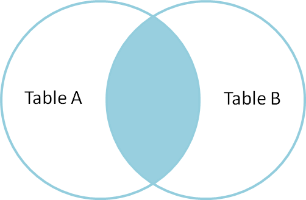
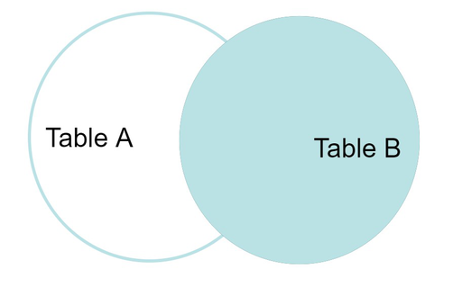
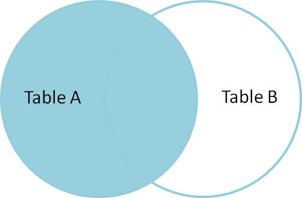
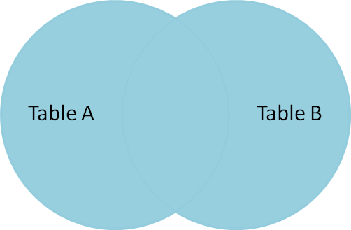

## Ziele

- Du weisst wofür SQL verwendet wird
- Du kennst die verschiedenen Statements in SQL
- Du kannst einfache SQL Queries/Statements schreiben

## Was ist SQL?

SQL oder „Structured Query Language“ ist eine Programmiersprache für die Bearbeitung von Daten und relationalen
Datenbanksystemen. Diese Sprache wird hauptsächlich für die Kommunikation mit Datenbanken verwendet, um die darin
enthaltenen Daten zu verwalten.

## Statements

### Was ist ein SQL Statement?

Ganz einfach gesagt ist ein Statement ein Befehl, der an die Datenbank geschickt und dort ausgeführt wird. Es gibt
viele verschiedene Statements, die teilweise kombiniert werden können, um den gewünschten Effekt auf der Datenbank zu
erzielen. Grundsätzlich werden Teile der Syntax (Select, Insert, usw.) gross geschrieben, um eine Unterscheidung
zwischen der Syntax und anderen Elementen wie tabellennamen usw. zu erhalten. Jedoch ist diese Regel nicht erzwungen.

### SELECT

Das Select Statement wird verwendet, um Daten aus bestimmten Tabellen auszuwählen. Ein SELECT ist grundsätzlich wie
folgt aufgebaut:

```sql
SELECT * FROM table_name;

-- Beispiel mit der Tabelle "benutzer"
SELECT * from benutzer;
```

Als Erstes kommt immer das "SELECT" gefolgt von den gewünschten Attribute. In diesem Statement wird ein Stern verwendet,
dieser steht für alle Attribute. Dementsprechend werden alle Attribute, die in der Tabelle vorhanden sind, zurückgegeben.
Auf die Attribute folgt das FROM, auf dieses folgt jeweils eine Tabelle, von welcher die Werte gewünscht sind.
Im Beispiel ist es die Tabelle "benutzer". Das Resultat dieses Statements würde schlussendlich so aussehen:

| vorname | nachname  | alter | beruf              |
| ------- | --------- | ----- | ------------------ |
| Anja    | Ackermann | 13    | Schüler/in         |
| Fritz   | Fischer   | 26    | Pilot/in           |
| Hans    | Hansen    | 52    | Hochbauzeichner/in |

Wenn wir nur eine Spalte auswählen möchten, können wir das Statement wie folgt anpassen:

```sql
SELECT column_name FROM table_name;

--Beispiel mit der Tabelle "benutzer"
SELECT vorname FROM benutzer;
```

Das Resultat würde dementsprechend so aussehen:

| vorname |
| ------- |
| Anja    |
| Fritz   |
| Hans    |

### INSERT

Das Insert Statement wird verwendet, um Daten in eine bestimmte Tabelle einzufügen. Ein INSERT ist grundsätzlich wie
folgt aufgebaut:

```sql
INSERT INTO table_name (column1, column2, column3, ...) VALUES (value1, value2, value3, ...);
```

Als Erstes kommt immer das "INSERT INTO" gefolgt von der betroffenen Tabelle. Schlussendlich wird mit VALUES angegeben, dass
ein oder mehrere Tupel eingefügt werden. In den Klammern können respektiv die Spaltennamen (optional) und die Inhalte angegeben werden.

Ein konkretes Beispiel würde mit dieser Tabelle beginnen:

| vorname | nachname  | alter | beruf              |
| ------- | --------- | ----- | ------------------ |
| Anja    | Ackermann | 13    | Schüler/in         |
| Fritz   | Fischer   | 26    | Pilot/in           |
| Hans    | Hansen    | 52    | Hochbauzeichner/in |

Dann wird dieses INSERT Statement ausgeführt:

```sql
INSERT INTO benutzer VALUES ("Max", "Mustermann", 16, "Maurer/in");
```

Nach dem Statement ist der neue Benutzer Max in der Tabelle zu finden:

| vorname | nachname     | alter | beruf              |
| ------- | ------------ | ----- | ------------------ |
| Anja    | Ackermann    | 13    | Schüler/in         |
| Fritz   | Fischer      | 26    | Pilot/in           |
| Hans    | Hansen       | 52    | Hochbauzeichner/in |
| _Max_   | _Mustermann_ | _16_  | _Maurer/in_        |

Alternativ zum vorherigen Statement können auch nur bestimmte Daten eingefügt werden. In unserem Beispiel könnte ein
Benutzer auch Arbeitslos sein, dementsprechend hätte er keinen Beruf. Wenn wir also so einen Benutzer hinzufügen möchten
würden wir das wie folgt machen:

```sql
INSERT INTO benutzer(vorname, nachname, alter) VALUES ("Peter", "Piccolo", 37);
```

In den Klammern nach der Tabelle können wir also die Attribute auswählen, die wir hinzufügen möchten. In der Tabelle
würde es so aussehen:

| vorname | nachname   | alter | beruf              |
| ------- | ---------- | ----- | ------------------ |
| Anja    | Ackermann  | 13    | Schüler/in         |
| Fritz   | Fischer    | 26    | Pilot/in           |
| Hans    | Hansen     | 52    | Hochbauzeichner/in |
| Max     | Mustermann | 16    | Maurer/in          |
| _Peter_ | _Piccolo_  | _37_  | **`null`**         |

Der Beruf wurde automatisch auf `null` gesetzt und ist dementsprechend leer.

### CREATE

Das Create Statement wird verwendet, um Tabellen, Datenbanken, usw. zu erstellen. Ein CREATE Statement ist grundsätzlich
wie folgt aufgebaut:

```sql
-- Datenbank erstellen
CREATE DATABASE databasename;

--Tabelle erstellen
CREATE TABLE table_name (
    column1 datatype,
    column2 datatype,
    column3 datatype,
   ....
);

-- Beispiel: die Tabelle "benutzer" erstellen
CREATE TABLE benutzer (vorname varchar(255),
       nachname varchar(255),
       alter number,
       beruf varchar(255));
```

Als Erstes kommt immer das "CREATE" gefolgt dem zu erstellenden Objekt, in diesem Fall eine Tabelle. Schlussendlich wird
noch ein Name festgelegt (die neue Tabelle heisst "benutzer"), gefolgt von den gewünschten Attributen der Tabelle und dem entsprechenden Datentyp.

Das Resultat dieses Statements würde schliesslich so aussehen:

| vorname | nachname | alter | beruf |
| ------- | -------- | ----- | ----- |
|         |          |       |       |

### WHERE

Die WHERE-Klausel ist im Vergleich zu den anderen kein Statement, sondern eine Ergänzung dazu. Mit WHERE kann
spezifiziert werden, welche Daten für das Statement verwendet werden sollen. Mehrere Bedingungen können mit den Keywords
`AND` und `OR` aneinandergereiht werden. Hier ein Beispiel dazu:

Ausgangstabelle:

| vorname | nachname   | alter | beruf              |
| ------- | ---------- | ----- | ------------------ |
| Anja    | Ackermann  | 13    | Schüler/in         |
| Fritz   | Fischer    | 26    | Pilot/in           |
| Hans    | Hansen     | 52    | Hochbauzeichner/in |
| Max     | Mustermann | 16    | Maurer/in          |

Dieses Statement schränkt das Alter zwischen 15 und 30 Jahren ein.

```sql
SELECT * FROM benutzer WHERE alter > 15 AND alter < 30;
```

Das Statement gibt schliesslich alle Werte zurück, die die Bedingung erfüllen:

| vorname | nachname   | alter | beruf     |
| ------- | ---------- | ----- | --------- |
| Fritz   | Fischer    | 26    | Pilot/in  |
| Max     | Mustermann | 16    | Maurer/in |

Zusätzlich gibt es bei Texten die Möglichkeit eine Teilüberprüfung mit `Like` zu machen. Damit können beispielsweise
Alle Adressen gesucht werden, die mit "Strasse" enden. Dazu muss beim `Like` angegeben werden, wo sich der Rest des
Textes befinden. Das funktioniert mit dem % Zeichen. Wenn der restliche Text vor dem Suchtext ist, wird das % vor diesem
platziert. Dasselbe funktioniert natürlich auch umgekehrt. Weiter kann auch auf beiden Seiten ein % verwendet werden, so
ist es egal wo sich der Suchtext befinden. Hier ein Beispiel-Query dazu:

Ausgangstabelle:

| vorname | nachname   | alter | beruf              |
| ------- | ---------- | ----- | ------------------ |
| Anja    | Ackermann  | 13    | Schüler/in         |
| Fritz   | Fischer    | 26    | Pilot/in           |
| Hans    | Hansen     | 52    | Hochbauzeichner/in |
| Max     | Mustermann | 16    | Maurer/in          |

```sql
SELECT * FROM person WHERE nachname like '%mann'
```

Resultat:

| vorname | nachname   | alter | beruf      |
| ------- | ---------- | ----- | ---------- |
| Anja    | Ackermann  | 13    | Schüler/in |
| Max     | Mustermann | 16    | Maurer/in  |

### UPDATE

Das Update Statement wird verwendet, um Inhalte (Tabelle, Datenbank, Constraints, etc.) zu ändern. Ein UPDATE
Statement ist grundsätzlich wie folgt aufgebaut:

```sql
UPDATE table_name
SET column1 = value1, column2 = value2, ...
WHERE condition;
```

Als Erstes kommt immer das "UPDATE" gefolgt von dem zu aktualisierenden Objekt, in diesem Fall eine Tabelle.
Anschliessend wird ein SET durchgeführt, wo die gewünschte Änderung gemacht wird. Dabei können auch mehrere Attribute
gleichzeitig geändert werden. Dazu kann hinter dem Wert ein Komma hinzugefügt werden und eine weitere Änderung angegeben
werden. Nach dem SET kann optional ein WHERE hinzugefügt werden, wenn die aktualisierung nicht für alle Werte
durchgeführt werden soll. Hier ein konkretes Beispiel dazu:

Ausgangstabelle:

| vorname | nachname   | alter | beruf              |
| ------- | ---------- | ----- | ------------------ |
| Anja    | Ackermann  | 13    | Schüler/in         |
| Fritz   | Fischer    | 26    | Pilot/in           |
| Hans    | Hansen     | 52    | Hochbauzeichner/in |
| Max     | Mustermann | 16    | Maurer/in          |

Dieses Statement setzt das Alter aller Benutzer mit dem Vornamen "Max" auf 18 und ändert den Beruf zu "Lehrer/in"

```sql
UPDATE benutzer
SET alter = 18, beruf = "Lehrer/in"
WHERE vorname = "Max";
```

Resultat:

| vorname | nachname   | alter | beruf              |
| ------- | ---------- | ----- | ------------------ |
| Anja    | Ackermann  | 13    | Schüler/in         |
| Fritz   | Fischer    | 26    | Pilot/in           |
| Hans    | Hansen     | 52    | Hochbauzeichner/in |
| Max     | Mustermann | 18    | Lehrer/in          |

### DELETE

Wie es der Name schon sagt, wird das Delete Statement zum Löschen von Daten verwendet. Ein DELETE Statement ist
grundsätzlich wie folgt aufgebaut:

```sql
DELETE FROM table_name WHERE condition;
```

Als Erstes kommt immer das "DELETE" gefolgt von FROM und der betroffenen Tabelle. Ein Delete sollte immer mit einem
Where verwendet werden, da sonst alle Daten aus der Tabelle gelöscht werden. Hier ein konkretes Beispiel dazu:

Ausgangstabelle:

| vorname | nachname   | alter | beruf              |
| ------- | ---------- | ----- | ------------------ |
| Anja    | Ackermann  | 13    | Schüler/in         |
| Fritz   | Fischer    | 26    | Pilot/in           |
| Hans    | Hansen     | 52    | Hochbauzeichner/in |
| Max     | Mustermann | 18    | Maurer/in          |

Dieses Statement löscht alle Benutzer mit dem Vornamen "Max".

```sql
DELETE FROM benutzer WHERE vorname = "Max";
```

Resultat:

| vorname | nachname  | alter | beruf              |
| ------- | --------- | ----- | ------------------ |
| Anja    | Ackermann | 13    | Schüler/in         |
| Fritz   | Fischer   | 26    | Pilot/in           |
| Hans    | Hansen    | 52    | Hochbauzeichner/in |

## Join

Ähnlich wie Where ist Join kein eigenes Statement, sondern eine Erweiterung. Mit dem Join Keyword werden in einem
Select mehrere Tabellen miteinander verbunden. Das wird benötigt wenn die gewünschten Daten sich nicht in einer sondern in mehreren Tabellen befinden. Zum Beispiel, wenn die Personalien und die Adresse
einer Person in verschiedenen Tabellen gespeichert wird. Ein Join funktioniert eigentlich immer gleich, es gibt jeweils
eine Tabelle A die mit der Tabelle B verbunden wird. Dazu wird jeweils eine Id oder zumindest ein Attribut verwendet,
welches in beiden Tabellen vertreten ist. So wird dann die Verbindung hergestellt.

Bei Joins gibt es viele verschiedene und teilweise sehr
komplexe Varianten, welche auch dementsprechend selten benutzt werden. Wir schauen uns hier die vier wichtigsten an.

Da diese nicht oft in der Praxis zum Einsatz kommen, sind Right-, Left- sowie auch Full-Join in dieser Doku Optional.

### Inner Join (_join_)

Der Inner Join ist der wichtigste und am meisten benötigte Join. Der Inner Join verbindet die Tabellen und gibt nur
die Schnittmenge zurück. Also alle Werte aus der Tabelle A, die auch ein Gegenstück in der Tabelle B haben. Grafisch
dargestellt würde dieser Join so aus sehen:



_Quelle: https://www.geeksforgeeks.org/sql-join-set-1-inner-left-right-and-full-joins/_

Das dazugehörige Statement würde so aussehen:

```sql
SELECT * FROM tabelle_a INNER JOIN tabelle_b ON tabelle_a.id = tabelle_b.id;
```

### Right und Left Join (Optional)

Im Vergleich zum Inner Join wird beim Right und Left Join nicht nur die Schnittmenge, sondern auch noch eine äussere
Menge zurückgegeben. Grafisch würde das so aussehen:

#### Right Join



_Quelle: https://www.geeksforgeeks.org/sql-join-set-1-inner-left-right-and-full-joins/_

#### Left Join



_Quelle: https://www.geeksforgeeks.org/sql-join-set-1-inner-left-right-and-full-joins/_

Die äussere Menge ist jeweils eine der beiden angegebenen Tabellen. Welche Tabelle das verwendet wird, ist dabei
abhängig vom Statement und welches Keyword verwendet wird. Schauen wir uns das in einem Beispiel an.

```sql
SELECT * FROM tabelle_a RIGHT JOIN tabelle_b ON tabelle_a.id = tabelle_b.id;
```

In diesem Query wird das Keyword `RIGHT` verwendet. Das bedeutet, dass die **rechte** Tabelle verwendet wird. Was
definiert jetzt aber welches die rechte Tabelle ist? In diesem Fall ist tabelle_b die rechte Tabelle, da sie rechts
vom `JOIN` steht. Dieser Logik entsprechend ist im unteren Beispiel tabelle_a die linke Tabelle, die also komplett
zurückgegeben wird.

```sql
SELECT * FROM tabelle_a LEFT JOIN tabelle_b ON tabelle_a.id = tabelle_b.id;
```

Was jedoch bei einem Right und Left Join zu beachten ist, dass `null` Werte entstehen können. Bei allen Werten, die kein
Gegenstück haben, werden die Attribute dieser Tabelle `null` sein. So würde das Resultat eines Left Joins aussehen:

Person:

| vorname | nachname | alter | beruf_id |
| ------- | -------- | ----- | -------- |
| Rolf    | Ringer   | 30    | 1        |
| Loris   | Liechti  | 21    | 40       |

Beruf:

| beruf_id | berufsbezeichnung |
| -------- | ----------------- |
| 1        | Lehrer/in         |
| 2        | Informatiker/in   |

Statement:

```sql
SELECT * FROM person LEFT JOIN beruf ON person.beruf_id = beruf.beruf_id;
```

Resultat:

| vorname | nachname | alter | beruf_id | beruf_id | berufsbezeichnung |
| ------- | -------- | ----- | -------- | -------- | ----------------- |
| Rolf    | Ringer   | 30    | 1        | 1        | Lehrer/in         |
| Loris   | Liechti  | 21    | 40       | `null`   | `null`            |

> beruf_id ist doppelt, da es in beiden Tabellen ein Attribut mit diesem Namen gibt. Könnte mit der Auswahl im Select
> auch ausgeblendet werden.

Umgekehrt würde das ganze so aussehen:

Statement:

```sql
SELECT * FROM person RIGHT JOIN beruf ON person.beruf_id = beruf.beruf_id;
```

Resultat:

| vorname | nachname | alter  | beruf_id | beruf_id | berufsbezeichnung |
| ------- | -------- | ------ | -------- | -------- | ----------------- |
| Rolf    | Ringer   | 30     | 1        | 1        | Lehrer/in         |
| `null`  | `null`   | `null` | `null`   | 2        | Informatiker/in   |

> beruf_id ist doppelt, da es in beiden Tabellen ein Attribut mit diesem Namen gibt. Könnte mit der Auswahl im Select
> auch ausgeblendet werden.

### Full Join (Optional)

Der Full Join ist sehr eng mit dem Left und Right Join verwandt. Jetzt werden jedoch alle Werte zurückgegeben. Wenn kein
Gegenstück zu einem Wert vorhanden ist, werden diese gleich wie beim Left und Right Join mit `null` angegeben. Grafisch
sieht das ganze so aus:



_Quelle: https://www.geeksforgeeks.org/sql-join-set-1-inner-left-right-and-full-joins/_

Das Statement würde schlussendlich so aussehen:

```sql
SELECT * FROM tabelle_a FULL JOIN tabelle_b ON tabelle_a.id = tabelle_b.id;
```

Mit dem vorherigen Beispiel würde das Resultat so aussehen:

Person:

| vorname | nachname | alter | beruf_id |
| ------- | -------- | ----- | -------- |
| Rolf    | Ringer   | 30    | 1        |
| Loris   | Liechti  | 21    | 40       |

Beruf:

| beruf_id | berufsbezeichnung |
| -------- | ----------------- |
| 1        | Lehrer/in         |
| 2        | Informatiker/in   |

Resultat:

| vorname | nachname | alter  | beruf_id | beruf_id | berufsbezeichnung |
| ------- | -------- | ------ | -------- | -------- | ----------------- |
| Rolf    | Ringer   | 30     | 1        | 1        | Lehrer/in         |
| `null`  | `null`   | `null` | `null`   | 2        | Informatiker/in   |
| Loris   | Liechti  | 21     | 40       | `null`   | `null`            |

> beruf_id ist doppelt, da es in beiden Tabellen ein Attribut mit diesem Namen gibt. Könnte mit der Auswahl im Select
> auch ausgeblendet werden.

## Aggregationen & weiteres

In diesem Abschnitt gehen wird auf Aggregationen und weitere wichtige Syntax-Elemente ein. Aggregationen in SQL sind
Funktionen, die verwendet werden, um zusammengefasste Informationen aus großen Datenmengen zu erhalten.
Dadurch wird es einfacher, die Daten zu analysieren und Muster oder Trends zu erkennen.
Dazu gehören unter anderem:

- Count
- Max/Min
- Sum
- Avg
- Group By

Wie diese angewendet werden findest du hier: https://mariadb.com/docs/server/reference/sql-functions/aggregate-functions
