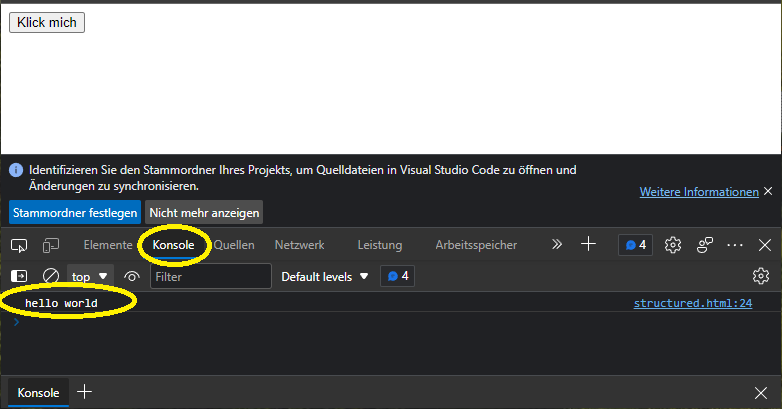

## Eine Nachricht loggen

In Java hast du Text mit `System.out.println(...)`, in C# mit `Console.WriteLine(...)` und vielleicht auch schon in Python mit `print(...)` geloggt. Natürlich ist das Loggen von Werten auch JavaScript möglich.

Dazu kannst du in deiner HTML-Datei (im `<script>`-Tag) die folgende Zeile hinzufügen:

```html
<script>
  ...
  // console output: hello world
  console.log('hello world');
</script>
```

Um diese Meldung sehen zu können, musst du die Konsole des Browsers öffnen. Dies kannst du machen, indem du die Entwickler-Tools des Browsers öffnest (meist über die [F12]-Taste). Anschliessend navigierst du zum "Konsole"-Tab. Nun solltest du die geloggte Nachricht einsehen können:



## Code direkt im Browser ausführen

Du kannst Code auch direkt in der Konsole des Browsers ausführen lassen. Klicke hierfür in das Eingabefeld unterhalt deiner geloggten Nachricht (gekennzeichnet durch das `>`-Symbol am Anfang). Dort kannst du dann Folgendes reinkopieren:

```javascript
for (let i = 0; i < 10; i++) {
  console.log(i);
}
```

Nun sollten in deiner Konsole die Zahlen 0 - 9 geloggt worden sein. Den Code solltest du bereits durch deine Einführung in Java verstehen. Der einzige grosse Unterschied hier ist, dass du die Nummer-Variable mit `let` deklarieren musst.

Du siehst also, wie einfach es ist, Code auf einer Website mithilfe der Konsole auszuführen. Die Konsole ist ein sehr mächtiges Tool, welches die Entwicklung mit JavaScript enorm vereinfachen kann. Oft kannst du, bevor du Code in der IDE (also deiner Entwicklungsumgebung) schreibst, vorher in der Konsole ausprobieren, ob dieser zum gewünschten Resultat führt.

## JavaScript in HTML einbinden

Es gibt hauptsächlich 2 Möglichkeiten, wie du Javascript in ein HTML-File einbinden kannst, ähnlich wie es bei CSS der Fall ist.

1. Per Inline-Script: JavaScript-Code kann direkt innerhalb einer HTML-Datei mit dem `<script>`-Tag eingebettet werden. Der `<script>`-Tag sollte entweder im `<head>`-Bereich oder am Ende des `<body>`-Bereichs platziert werden.

```html
<!doctype html>
<html>
  <head>
    <title>JavaScript in HTML</title>
  </head>
  <body>
    <h1>JavaScript in HTML</h1>

    <script>
      // Hier kannst du deinen JavaScript-Code schreiben
      alert("Hallo, Welt!");
    </script>
  </body>
</html>
```

2. Per externem Skript: JavaScript-Code kann auch innerhalb einer separaten Datei geschrieben werden, welche dann mit dem `<script>`-Tag in die HTML-Datei eingebunden werden kann. Dazu kannst du eine neue JavaScript-Datei mit der Erweiterung `.js` erstellen und dann im `<script>`-Tag auf diese Datei mit dem `src`-Attribut verweisen.

```html
<!doctype html>
<html>
  <head>
    <title>JavaScript in HTML</title>
    <script src="script.js"></script>
  </head>
  <body>
    <h1>JavaScript in HTML</h1>
  </body>
</html>
```

Es ist ebenfalls möglich, mehrere externe JavaScript-Dateien in dein HTML-File einzubinden, indem mehrere `<script>`-Tags mit unterschiedlichen `src`-Attributen verwendet werden.
