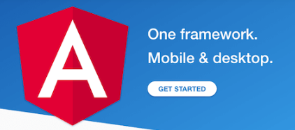

### Ziele

- Du weisst, was ein Frontend ist.
- Du weisst, was Angular ist, und kennst entsprechende Alternativen dazu.

## Was ist das Frontend?

Das Wort Frontend gibt bereits einen Hinweis, worum es sich handelt. Ein Frontend ist der Teil einer Applikation, welchen der Nutzer sieht.
Bei einer Webapplikation ist es der Teil, der dem Besucher im Browser angezeigt wird: die Benutzeroberfläche.

## Was ist ein Framework?

Ein Framework ist eine Art "Grundgerüst" für die Entwicklung von Software, welche es dem Entwickler ermöglicht, schnell und effizient Applikationen zu entwickeln, ohne von Grund auf beginnen zu müssen.

## JS Frameworks

JavaScript-Frameworks sind also da, um die Arbeit mit JavaScript einfacher und reibungsloser zu machen.

Durch verschiedenste Web-Frameworks wird die Gestaltung von Websites sehr flexibel, daher bevorzugen es die meisten Entwickler, ein solches zu verwenden.

### Die bekanntesten JS-Frameworks: 

### Angular

Eines der leistungsstärksten und effizientesten Open-Source-JavaScript-Frameworks ist Angular.
Google betreibt dieses Framework, welches für die Entwicklung einer Single Page Application (SPA) verwendet wird.
Eine Single-Page-Application ist eine Anwendung, welche mit dem Nutzer interagiert, indem die aktuelle Seite dynamisch mit neuen Daten gerendert wird. Das heisst, es wird für eine neue
Ansicht nicht jedes mal eine neue Page erstellt, sondern wird die bestehende Seite an die neuen Daten angepasst.

### React

Das von Facebook erstellte Framework React hat innerhalb kurzer Zeit an Popularität gewonnen.
Es wird verwendet, um die dynamische Benutzeroberfläche von Webseiten mit hohem eingehenden Datenverkehr zu entwickeln und zu betreiben.

### Vue.js

Obwohl dieses JavaScript-Framework erst im Jahr 2016 entwickelt wurde, hat es bereits seinen Weg auf den Markt gefunden und sich durch verschiedene Funktionen bewährt. Es ist sehr zuverlässig bei der Entwicklung von Cross-Plattform.

