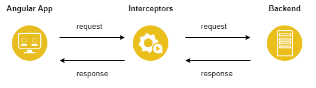

## Ziele

- Du weisst, was Interceptors in Angular sind und kannst diese anwenden.

## Interceptor

Interceptors in Angular sind eine Funktionalität des Frameworks, die es ermöglicht, HTTP-Requests global abzufangen und zu verändern, bevor sie an den Server gesendet werden.
Das ist sehr praktisch, wenn wir Authentifizierungs-Tokens konfigurieren, Protokolle der Requests erstellen und benutzerdefinierte Header zur Request hinzufügen wollen.



Um einen Interceptor zu implementieren, müssen wir eine Klasse erstellen, die die `Intercept` Methode des `HttpInterceptor` Interface implementiert.

Der folgende Interceptor ist sehr simpel gehalten. Er gibt jede generierte Request in der Konsole aus:

```typescript
@Injectable()
export class RequestLogInterceptor implements HttpInterceptor {
  intercept(
    request: HttpRequest<any>,
    next: HttpHandler,
  ): Observable<HttpEvent<any>> {
    console.log(request.url);
    return next.handle(request);
  }
}
```

Die `Intercept`-Methode wandelt jede Request in Observables um, die später durch das Aufrufen von `next.handle()` aufgelöst werden.
Für unsere Implementierung ist es also recht simpel: Wir nehmen den Request entgegen, protokollieren die URL und rufen `next.handle()` auf, um die Request an den Server zu senden, ohne Änderungen daran vorzunehmen.

## Interceptors unter der Benutzung von Modules Providen

Da die Interceptors eine Dependency des HttpClients sind, müssen diese als Provider im gleichen Injektor wie der HttpClient bereitgestellt werden.
Angenommen, wir haben unser `HttpClientModule` in das AppModule importiert, müssen wir die Interceptors hier zu den Providern hinzufügen.

```typescript
//...
import { HTTP_INTERCEPTORS } from "@angular/common/http";
import { RequestLogInterceptor } from "...";

@NgModule({
  //..
  imports: [
    HttpClientModule,
    // ..
  ],
  providers: [
    {
      provide: HTTP_INTERCEPTORS,
      useClass: RequestLogInterceptor,
      multi: true,
    },
    // ..
  ],
  // ..
})
export class AppModule {}
```

Die Option `multi: true` teilt Angular mit, dass wir mehrere Interceptors bereitstellen. Diese Einstellung muss daher auch nur in diesem Fall gemacht werden.
In unserem Beispielszenario wäre dies also nicht erforderlich, da wir nur einen Interceptor implementiert haben.

Ebenfalls wichtig zu berücksichtigen ist, dass Angular Interceptors in der Reihenfolge anwendet, in der sie bei den Providers des Moduls angegeben sind.

<details>
<summary>Interceptors in Angular 19</summary>

Angular 17 brachte auch bei den Interceptors einige Änderungen mit sich. Da nun ja nicht mehr standardmässig mit `modules` gearbeitet wird, müssen sie anders angegeben werden.
Das wird jetzt von der `app.config.ts` übernommen.

In der `app.config.ts` muss man nun den `provideHttpClient(withInterceptors([AuthInterceptor]))`-Teil angeben. in den eckigen klammern von `withInterceptors` gibt man die definierten Konstanten an.

```ts
import { ApplicationConfig } from "@angular/core";
import { provideRouter } from "@angular/router";

import { routes } from "./app.routes";
import { provideHttpClient, withInterceptors } from "@angular/common/http";
import { AuthInterceptor } from "./interceptors/auth.interceptor";

export const appConfig: ApplicationConfig = {
  providers: [
    provideRouter(routes),
    provideHttpClient(withInterceptors([AuthInterceptor])),
  ],
};
```

Zudem ist der Interceptor keine `class` mehr, welche mit `implements` implementiert wird. Er ist nun einfach eine Konstante mit dem Typ eines Interceptors. Ansonsten funktioniert alles gleich wie zuvor.

```ts
import {
  HttpRequest,
  HttpEvent,
  HttpInterceptorFn,
  HttpHandlerFn,
} from "@angular/common/http";
import { Observable } from "rxjs";

export const AuthInterceptor: HttpInterceptorFn = (
  req: HttpRequest<any>,
  next: HttpHandlerFn,
): Observable<HttpEvent<any>> => {
  console.log(request.url);
  return next.handle(request);
};
```

Beispiel für eine Authentifizierung in der das Passwort und der Benutzer, welche mit Base64 verschlüsselt wurden (`btoa`), im Header versendet werden. Das jedoch nur, wenn es keine `GET`-Request ist.

```ts
import {
  HttpRequest,
  HttpEvent,
  HttpInterceptorFn,
  HttpHandlerFn,
} from "@angular/common/http";
import { Observable } from "rxjs";

export const AuthInterceptor: HttpInterceptorFn = (
  req: HttpRequest<any>,
  next: HttpHandlerFn,
): Observable<HttpEvent<any>> => {
  if (req.method !== "GET") {
    const authRequest = req.clone({
      setHeaders: {
        "Content-Type": "application/json",
        Authorization: "Basic " + btoa("admin:admin"),
      },
    });
    return next(authRequest);
  }
  return next(req);
};
```

</details>
