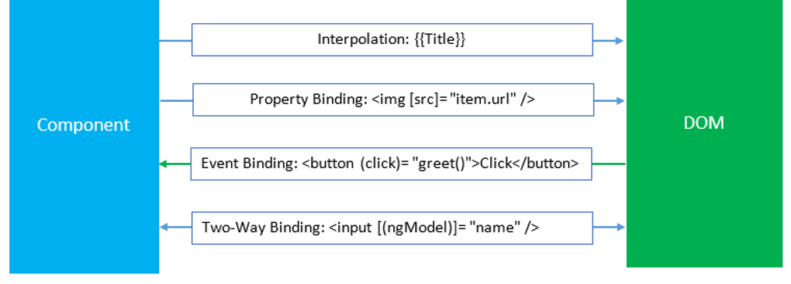

## Ziele

- Du kennst die verschiedenen Angular Data Bindings und kannst diese umsetzen.

## Angular Data Bindings

### Interpolation

- Mithilfe dieses One-Way-Bindings kann man Properties(u.a. Variablen) des Components im Template anzeigen.
  Wenn sich das Property im Component ändert, wird das Template aktualisiert, um die neuen Änderungen anzuzeigen.

```typescript
import { Component } from "@angular/core";

@Component({
  selector: "app-greeting",
  templateUrl: "./app-greeting.component.html",
  styleUrls: ["./app-greeting.component.scss"],
})
export class GreetingComponent {
  name: string = "Dragon Warrior";
}
```

```html
<!--app-greeting.component.html-->
<h1>Hello, {{ name }}!</h1>
```

### Event Binding

- Event Binding ist definiert als das Aktualisieren/Senden des Werts/der Information einer bestimmten Variable vom Template zum Component.\
  Zum Beispiel das Klicken eines Buttons.

```typescript
import { Component } from "@angular/core";
import { WeaponService } from "src/app/services/weapon.service";

@Component({
  // ..
})
export class WeaponComponent {
  chosenWeapon: string = "";
  weapons: string[] = [];

  constructor(private weaponService: WeaponService) {}

  ngOnInit() {
    this.weapons = this.weaponService.getWeapons();
    const index = Math.floor(Math.random() * this.weapons.length);
    this.chosenWeapon = this.weapons[index];
  }

  choseNewWeapon() {
    const index = Math.floor(Math.random() * this.weapons.length);
    this.chosenWeapon = this.weapons[index];
  }
}
```

```html
<!--app-weapon.component.html-->
<button (click)="choseNewWeapon()">Choose New Weapon</button>
```

### Property Binding

- Mithilfe von Property Bindings können wir einen Wert unseres Components auf eine Eigenschaft eines Elements binden.
  Wenn sich also der bestimmte Wert im Component verändern sollte, wird dies im Template aktualisiert.

```typescript
import { Component } from "@angular/core";
import { WeaponService } from "src/app/services/weapon.service";

@Component({
  // ..
})
export class WeaponComponent {
  // ..
  isButtonDisabled: boolean = false;

  // ..

  toggleButtonDisabled() {
    this.isButtonDisabled = !this.isButtonDisabled;
  }
}
```

```html
<!--app-weapon.component.html-->
<button (click)="chooseNewWeapon()" [disabled]="isButtonDisabled">
  Choose New Weapon
</button>
<button (click)="toggleButtonDisabled()">Toggle Button Disabled</button>
```

### Two-Way-Binding

- Two-Way-Binding ist eine Kombination aus Property- und Eventbinding. Daten werden kontinuierlich synchronisiert: vom Template zum Component und vom Component zum Template.
  Dies bedeutet also, dass Änderungen, die an den Daten des Components vorgenommen wurden, werden mit dem Template synchronisiert und sofort aktualisiert.
  Umgekehrt funktioniert es auf dieselbe Weise, daher auch der Name "Two-Way-Binding".

- Achte hierbei auf die Verwendung des `@Input`-Decorators im Component. Dieser markiert ein Feld als ein Input-Property, wodurch es an das DOM-Property angebunden wird. Damit erkennt Angular während der Change-Detection automatisch, ob sich das etwas geändert hat und passt in diesem Fall automatisch das Property im DOM an.

```typescript
import { Component } from "@angular/core";

@Component({
  selector: "app-ng-model",
  templateUrl: "./app-ng-model.component.html",
  styleUrls: ["./app-ng-model.component.scss"],
})
export class TriumphsComponent {
  @Input() title: string = "";
  // ..

  getValue(event: Event): string {
    return (event.target as HTMLInputElement).value;
  }
}
```

```html
<!--app-triumphs.component.html-->
<div>
  <p>
    <input [value]="title" (input)="title = getValue($event)" />
  </p>

  //Das folgende Beispiel ist eine kompakte Schreibweise für ein Input-Property.
  <p>
    <input [(ngModel)]="title" />
  </p>

  <p>
    <input [ngModel]="title" (ngModelChange)="title = $event" />
  </p>
</div>
```


