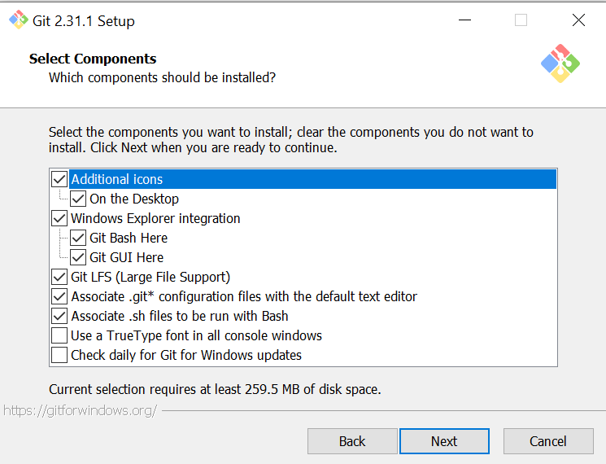
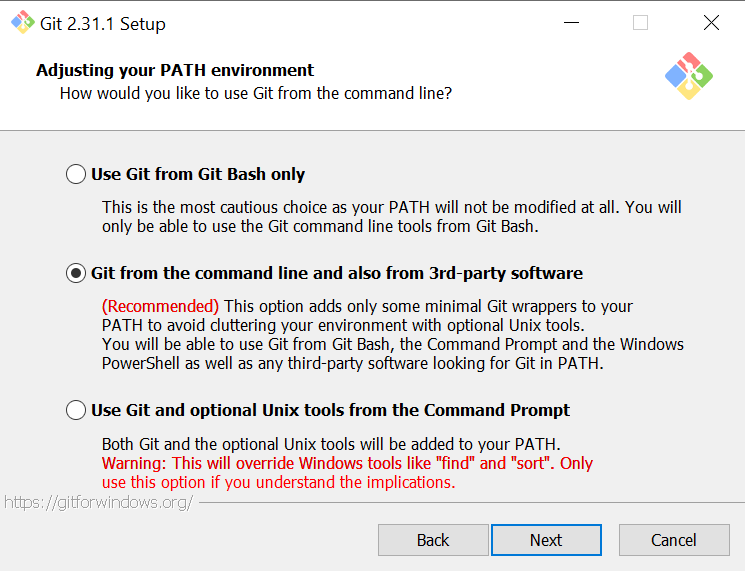

## Inhalt

- [Git unter Linux installieren](#git-unter-linux-installieren)
- [Git unter Windows installieren](#git-unter-windows-installieren)

## Ziele

- Ich weiss, wie ich Git in meinem Betriebssystem installiere.

## Überprüfe die Installation

Verwende den folgenden Befehl, um zu überprüfen, ob git bereits installiert ist:

```
git --version
```

## Git unter Linux installieren

- Debian basierte Linux (Ubuntu): `sudo apt install git`
- Redhat basierte Linux (Fedora, Rocky Linux): `sudo dnf install git`

Überprüfe die Installation mit `git --version`.

## Git unter Windows installieren

1.  Navigiere zum [Git für Windows Installer](https://git-scm.com/download/win) und lade die neuste Version herunter.
2.  Folge den Installationsanweisungen bis die Installation abgeschlossen ist.
    - Es wird empfohlen während der Installation Git Bash zu installieren
      
    - Es wird empfohlen während der Installation den PATH zu ändern.
      
3.  Öffne Git Bash
4.  Schreibe `git --version` zum Überprüfen, ob Git erfolgreich installiert wurde.
