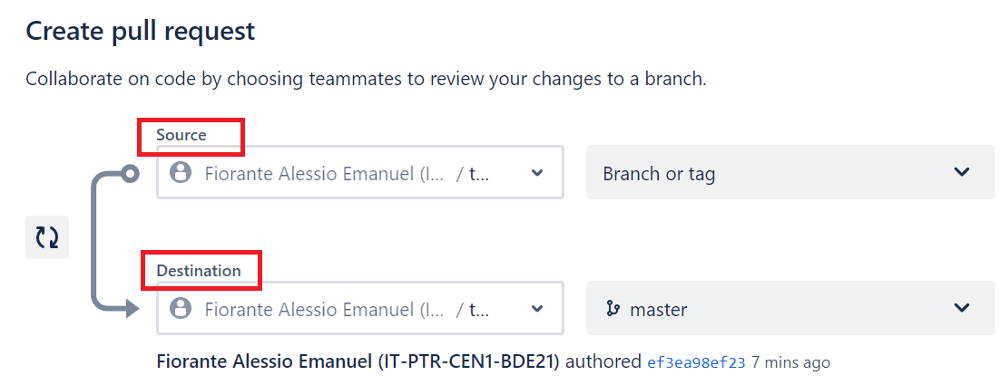

Nachdem du die Basics von git gelernt hast, ist es Zeit dich weiter zu vertiefen.

## Inhalt

- [Stash](#stash)
- [Cherry Pick](#cherry-pick)
- [Tag](#tag)
- [Alias](#alias)

### Ziele

- Ich verstehe, was ein Stash ist und wie er funktioniert.
- Ich weiss, wie ich einen Pull-Request in meiner IDE, wie auch im Web erstelle.
- Ich kenne Tags und kann sie über die Kommando-Zeile erstellen.
- Ich kann Git-Blame in der Kommando-Zeile anwenden.

## Stash

#### Was ist stash?

Mit git stash ist es möglich Änderungen zwischenzuspeichern und diese später abzurufen.
Nach dem Stash-Vorgang kannst du an anderen Dateien (auch in anderen Branches) arbeiten, bis du die zwischengespeicherten Daten wieder abrufen kannst.

#### Wie funktioniert stash?

Um Dateien zu stashen wird der folgende Befehl verwendet:

```bash
git stash
```

Um Dateien im Anschluss abzurufen wird der folgende Befehl verwendet:

```bash
git stash pop
```

Mit `git stash pop` werden alle Änderungen des Stashes gelöscht und der ursprünglichen Datei hinzugefügt.

Die Alternative dazu ist:

```bash
git stash apply
```

Mit `git stash apply` werden die Änderungen ebenfalls übernommen,
der Unterschied zu `git stash pop` liegt darin das stash apply die Dateien nicht aus dem Stash löscht,
dies kann nützlich sein, wenn dieselbe Änderung mehreren Branches hinzugefügt werden soll.

## Squash

#### Was ist Squash

`squash` in Git meint, mehrere Commits zu vereinen.
Squash wird meistens benutzt, wenn Branches gemerged werden.
An dieser Stelle ist es jedoch wichtig zu erwähnen das es keinen `git squash` Befehl gibt.

#### Wie funktioniert squash?

Es gibt verschiedene Wege, um Commits zu squashen.
Zum Beispiel gibt es die Methode des manuellen Squashens, dazu wird das Interactive Rebase Feature von Git genutzt.
Um die Interactive Rebase Session zu starten wird der folgende Befehl verwendet:

```bash
git rebase -i HEAD~3
```

Danach öffnet sich ein Editor, der die letzten n Commits anzeigt, n wird durch die Zahl nach dem "~" definiert.
Um jetzt die Commits zu squashen muss das Pick zu Beginn der Zeile mit squash ersetzt werden.
Jetzt werden alle Commits mit dem squash Schlüsselwort an den obersten Commit hinzugefügt.

##### Wieso sollte man Squashen:

Angenommen, du beendest die Arbeit an einem Feature-Branch und willst diese in den Main-Branch mergen.
Der Feature-Branch enthält aber viele Commits, die nicht zwingend im Main-Branch aufgeführt werden sollen,
in diesem Fall eignet sich das Squashen, um diese Commits zusammenzufassen.

## Merge/Pull Requests

### Was ist der Unterschied zwischen einer Merge Request und einer Pull Request?

Beide Begriffe meinen dasselbe, werden jedoch mit einer anderen Plattform assoziiert.
Der Begriff Merge Request wird im Zusammenhang mit GitLab verwendet.
Im Zusammenhang mit GitHub oder Bitbucket wird jedoch der Begriff Pull Request verwendet.
Der Einfachheit halber wird im folgenden Text nur von Pull Request gesprochen.

### Was ist ein Pull Request bzw. ein Merge Request?

In ihrer einfachsten Form sind Pull-Requests eine Funktion für Entwickler,
die andere Teammitglieder darüber informiert, dass ein Feature fertiggestellt wurde.
Dies lässt alle Beteiligten wissen, dass der Code bereit für eine Überprüfung ist und danach in einen anderen Zweig gemerged werden kann.

### Wie kann ein Pull Request erstellt werden (IntelliJ)

Um einen Pull Request direkt aus IntelliJ zu erstellen, muss zuerst sichergestellt werden, dass man selbst berechtigt ist, einen Pull Request zu erstellen.
Sind diese Berechtigungen vorhanden, kann der Pull Request in wenigen Schritten erstellt werden.
Oben Links in IntelliJ befindet sich einen Button der mit Pull Request beschriftet ist.
Danach öffnet sich ein Fenster in dem ausgewählt werden kann, welchen der lokalen Branches in das Ziel Repo gemerged werden soll.
Danach muss noch ein Titel festgelegt werden. Es besteht ebenfalls die Möglichkeit, eine Beschreibung hinzuzufügen, dies ist jedoch optional.
Im Anschluss besteht die Möglichkeit einen Reviewer hinzuzufügen.
Jetzt kann der Pull Request erstellt werden.

Funktioniert nur für GitHub, um Pull Requests in Bitbucket zu erstellen ist die folgende Anleitung zu beachten.

### Wie kann eine Pull Request erstellt werden (Github)

Um einen Pull Request direkt von GitHub aus zu erstellen, muss zuerst der Reiter Pull Request ausgewählt werden.
Jetzt stehen verschiedene Möglichkeiten zu Auswahl, in unserem Fall wollen wir aber nur einen neuen Pull Request erstellen.
Im Anschluss erscheint ein neues Panel, das Wichtigste dabei ist die Wahl der richtigen Source und Target Branches.
Danach kann noch ein Name und eine Beschreibung für den Pull Request gesetzt werden.
Wie in IntelliJ besteht auch hier die Möglichkeit einen Reviewer hinzuzufügen. Der Button dazu befindet sich mittig auf der linken Seite.
Da nun alle Einstellungen vorgenommen wurden, kann der Pull Request erstellt werden.

### Wie kann eine Pull Request erstellt werden (Bitbucket)

Um einen Pull Request in Bitbucket zu erstellen, muss im Web in der linken Navigationsleiste unter `ACTIONS` die Option `Create pull request` ausgewählt werden.
Hier hat man nun die Möglichkeit einen Branch welcher Änderungen hat (Source Branch) und den Ziel Branch (Destination Branch), dort wo die Änderungen hinzugefügt werden sollen, auszuwählen.


Auf der folgenden Seite kann ein Titel und eine Beschreibung für den Pull Request gesetzt werden. Ebenfalls können hier Reviewers hinzugefügt werden.
Da nun alle Einstellungen vorgenommen wurden, kann der Pull Request erstellt werden.

## Cherry Pick

### Was ist Cherry-Pick?

git cherry-pick ist ein Befehl, welcher es ermöglicht, beliebige Git-Commits (auch von anderen Branches) per Referenz
anzusprechen und diese an den momentanen Arbeitskopf (HEAD) anzuheften.
git cherry-pick kann sehr nützlich sein, um Änderungen rückgängig zu machen.

Zum Beispiel: Ein Commit wurde aus Versehen im falschen Branch durchgeführt. Nun kannst du zum korrekten
Branch wechseln und git cherry-pick nutzen, um den Commit am richtigen Ort zu befestigen.

### Wie funktioniert Cherry-Pick?

Um Cherry Pick anzuwenden, gibt man folgenden Befehl ein:

```
git cherry-pick <commit-hash>
```

Der <commit-hash> muss natürlich noch mit dem korrekten Hash des Commits ersetzt werden, welchen
man verschieben will. Anschliessend wird der Commit an den Branch angeheftet, auf dem man sich gerade
befindet. Darum Achtung!: Immer zuerst kontrollieren, ob man derzeit auch wirklich auf dem korrekten
Branch ist.

## Tag

### Was sind Tags?

Tags sind Referenzen, welche an einen bestimmten Punkt der History
zeigen. Tagging wird üblicherweise benutzt, um wichtige Ereignisse wie z.B.
den Release einer Applikation festzuhalten. Ein Tag ist etwas ähnliches
wie ein Branch, nur das ein Tag sich nicht verändert. Anders als ein Branch,
kann ein Tag nach dem Erstellen keine weiteren Commits
beinhalten.

### Wie funktionieren Tags?

Um ein Tag zu erstellen wird folgender Befehl benötigt:

```
git tag <tagname>
```

Wobei der <tagname> auch wieder durch den gewünschten String ersetzt werden muss.
Will man zusätzlich zum Tag eine Beschriftung hinzufügen, macht man das mit:

```
git tag <tagname> -a
```

Damit wird ein Annotated Tag erstellt.
Diese Tags werden im Gegensatz zu normalen Tags für einen Release verwendet.

Auch wichtig anzumerken: Wenn du normal auf den Branch pushst, werden die Tags
nicht standardmässig mitgepusht. Dazu brauchst du dann:

```
git push origin --tags
```

Willst du nur ein einzelnes Tag pushen, brauche:

```
git push origin <tag>
```

## Alias

### Was sind Aliasse?

Ein Git-Alias ist zu vergleichen mit einem Shortcut. Aliase werden z.B.
auch beim Arbeiten mit der Bash-Konsole eingesetzt. Aliase werden gebraucht um kürzere Befehle
zu realisieren. Sie ermöglichen effizienteres Programmieren.

Nehmen wir zum Beispiel den git-checkout Befehl.
Dieser Befehl wird häufig verwendet und muss immer wieder neu eingetippt werden. Mit den Git-Aliassen
jedoch kann man git-checkout z.B. in git.co verwandeln. Dies spart enorme Schreibarbeit über längere Zeit
und verliert dennoch nicht an Wirksamkeit.

### Wie funktionieren Aliasse?

Um Aliasse festzulegen, müssen wir diese in der gitconfig-Datei definieren. Dort erstellen wir das
Stichwort [alias]. Das könnte in etwa so aussehen:

```
[alias]
    st = status
    ci = commit -v
```

Die Aliasse können beliebig definiert werden, Ziel davon soll nur sein, die Schreibarbeit zu
minimieren und das eigene Programmieren praktischer zu machen.

## Git Blame

### Was ist Git-Blame?

Ist ein Befehl, welcher dazu dient den Autor der letzten Änderung anzuzeigen. Deswegen auch
git "blame". Man "blamed" den Verfasser der letzten Änderung für seinen Fehler (falls er
einen gemacht hat).

### Wie funktioniert Git-Blame?

Um git blame anzuwenden brauchen wir den folgenden Befehl:

```
git blame <filename>
```

Und schon haben wir den Verantwortlichen für die letzte Änderung an einer Datei ausfindig gemacht.
Jedoch bietet `git blame` auch andere Anwendungsmöglichkeiten:

```Bash
git blame -L 1,5 <filename>
```

Hier zum Beispiel definieren wir eine Range von der Zeile 1 bis zur Zeile 5. Oder hier, noch
eine weitere Variante:

```
git blame -e <filename>
```

Die Option -e zeigt uns anstatt des Benutzernamen des Autors, direkt die E-Mail-Adresse von
ihm, so dass wir gerade Kontakt aufnehmen können.

Zum Schluss haben wir noch die -w Option

```
git blame -w <filename>
```

Dieser Befehl ignoriert, wenn ein Autor nur Leerschläge geändert hat. Das hat den Vorteil, dass
wir nur die Autoren bekommen, welche auch wirklich etwas am Code selbst geändert und ihn
nicht nur formatiert haben.
