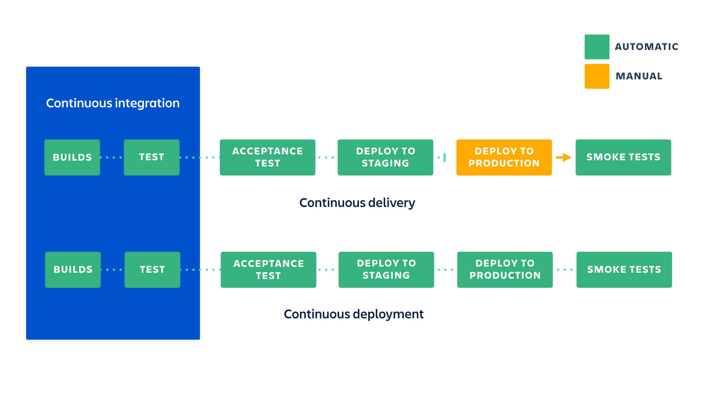

#### Ziele

- Ich kann den Begriff Continuous Deployment erklären.

## Continuous Deployment

Continuous Deployment, was verwirrenderweise ebenfalls gleich wie Continuous Delivery abgekürzt wird, treibt das Prinzip auf die Spitze. Jede Änderung wird sofort produktiv gesetzt, vorausgesetzt es gibt keinen Fehler in den automatisierten Tests.

Das hat verschiedene Vorteile. Man kriegt sehr schnell Feedback von Kunden und es gibt keinen stressigen "Release-Day" mehr. Wenn man jedoch eine schlechte CI-Pipeline und/oder ungenügende Code-Reviews hat, führt das Verfahren zu mehr Problemen, als dass es nützt.

