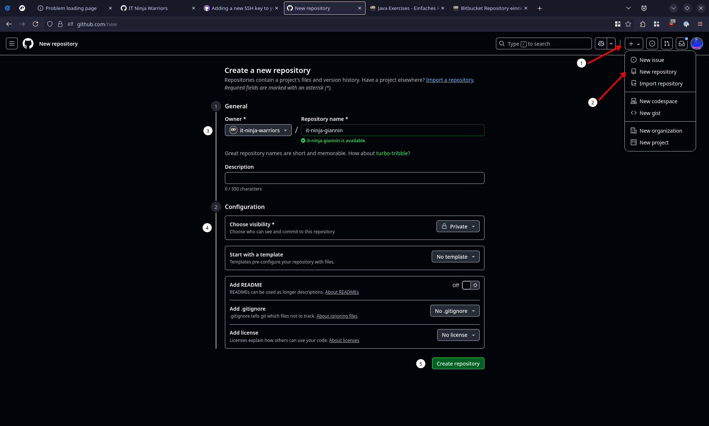
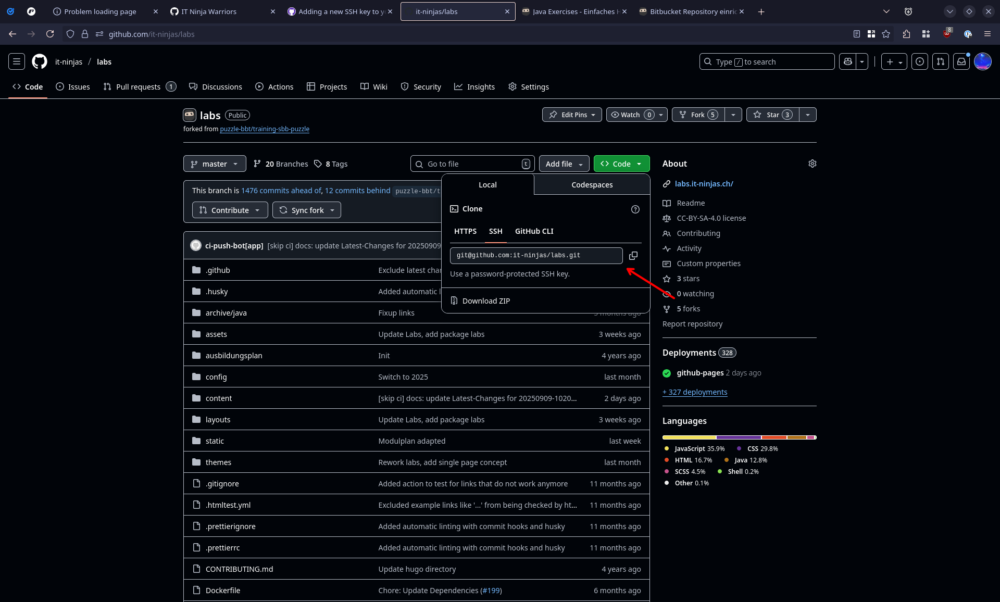

## Voraussetzungen

- Git (inkl. Git-Bash falls du Windows brauchst) ist auf deinem Computer installiert. Falls nicht, siehe:
  [Git installieren](../../../../99_shared/collaboration/source-repositories/git/01_grundwissen/02_git-install)
- Du hast die Grundeinstellungen für Git vorgenommen:

  

  ```shell
   git config --global user.name "u123456"
   git config --global user.email "u123456@sbb.ch"
   git config --global core.autocrlf true
   git config --global core.longpaths true
  ```

  

  

  ```shell
   git config --global user.name "Dein Name oder Pseudonym"
   git config --global user.email "deine-puzzle-email@puzzle.ch"
   git config --global --add --bool push.autoSetupRemote true
  ```

  

---

## Schritt-für-Schritt Anleitung

### 1. Tritt den IT Ninja Warriors bei

Melde dich bei einem deiner Praxisbildnern, damit dieser dich in die der [Organisation auf GitHub](https://github.com/it-ninja-warriors) hinzufügen kann.


Falls du noch kein GitHub Konto hast, kannst du dich entweder bei deinen Praxisbildner melden oder ganz einfach ein neues Konto erstellen.
Überlegt dir deinen Benutzername gut, da er nicht mehr so einfach geändert werden kann und ihn die ganze Welt sehen wird!


---

### 2. Einen SSH-Schlüssel erstellen

1. Öffne dein Terminal und führe folgenden Befehl aus, vergiss nicht die Email-Adresse anzupassen!

   ```bash
   ssh-keygen -t ed25519 -C "your_email@example.com"
   ```

   Der SSH-key ist ein Schlüssel um sich mit anderen Rechnern zu verbinden. Ändert man diesen Schlüssel, muss man auf den
   anderen Rechnern, wo man bisher Zugang hatte, überall den öffentlichen Teil (das Schlüsselloch) anpassen.

2. Drücke `Enter` für den Standardspeicherort

3. Optional: Passphrase setzen


Da sich der Schlüssel auf deinem Rechner in deinem persönlichen Ordner befindet, ist es ok, den Schlüssel nicht durch
ein Passwort zu schützen.


4. Die Schlüssel befinden sich in `/home/<dein-user>/.ssh/`.

> - `id_ed25519` (privat, **niemals weitergeben**)
> - `id_ed25519.pub` (öffentlich)

---

### 3. SSH-Schlüssel zu GitHub hinzufügen

1. Zeige den Öffentlichen Schlüssel an:

   ```bash
   cat /home/<your-user>/.ssh/id_ed25519.pub
   ```

   Du kannst den Text nun kopieren.

2. Öffne die [SSH und GPG-Keys](https://github.com/settings/keys)-Einstellungen auf GitHub

3. Klicke oben rechts auf den grünen "Neuer SSH Key"-Knopf, wähle einen Namen und "Authentifierungs Schlüssel" aus. Füge dann den kopierten Schlüssel im grossen Feld unten ein.

4. Klicke wieder auf den grünen Button

### 4. Repository auf GitHub erstellen

1. [GitHub](https://github.com) öffnen
2. Oben rechts auf das "+" klicken
   3 "Neues Repository" hinzufügen
3. Als Owner die it-ninja-warriors Organisation auswählen und einen Namen eingeben
4. Als Sichtbarkeit "Privat" auswählen
5. Auf den grünen Knopf klicken



### 5. Repository auf deinen Rechner klonen

5. Öffne auf deinem Rechner den Ordner, wo Repositories abgelegt werden sollen

   
   Wie PDFs unter `Dokumente` abgelegt werden, legen wir unseren Quellcode in einem seperaten Ordner ab. Du kannst zum Beispiel `/home/<your-user>/projects` brauchen, eventuell muss der Ordner noch erstellt werden.
   

   Falls der Ordner noch nicht existiert, muss er zuerst erstellt werden:

   
   mkdir /home/[deinName]/projects
   

   Öffne ihn:
   
   cd /home/[deinName]/projects
   

6. Clone das Repository. Den Link dazu findest du auf der Seite von deinem Projekt. Er sollte in etwa so aussehen:
   
   git clone git@github.com:it-ninja-owners/[deinName].git
   
   

---

### 5. Erstelle ein README.md und pushe es


Mit diesem Schritt wird sichergestellt, dass es keinen leeren Main Branch gibt.


Führe die folgenden Befehle aus:


cd /home/[deinName]/projects/[deinName]
echo it-ninja repository > ./README.md
git add .
git commit -m "Initial Commit"
git push

