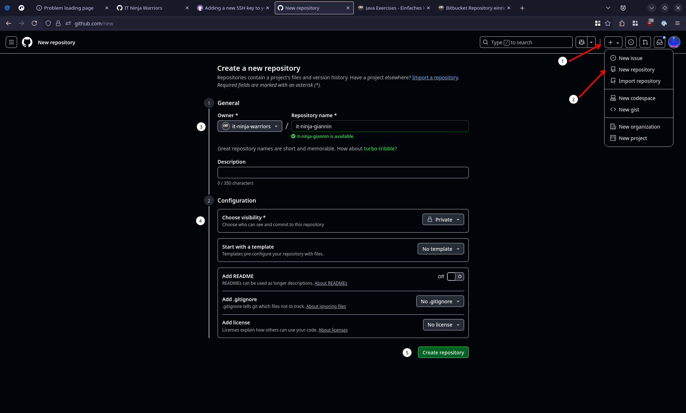
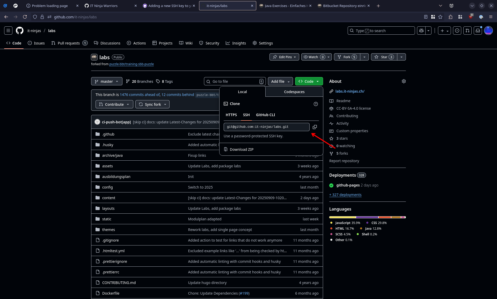

## Voraussetzungen

- Du hast Zugriff auf das Git-Tool Bitbucket
- Git (inkl. Git-Bash) ist auf deinem Computer installiert. Falls nicht, siehe:
  [Git installieren](../../../../99_shared/collaboration/source-repositories/git/01_grundwissen/02_git-install)
- Du hast die Grundeinstellungen für Git vorgenommen:

  
  git config --global user.name "u123456"  
  git config --global user.email "u123456@sbb.ch"

  # Für Windows zusätzlich:

  git config --global core.autocrlf true  
  git config --global core.longpaths true  
  

---

> Wende dich an deinen Praxisbildner, falls du nicht bei der SBB arbeitest (und falls Du bei SBB arbeitest, kannst du in
> der [!\*Konfiguration](../../../../../config#apprenticeshipprovider) die spezifischen Anleitungen und Informationen
> freischalten -> `Wahl der Ausbildungsstätte`).



## Schritt-für-Schritt Anleitung

### 1. Tritt den IT Ninja Warriors bei
Melde dich bei einem deiner Praxisbildnern, damit dieser dich in die der [Organisation auf GitHub](https://github.com/it-ninja-warriors) hinzufügen kann.


Falls du noch kein GitHub Konto hast, kannst du dich entweder bei deinen Puzzle Praxisbildner melden oder ganz einfach ein neues Konto erstellen.
Überlegt dir deinen Benutzername gut, da er nicht mehr so einfach geändert werden kann und ihn die ganze Welt sehen wird!


---

### 2. Einen SSH-Schlüssel erstellen

1. Öffne dein Terminal und führe folgenden Befehl aus, vergiss nicht die Email-Adresse anzupassen!

    ```bash
    ssh-keygen -t ed25519 -C "your_email@example.com"
    ```

    Der SSH-key ist ein Schlüssel um sich mit anderen Rechnern zu verbinden. Ändert man diesen Schlüssel, muss man auf den
    anderen Rechnern, wo man bisher Zugang hatte, überall den öffentlichen Teil (das Schlüsselloch) anpassen.

2. Drücke `Enter` für den Standardspeicherort

3. Optional: Passphrase setzen


Da sich der Schlüssel auf deinem Rechner in deinem persönlichen Ordner befindet, ist es ok, den Schlüssel nicht durch
ein Passwort zu schützen.


4. Die Schlüssel befinden sich in `/home/<dein-user>/.ssh/`.

> - `id_ed25519` (privat, **niemals weitergeben**)
> - `id_ed25519.pub` (öffentlich)

---

### 3. SSH-Schlüssel zu GitHub hinzufügen

1. Zeige den Öffentlichen Schlüssel an:

   ```bash
   cat /home/<your-user>/.ssh/id_ed25519.pub
   ```
   Du kannst den Text nun kopieren.

2. Öffne die [SSH und GPG-Keys](https://github.com/settings/keys)-Einstellungen auf GitHub

3. Klicke oben rechts auf den grünen "Neuer SSH Key"-Knopf, wähle einen Namen und "Authentifierungs Schlüssel" aus. Füge dann den kopierten Schlüssel im grossen Feld unten ein. 

4. Klicke wieder auf den grünen Button

### 4. Repository auf GitHub erstellen

1. [GitHub](https://github.com) öffnen
2. Oben rechts auf das "+" klicken
3 "Neues Repository" hinzufügen
4. Als Owner die it-ninja-warriors Organisation auswählen und einen Namen eingeben
5. Als Sichtbarkeit "Privat" auswählen
6. Auf den grünen Knopf klicken

  

### 5. Repository auf deinen Rechner klonen
5. Öffne auf deinem Rechner den Ordner, wo Repositories abgelegt werden sollen

   
   Wie PDFs unter `Dokumente` abgelegt werden, legen wir unseren Quellcode in einem seperaten Ordner ab. Du kannst zum Beispiel `/home/<your-user>/projects` brauchen, eventuell muss der Ordner noch erstellt werden.
   

   Falls der Ordner noch nicht existiert, muss er zuerst erstellt werden:

   
   mkdir /home/<your-user>/projects
   

   Öffne ihn:
   
   cd /home/<your-user>/projects
   

5. Clone das Repository. Den Link dazu findest du auf der Seite von deinem Projekt. Er sollte in etwa so aussehen:
   
   git clone git@github.com:it-ninja-owners/<your-name>.git
   
  

---

### 5. Erstelle ein README.md und pushe es


Mit diesem Schritt wird sichergestellt, dass es keinen leeren Main Branch gibt.


Führe die folgenden Befehle aus:


cd /home/<your-user>/projects/<your-name>
echo it-ninja repository > ./README.md
git add .
git commit -m "Initial Commit"
git push





## Schritt-für-Schritt Anleitung

### 1. Öffne Bitbucket

1. Öffne [!Bitbucket](https://code.sbb.ch/)
2. Logge dich ggf. ein

---

### 2. SSH-Schlüssel erstellen

1. Öffne eine [CMD Shell](../../../shell/cmd/) und gib den folgenden Befehl ein:


In früheren Versionen von diesem Modul wurden RSA-Keys eingesetzt. Da diese Keys nicht mehr als sehr sicher gelten
wechseln wir zu den besseren ed25519-Keys.



**Existiert die Datei bereits, dann überschreibe sie nicht!**

Der ssh-key ist ein Schlüssel um sich mit anderen Rechnern zu verbinden. Ändert man diesen Schlüssel, muss man auf den
anderen Rechnern, wo man bisher Zugang hatte, überall den öffentlichen Teil (das Schlüsselloch) anpassen.


```bash
  ssh-keygen -t ed25519 -C "deine.email@sbb.ch"
```

2. Drücke `Enter` für den Standardspeicherort

3. Optional: Passphrase setzen


Da sich der Schlüssel auf deinem Rechner in deinem persönlichen Ordner befindet, ist es ok, den Schlüssel nicht durch
ein Passwort zu schützen.


4. Die Schlüssel befinden sich in `C:\Users\[username]\.ssh\`:

> - `id_ed25519` (privat, **niemals weitergeben**)
> - `id_ed25519.pub` (öffentlich)

---

### 3. SSH-Schlüssel zu Bitbucket hinzufügen

1. Zeige den Öffentlichen Schlüssel an:

   ```bash
   type C:\Users\u123456\.ssh\id_ed25519.pub
   ```

   > In Windows kannst du die Datei auch einfach mit notepad.exe öffnen und den Inhalt kopieren.

2. Kopiere den Inhalt und füge ihn unter [SSH-Key hinzufügen](https://code.sbb.ch/plugins/servlet/ssh/account/keys) ein.

---

### 4. Erstelle ein Repository und klone es

1. Öffne dein **[Bitbucket Konto](https://code.sbb.ch/profile)**
2. Klicke auf **Repository erstellen**
3. Vergib einen Namen (z. B. `it-ninja-[deinName]`) und klicke auf **Repository erstellen**

4. Öffne auf deinem Rechner den Ordner, wo Repositories abgelegt werden sollen

   
   Wie Word-Dokumente unter `Dokumente` abgelegt werden, legen wir unseren Quellcode in einem seperaten Ordner ab. In
   der Talent Factory haben wir uns für `C:\Users\u123456\local_repos` entschieden.
   

   Falls der Ordner noch nicht existiert, muss er zuerst erstellt werden:

   
   mkdir C:\Users\u123456\local_repos
   

   Öffne ihn:
   
   cd C:\Users\u123456\local_repos
   

5. Clone das Repository. Den Befehl dazu findest du auf der Seite von deinem Projekt. Er sollte in etwa so aussehen:
   
   git clone ssh://git@codessh.sbb.ch:7999/~u123456/it-ninja-[deinName].git
   

---

### 5. Erstelle ein README.md und pushe es


Mit diesem Schritt wird sichergestellt, dass es keinen leeren Master Branch gibt.


Führe die folgenden Befehle aus:


cd C:\Users\u123456\local_repos\it-ninja-[deinName]
echo it-ninja repository > ./README.md
git add .
git commit -m "Initial Commit"
git push


### 6. Praxisbildner berechtigen

1. Repository in Bitbucket öffnen
2. Zu **Repository Settings → Repository Permissions** navigieren
3. **Add user or group** klicken
4. Praxisbildner als Administratoren hinzufügen


