## Ziele

- Du kannst ein Google-Konto erstellen.
- Du kannst dich im Google Developer Portal anmelden.
- Du kannst einen API Key für die Custom Search API generieren.
- Du weißt, wie du den API Key sicher speicherst.



---

## Google API Key erstellen

Die folgenden Schritte leiten dich durch den Prozess um einen API Key für die Google APIs zu erhalten.


Behandle den Key vertraulich. Er sollte nicht in einem Git-Repository gespeichert werden. [Hier](../../ide/intellij/05_secrets/) erfährst du, wie du es in unseren Übungen machen kannst.


1. Öffne [https://developers.google.com/?hl=de](https://developers.google.com/?hl=de)

2. Melde Dich oben rechts an
   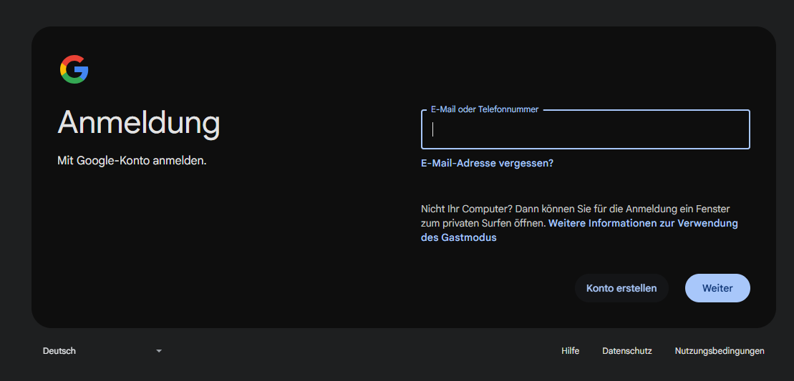

3. Erstelle ein neues Konto

   Falls du bereits ein Konto hast, welches Du benutzen willst, kannst Du die nachfolgenden Schritte überspringen

   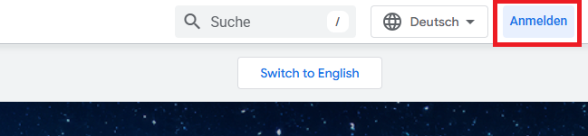

   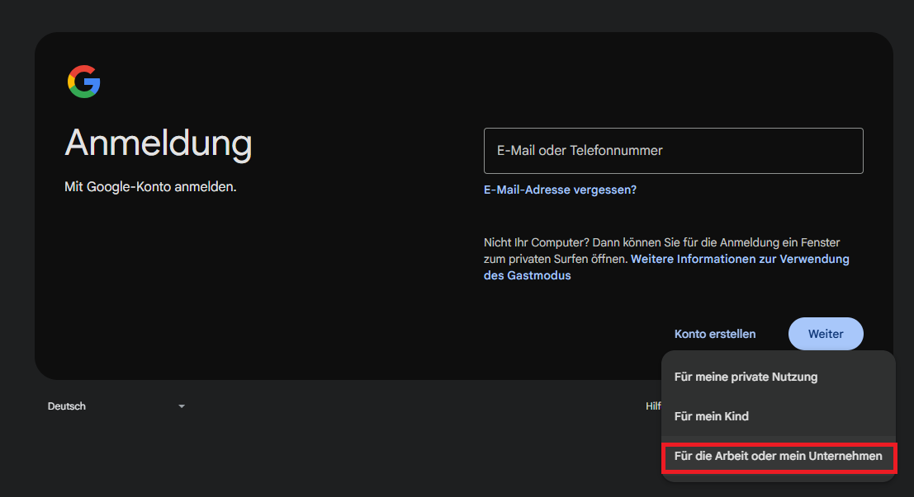

   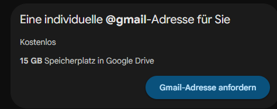

   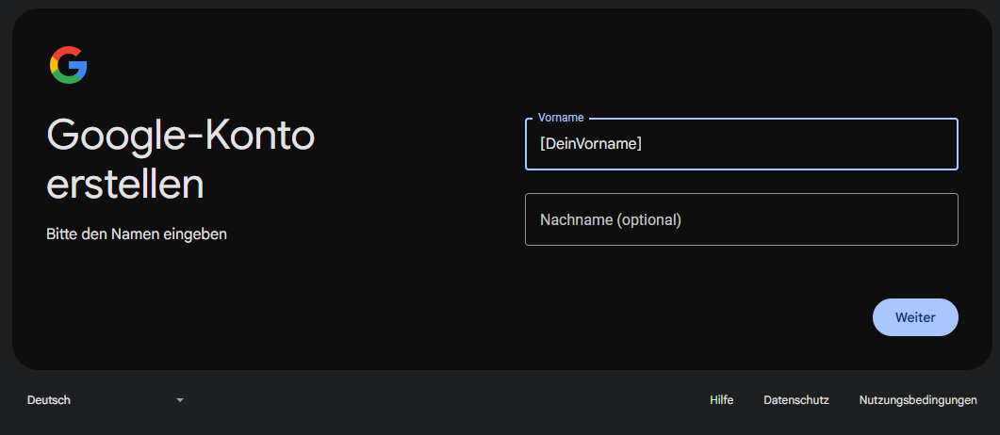

   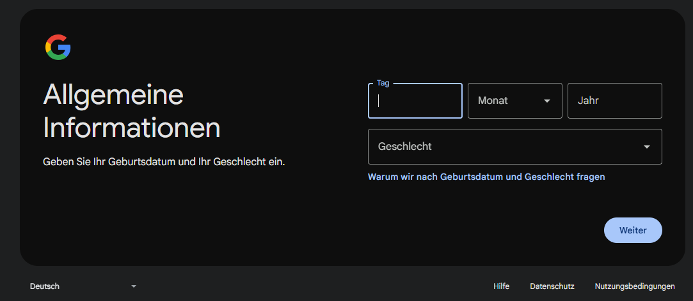

   Du kannst dir eine neue Email Adresse erstellen (nicht empfohlen)...

   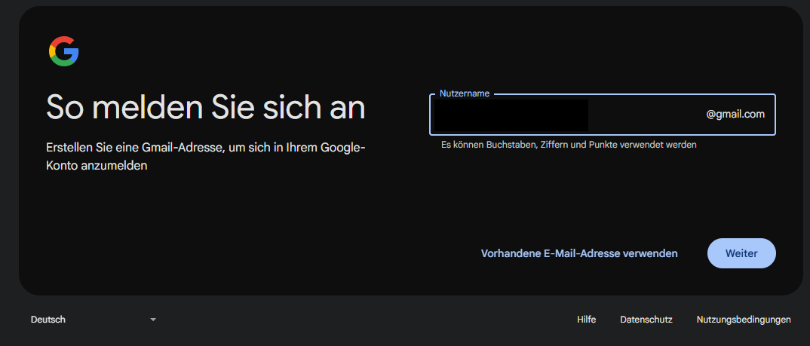

   oder eine bestehende Email Adresse nehmen (empfohlen)

   
   Nimm deine Email Adresse von SBB (vorname.name@sbb.ch)
   

   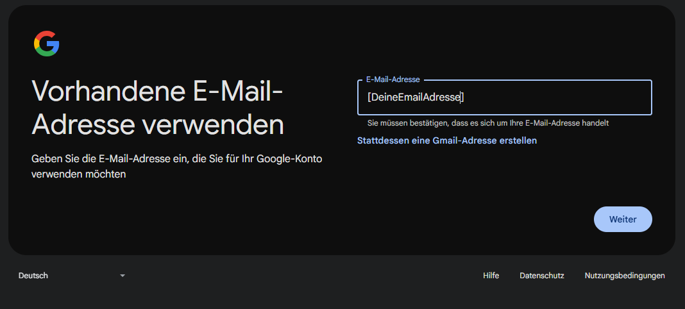

   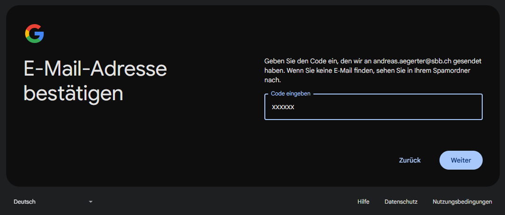

   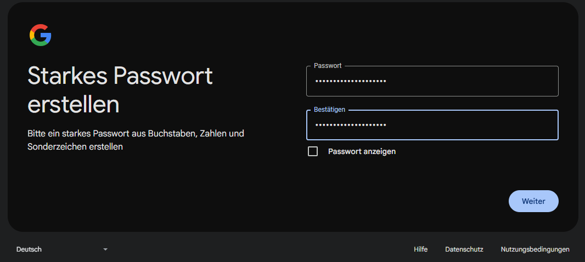

   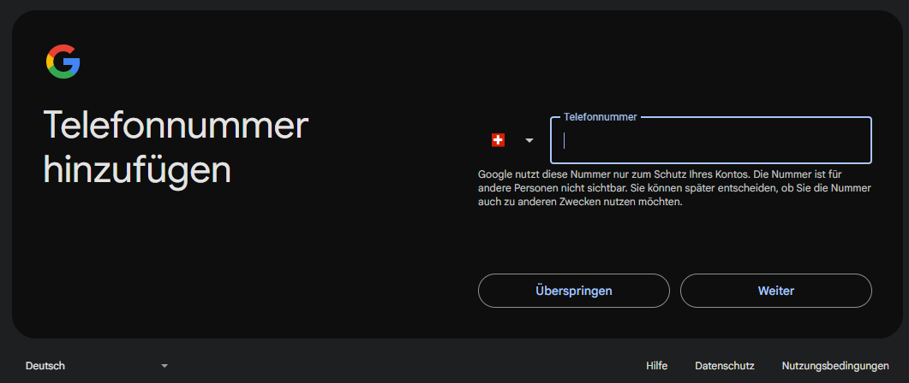

   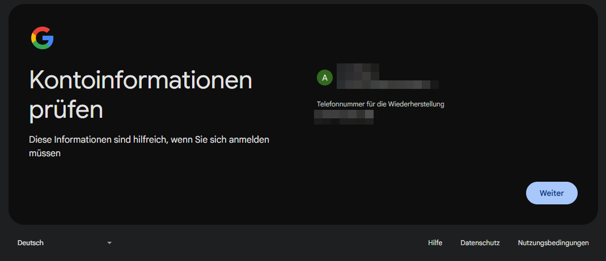

   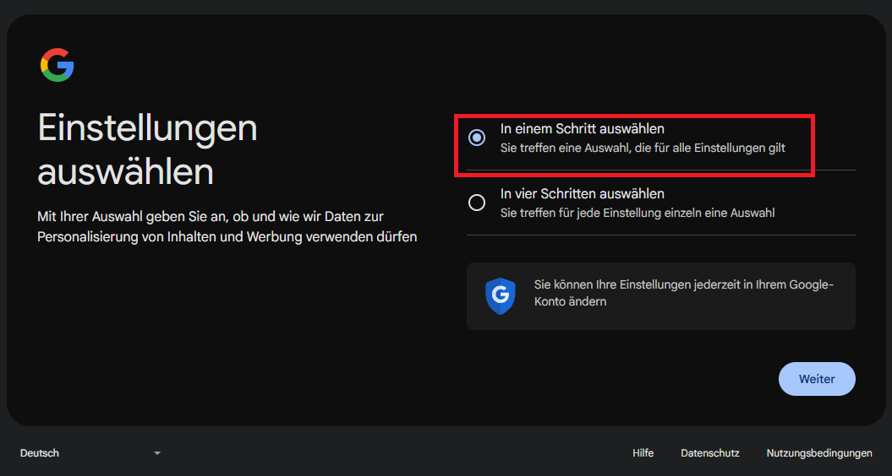

   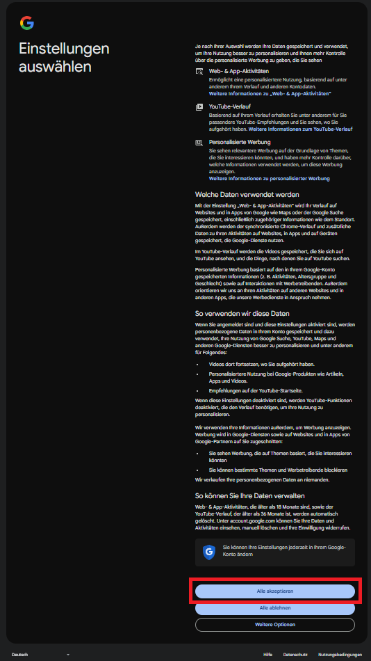

   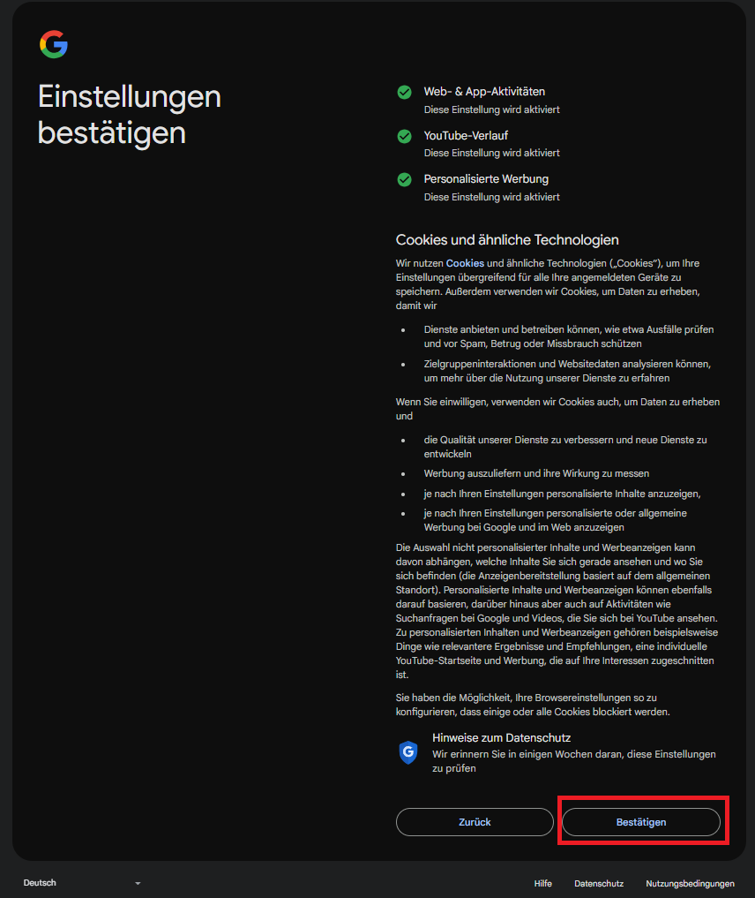

   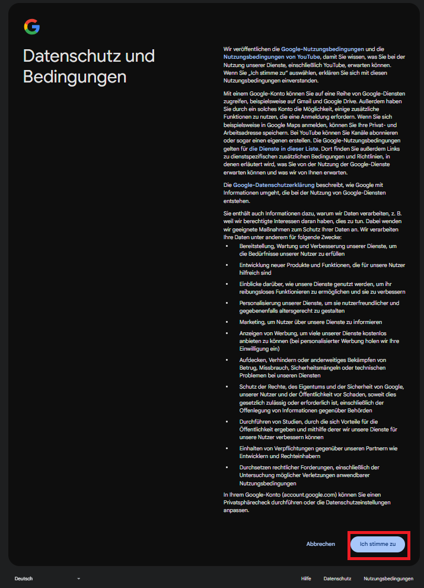

   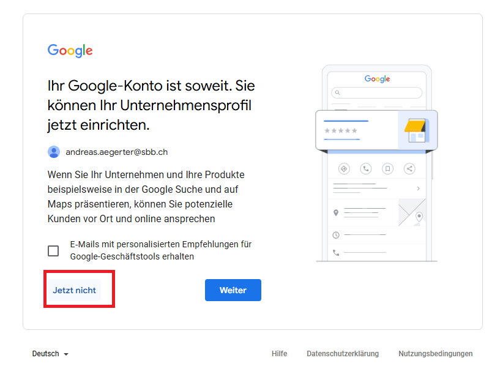

4. Auf [https://developers.google.com/?hl=de](https://developers.google.com/?hl=de) Developers Program als Student

   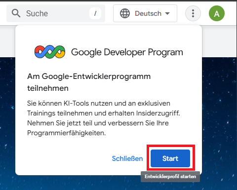

   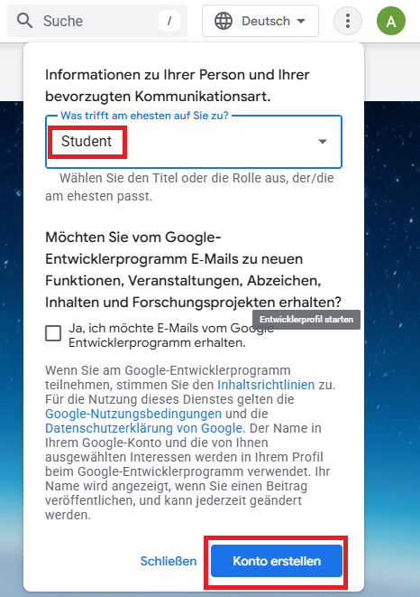

   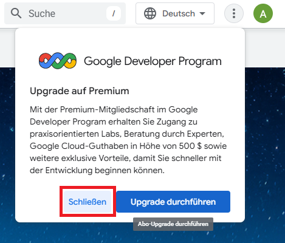

5. API Key anfordern

   https://developers.google.com/custom-search/v1/overview?hl=de

   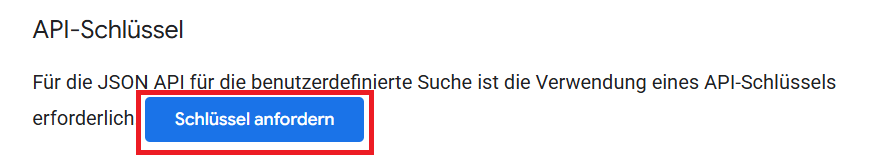

   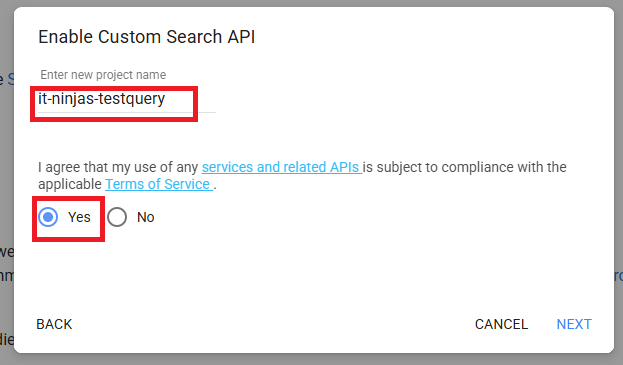

   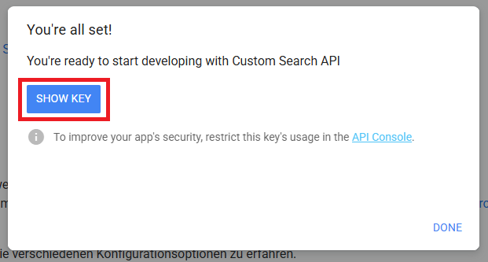

   
   Den Key kopieren und sicher ablegen. Nicht ins Git-Repository. Vertraulich behandeln! [Hier](../../ide/intellij/05_secrets/) erfährst du, wie du es in unseren Übungen machen kannst.
   
