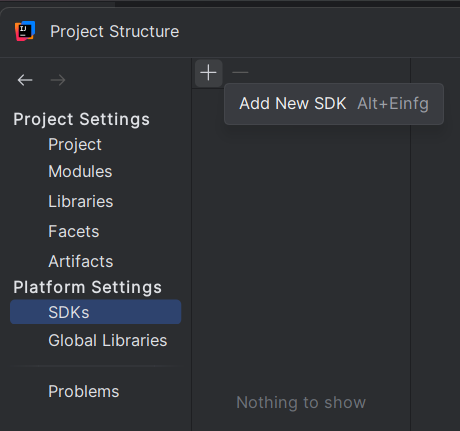
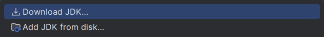
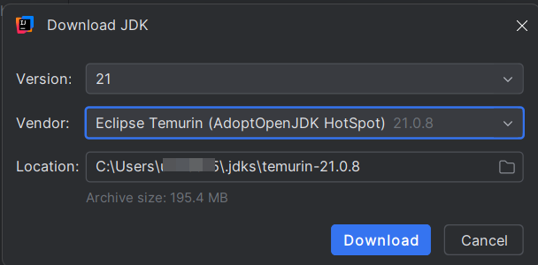

## Ziel

- IntelliJ IDEA ist auf deinem Rechner installiert.
- Du kannst ein einfaches Projekt laden und ausführen.

---

## IntelliJ IDEA installieren

### Schritt 1: Download


Wenn du bei der SBB in Ausbildung bist dann wähle hier die **Ultimate Edition**. Damit stehen dir alle Features zur
Verfügung.

Wie du diese Version aktivierst, erfährst du weiter unten.


1. Öffne [https://www.jetbrains.com/idea/download](https://www.jetbrains.com/idea/download).
2. Wähle die **Community Edition** für dein Betriebssystem.

### Unterschied Community und Ultimate Edition

| Feature                        | Community Edition           | Ultimate Edition                     |
| ------------------------------ | --------------------------- | ------------------------------------ |
| **Lizenz**                     | Kostenlos (Open Source)     | Kostenpflichtig (kommerziell)        |
| **Sprachen-Support**           | Java, Kotlin, Groovy, Scala | Alle aus Community + mehr            |
| **Web-Entwicklung**            | ❌                          | ✅ HTML, CSS, JavaScript, etc.       |
| **Framework-Support**          | Grundlegend (z. B. Maven)   | ✅ Spring, Java EE, Micronaut        |
| **Datenbank-Tools & SQL**      | ❌                          | ✅ Integrierter DB-Support           |
| **Remote Development**         | ❌                          | ✅ (z. B. via JetBrains Gateway)     |
| **Erweiterte Debugging-Tools** | Einfaches Debugging         | ✅ HTTP Client, Performance Profiler |
| **Enterprise Features**        | ❌                          | ✅ (z. B. Jakarta EE, Web Services)  |
| **Support & Updates**          | Community-Support           | ✅ JetBrains-Support                 |

> Die Community Edition eignet sich gut für reine Java/Kotlin-Entwicklung und reicht für die grundlegenden Module auf IT-Ninjas.

> Die Ultimate Edition ist ideal für professionelle Full-Stack- und Enterprise-Entwicklung. Sie wird in späteren Modulen (Angular, Spring Boot) benötigt wenn man nicht auf Visual Studio Code wechseln will.

### Schritt 2: Installation



1. Lade die `.exe`-Datei herunter und starte sie.
2. Wähle:
   - Installationsverzeichnis
   - Optional: `Add launchers dir to the PATH`
   - Optional: `.java`-Dateien mit IntelliJ verknüpfen
3. Klicke auf **Install**.
4. Starte IntelliJ IDEA nach Abschluss der Installation.





1. Lade die `.dmg`-Datei herunter und öffne sie.
2. Ziehe das IntelliJ-Icon in den Ordner `Applications`.
3. Starte IntelliJ IDEA.





1. Lade das `.tar.gz`-Archiv herunter.
2. Entpacke das Archiv (z. B. in `~/apps`).
3. Führe das Startskript `bin/idea.sh` aus.



### Schritt 3: Erststart

Beim ersten Start:

- Frühere Einstellungen übernehmen? → Optional
- UI-Stil wählen (hell/dunkel)

Diese Einstellungen kannst du später jederzeit anpassen.




Das hier musst Du unbedingt lesen!


Um einen positiven Lerneffekt zu erhalten, verzichten wir am Anfang auf die Unterstützung von KI.

Die folgenden Schritte **must** du ausführen um Code-Vervollständigung innerhalb von IntelliJ auszuschalten.

1. **ZIP-Datei herunterladen**  
   Lade die bereitgestellte ZIP-Datei mit den IntelliJ-Settings herunter:  
   [Download Editor-Settings](/files/tools/ide/intellij/BaseProfil.zip)

2. **ZIP entpacken**  
   Entpacke die ZIP-Datei an einem Ort deiner Wahl.  
   Du solltest danach die beiden Dateien sehen:

   - `editor.xml`
   - `full.line.xml`

3. **IntelliJ-Options-Verzeichnis finden**  
   Das Options-Verzeichnis liegt im **Benutzereinstellungen-Ordner** von IntelliJ IDEA.  
   Je nach Betriebssystem findest du diesen hier:

   - **Windows**:  
     `C:\Users\<BENUTZERNAME>\AppData\Roaming\JetBrains\IntelliJIdea<Version>\options`
   - **macOS**:  
     `~/Library/Application Support/JetBrains/IntelliJIdea<Version>/options`
   - **Linux**:  
     `~/.config/JetBrains/IntelliJIdea<Version>/options`

   Ersetze `<Version>` durch deine IntelliJ-Version, z. B. `2025.2`.

4. **Dateien kopieren**  
   Kopiere die beiden Dateien `editor.xml` und `full.line.xml` in das **options**-Verzeichnis.

5. **IntelliJ neu starten**  
   Schließe IntelliJ IDEA vollständig und starte es neu, damit die Änderungen übernommen werden.


Falls das `options`-Verzeichnis noch nicht existiert, starte IntelliJ einmal und beende es wieder – danach wird es automatisch angelegt.



Denk daran, dass du dich verpflichtet hast, auf den Einsatz von KI zu verzichten. Bei Unsicherheiten gehe auf deinen
Praxisbildner zu, damit er mit dir zusammen prüfen kann, ob alles korrekt eingestellt ist.





Nach der Installation beginnt ein 30-tägiger Testzeitraum der **Ultimate Edition**.  
Nutze diesen Zeitraum und fordere eine Lizenz an:

1. Besuche [https://omada.sbb.ch/home](https://omada.sbb.ch/home)
2. Suche nach der Gruppe `DG_RBT_INTELLIJ-LICENSE`
3. Klicke auf **Zugriff anfordern**  
     
   
4. Sobald du Zugriff hast, registriere IntelliJ:

   - Wähle **Activate (another) License**
   - Wähle **License Server**
   - Gib die Adresse `https://sbb-license.fls.jetbrains.com` ein
   - Klicke auf **Activate**  
       
     

Danach ist IntelliJ Ultimate aktiviert.


### Schritt 4: JDK einrichten

In der Ausbildung nutzen wir Eclipse Temurin **JDK 21 (LTS)** als Standard JDK.

1. Öffne **File → Project Structure…** (`Strg+Alt+Shift+S`).
2. Links **Platform Settings → SDKs**.
3. Klicke **+ → Download JDK**
   
   
4. Wähle:

   - Version: **21**
   - Anbieter: z. B. **JetBrains Runtime**, nicht Oracle!
   - Den Installationsordner so belassen wie vorgeschlagen  
     

5. IntelliJ lädt und installiert das JDK automatisch.
