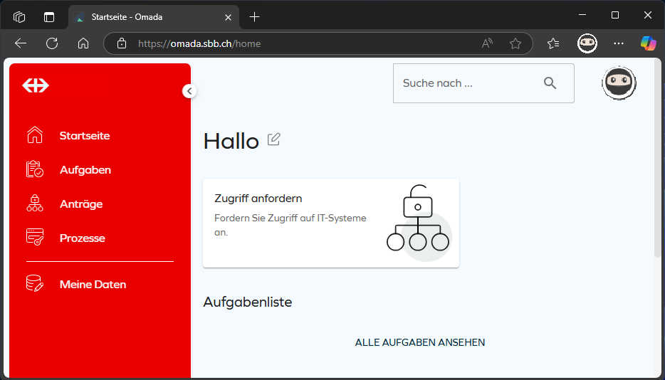
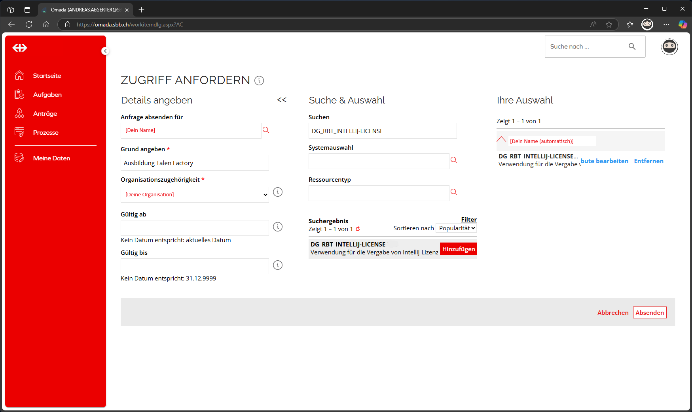
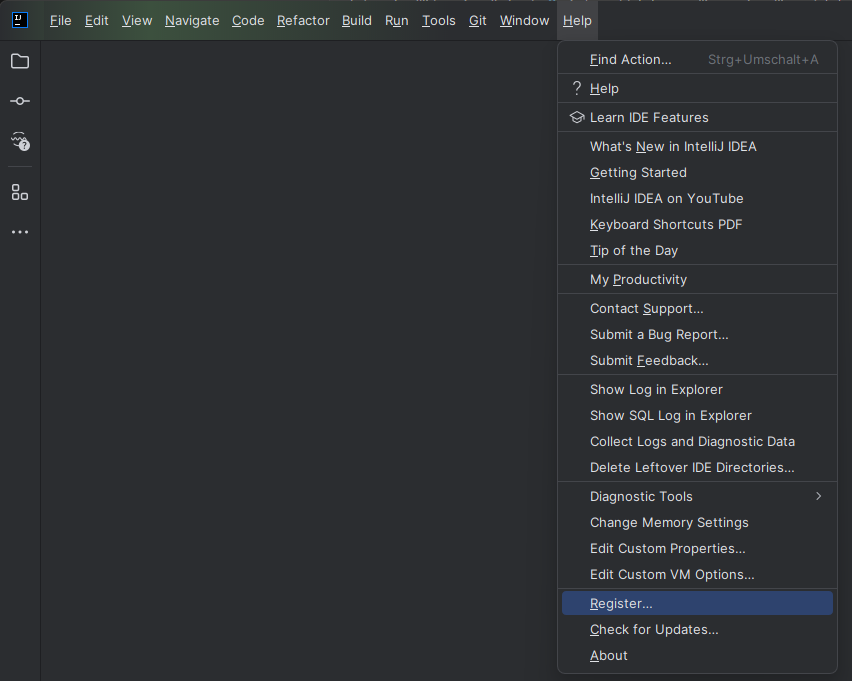
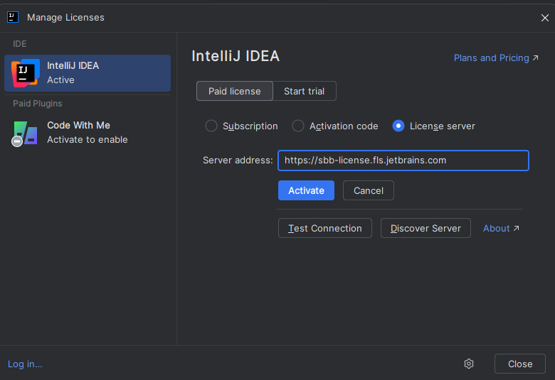

## Ziel

- IntelliJ IDEA ist auf deinem Rechner installiert.
- Du kannst ein einfaches Projekt laden und ausführen.

---

## IntelliJ IDEA installieren

### Schritt 1: Download

1. Öffne [https://www.jetbrains.com/idea/download](https://www.jetbrains.com/idea/download).
2. Wähle die **Community Edition** für dein Betriebssystem.

### Unterschied Community und Ultimate Edition

| Feature                        | Community Edition           | Ultimate Edition                     |
| ------------------------------ | --------------------------- | ------------------------------------ |
| **Lizenz**                     | Kostenlos (Open Source)     | Kostenpflichtig (kommerziell)        |
| **Sprachen-Support**           | Java, Kotlin, Groovy, Scala | Alle aus Community + mehr            |
| **Web-Entwicklung**            | ❌                          | ✅ HTML, CSS, JavaScript, etc.       |
| **Framework-Support**          | Grundlegend (z. B. Maven)   | ✅ Spring, Java EE, Micronaut        |
| **Datenbank-Tools & SQL**      | ❌                          | ✅ Integrierter DB-Support           |
| **Remote Development**         | ❌                          | ✅ (z. B. via JetBrains Gateway)     |
| **Erweiterte Debugging-Tools** | Einfaches Debugging         | ✅ HTTP Client, Performance Profiler |
| **Enterprise Features**        | ❌                          | ✅ (z. B. Jakarta EE, Web Services)  |
| **Support & Updates**          | Community-Support           | ✅ JetBrains-Support                 |

> Die Community Edition eignet sich gut für reine Java/Kotlin-Entwicklung und reicht für die grundlegenden Module auf IT-Ninjas.

> Die Ultimate Edition ist ideal für professionelle Full-Stack- und Enterprise-Entwicklung. Sie wird in späteren Modulen (Angular, Spring Boot) benötigt wenn man nicht auf Visual Studio Code wechseln will.


Wenn du bei der SBB in Ausbildung bist dann wähle hier die **Ultimate Edition**. Damit stehen dir alle Features zur
Verfügung.

Wie du diese Version aktivierst, erfährst du weiter unten.


### Schritt 2: Installation



1. Lade die `.exe`-Datei herunter und starte sie.
2. Wähle:
   - Installationsverzeichnis
   - Optional: `Add launchers dir to the PATH`
   - Optional: `.java`-Dateien mit IntelliJ verknüpfen
3. Klicke auf **Install**.
4. Starte IntelliJ IDEA nach Abschluss der Installation.





1. Lade die `.dmg`-Datei herunter und öffne sie.
2. Ziehe das IntelliJ-Icon in den Ordner `Applications`.
3. Starte IntelliJ IDEA.





1. Lade das `.tar.gz`-Archiv herunter.
2. Entpacke das Archiv (z. B. in `~/apps`).
3. Führe das Startskript `bin/idea.sh` aus.



### Schritt 3: Erststart

Beim ersten Start:

- Frühere Einstellungen übernehmen? → Optional
- UI-Stil wählen (hell/dunkel)
- Plugins konfigurieren

Diese Einstellungen kannst du später jederzeit anpassen.


Nach der Installation beginnt ein 30-tägiger Testzeitraum der **Ultimate Edition**.  
Nutze diesen Zeitraum und fordere eine Lizenz an:

1. Besuche [https://omada.sbb.ch/home](https://omada.sbb.ch/home)
2. Suche nach der Gruppe `DG_RBT_INTELLIJ-LICENSE`
3. Klicke auf **Zugriff anfordern**  
     
   
4. Sobald du Zugriff hast, registriere IntelliJ:

   - Wähle **Activate (another) License**
   - Wähle **License Server**
   - Gib die Adresse `https://sbb-license.fls.jetbrains.com` ein
   - Klicke auf **Activate**  
       
     

Danach ist IntelliJ Ultimate aktiviert.


### Schritt 4: JDK einrichten

Beim Erstellen des ersten Projekts prüft IntelliJ, ob ein Java Development Kit (JDK) vorhanden ist. Falls nicht, erscheint ein Hinweis zum Download.

**Empfohlener Weg:**

1. Klicke auf **Download JDK**
2. Wähle:
   - Version: **17** oder neuer
   - Anbieter: z. B. **JetBrains Runtime** oder **Oracle OpenJDK**
3. IntelliJ lädt und installiert das JDK automatisch.
4. Das JDK wird automatisch dem Projekt zugewiesen.


Ein manuelles Herunterladen und Installieren eines JDKs ist nicht nötig – IntelliJ übernimmt das für dich.


**Empfohlen:** Java 17 oder neuer.

### Schritt 5: Projekt anlegen

1. Klicke auf **New Project**
2. Wähle:
   - Projekttyp: **Java**
   - JDK: auswählen
3. Projektname und Speicherort definieren
4. IntelliJ erstellt ein leeres Projekt


Du kannst auch direkt mit der **Hello World**-Applikation von it-ninja starten:  
Die Einführung findest du [hier](../../../../02_java/03_java-grundlagen/01_java_intro)  
Das Beispielprojekt findest du hier

