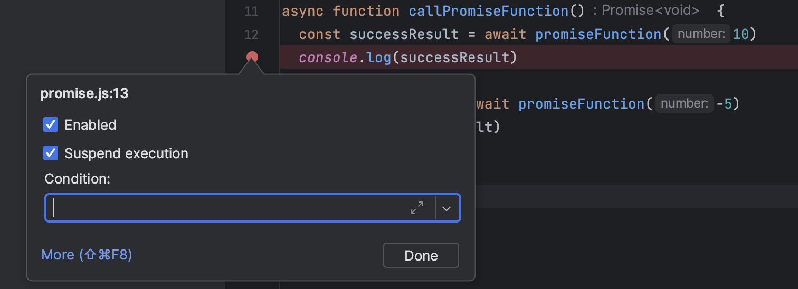
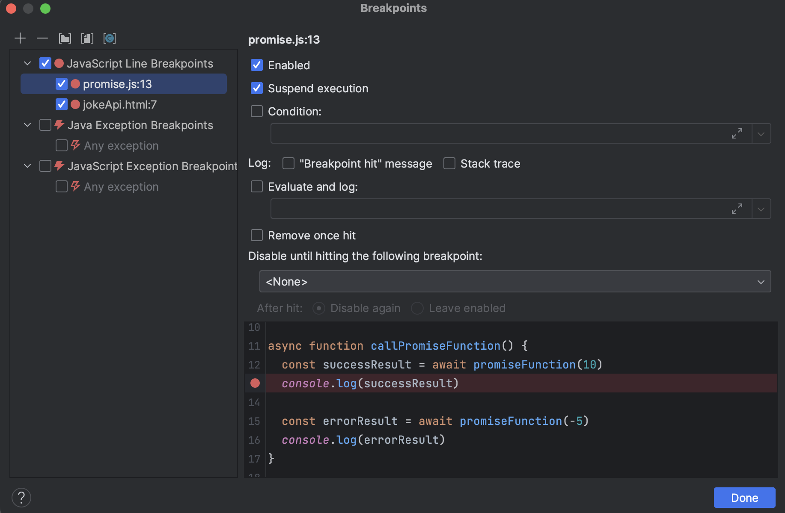
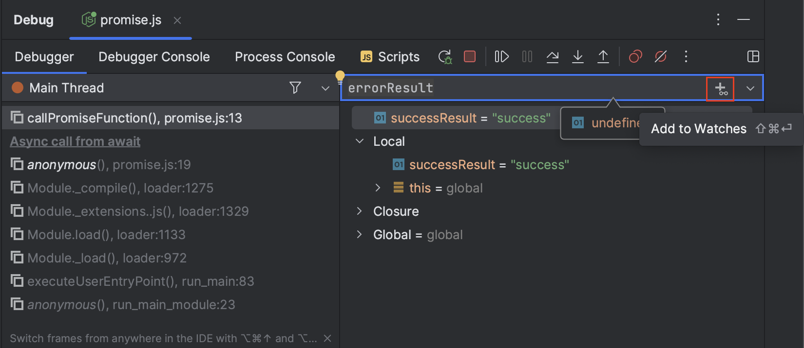


Noch nicht sicher, was Debugging genau ist oder wann man es verwendet? Schau dir zuerst das Modul [Debugging – Fehler finden und verstehen](../../../../02_java/03_java-grundlagen/09_debugging/) an.


## Ziele

- Du kannst in IntelliJ Breakpoints setzen und konfigurieren.
- Du verstehst die wichtigsten Funktionen des Debuggers.
- Du kannst den Zustand deines Programms gezielt analysieren.

## Breakpoints setzen

- **Linksklick** auf die Zeilennummer: Standard-Breakpoint
- **Rechtsklick** für erweiterte Optionen wie Conditional Breakpoints

## Erweiterte Breakpoint-Einstellungen

- Bedingung festlegen
- Nur einmal auslösen
- Log-Nachricht statt Pause
- Nur aktiv, wenn ein anderer Breakpoint vorher ausgelöst wurde

## Debug starten

Klicke oben rechts auf das **Käfer-Symbol**, um im Debug-Modus zu starten:

## Debugger-Panel

Hier findest du alle wichtigen Bereiche:

- **Debugger Controls** (Steuerung)
- **Variables** (aktuelle Werte)
- **Frames** (Call Stack)
- **Watches** (beobachtete Variablen)
- **Console** (Fehlermeldungen, Ausgaben)

### Controls (oben links)

- ▶ Resume: weiterlaufen lassen
- ⏯ Step Over: nächste Zeile
- 🔽 Step Into: in Methode springen
- 🔼 Step Out: aus Methode raus
- ⏹ Stop: Debug beenden
- ♻ Rerun: neu starten
- 🔕 Mute Breakpoints: pausiert alle Breakpoints

### Watches & Variables

Variablen und eigene Ausdrücke überwachen:

- Rechtsklick → „Add to Watches“
- Oder ins Watch-Feld schreiben

## Weitere Infos

👉 [Offizielle JetBrains Doku zu Debugging](https://www.jetbrains.com/help/idea/debugging-code.html)
