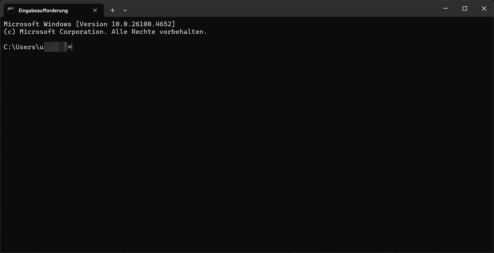
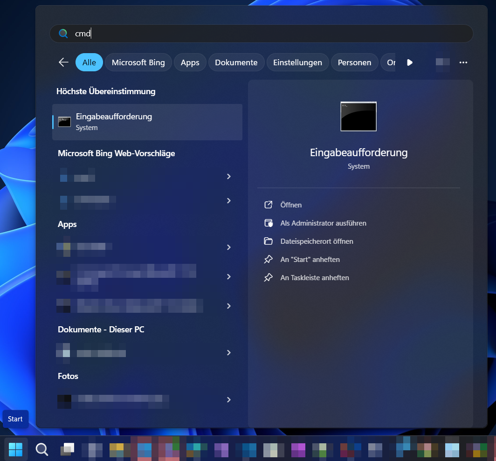

## Ziele

- Ich weiss, was die CMD Shell ist.
- Ich kann sie unter Windows starten.
- Ich verstehe den grundlegenden Einsatzzweck.



## Was ist die CMD Shell?

Die **CMD Shell** (oder _Eingabeaufforderung_) ist eine textbasierte Oberfläche, um Befehle direkt an das
Windows-Betriebssystem zu senden.



Sie ist seit den frühen Windows-Versionen verfügbar und wird oft für Systemadministration, Skripte und Fehlerdiagnosen
verwendet.

Typische Einsatzbereiche:

- Dateien und Ordner verwalten (`dir`, `copy`, `del`, …)
- Netzwerkbefehle ausführen (`ping`, `ipconfig`, …)
- Programme und Skripte starten
- Systemdiagnosen durchführen

## CMD starten

Es gibt mehrere Wege, die CMD Shell zu öffnen:

1. **Über das Startmenü**

   - Klicke auf die **Windows-Taste** oder das **Startmenü**.
   - Tippe `cmd` ein.
   - Drücke **Enter** oder klicke auf **Eingabeaufforderung**.

2. **Mit Administratorrechten**
   - Führe die Schritte oben aus.
   - Klicke mit der rechten Maustaste auf **Eingabeaufforderung**.
   - Wähle **Als Administrator ausführen**.



## Erste Befehle

Probiere in der CMD Shell zum Einstieg:

```text
ver
```

Zeigt die aktuelle Windows-Version an.

```text
help
```

Listet alle verfügbaren Befehle mit kurzer Beschreibung.


Viele CMD-Befehle funktionieren auch in PowerShell, die moderner ist, aber ähnliche Grundlagen hat.

