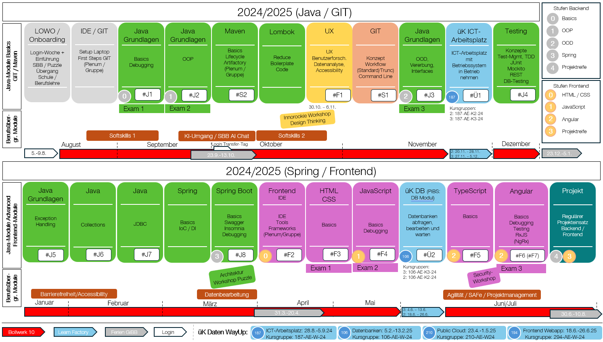

**Willkommen bei deinem Start ins Abenteuer Softwareentwicklung!**  

Unser Ausbildungsprogramm ist dein persönlicher Fahrplan durch die Welt der IT – strukturiert, praxisnah und auf deinen Lernerfolg ausgerichtet.

## Was dich erwartet

Du beginnst direkt mit Java – der meistgenutzten Programmiersprache der Welt. Du schreibst echten Code, baust Anwendungen und bekommst sofort Rückmeldung. Schritt für Schritt erarbeitest du dir die wichtigsten Skills für die Berufswelt von heute.

Jedes Modul ist klar aufgebaut:

- **Lernstoff im Selbststudium** – verständlich aufbereitet, mit Beispielen und Übungen.
- **Labs zum Mitmachen** – du setzt das Gelernte direkt um.
- **Examen zum Abschluss eine Moduls** – stelle das gelernte unter Beweis und zeige was du kannst.

Das Ziel: Du lernst nicht nur Java, sondern auch moderne Tools und Frameworks wie Maven, JUnit, Spring Boot und Angular kennen – und zwar genau so, wie sie auch in echten Projekten eingesetzt werden.

## Dein technischer Werkzeugkasten

Am Ende des Programms kannst du sicher mit diesen Technologien umgehen:

- ✅ **Java** – die Basis moderner Softwareentwicklung
- ✅ **Maven & Testing** – Projekte strukturieren und zuverlässig testen
- ✅ **Spring Boot** – professionelle Backend-Entwicklung
- ✅ **HTML, CSS & JavaScript** – dein Einstieg ins Web
- ✅ **TypeScript & Angular** – moderne Webanwendungen bauen

Alles im begleiteten Selbststudium – individuell, effizient und mit maximalem Praxisbezug.

## Anpassen der Webseite

Unter [Konfiguratuion](../config/) kannst du it-ninjas an deine Bedürfnisse anpassen. Wir empfehlen dir, das gleich zu tun, damit du optimal arbeiten kannst.


Hey cool, willkommen bei der SBB!

Boxen wie diese geben dir zusätzliche Informationen, wie du mit den Tools und Werkzeugen bei SBB deine Herausforderungen meistern kannst. 


Gewisse Tools bedingen, dass du per VPN mit dem Netzwerk von SBB verbunden bist!



---

Starte jetzt mit den [Java Grundlagen](./02_java/03_java-grundlagen/) um bald ein it-ninjas zu werden!

---


## Übersicht Ausbildungsprogramm

Anbei findest du eine Übersicht, welche Module du zu welchem Zeitpunkt anschauen wirst. 


Beachte, die Zeiten sind grobe Vorgaben. Jeder hat sein eigenes Tempo. Es ist wichtig dass du dir Zeit nimmst und den Inhalt verstehst. Die nachfolgenden Module bauen auf das erlernte Wissen auf.



Die berufsübergreifenden Workshops und Erfahrungstransfers sind ebenfalls wichtig – du findest sie ausserhalb von IT-Ninjas in separaten Angeboten.




---

## Direkt zu den Debugging-Seiten

- [Debugging von Java Code in IntelliJ](02_java/03_java-grundlagen/12_debugging)
- [Frontend-Debugging](03_web/03_javascript/24_debugging/)

## Direkt zu den Testing-Seiten

- [Testing Konzepte / JUnit / Mockito](02_java/08_java-testing)
- [Spring Boot Testing](02_java/12_spring-framework/10_spring-boot-testing)
- [Rest-Schnittstellen testen](02_java/12_spring-framework/09_rest-testing/)
- [Angular Testfiles](03_web/06_angular/02_7_unit-test/)
