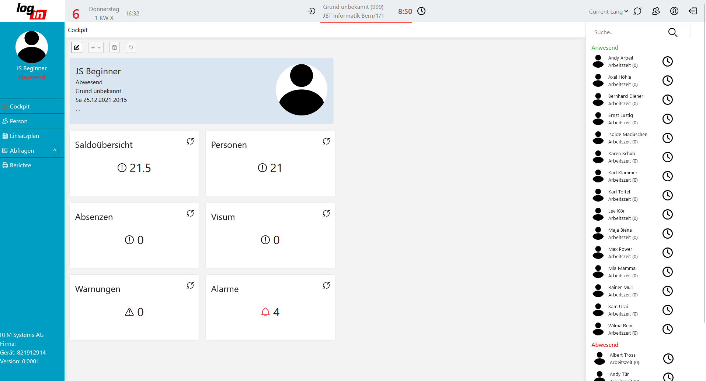

# Exam - Zeiterfassungs-Dashboard mit JavaScript ergänzen

 - Einzelarbeit

Bei diesem Exam geht es darum, dass du das Dashboard, welches du im [HTML-CSS-Exam](../02_html_css/01_exam-html-css-rtm) geschrieben hast, mit JavaScript-Logik ergänzt.

Die Seite sollte ungefähr so aussehen:

## Zeitangaben aktualisieren

Oben links im Zeiterfassungstool ist die aktuelle Zeit zu finden.

    Schreibe ein JavaScript auf dieser Seite, das die aktuelle Zeit oben links anzeigt.

 Hinweis:

Um auf die aktuelle Uhrzeit und auf das Datum zuzugreifen, wirst du sicher auf die Klasse `Date` zugreifen müssen. Hier findest du mehr Informationen darüber: https://www.w3schools.com/jsref/jsref_obj_date.asp

Die Kalenderwoche (KW) hinzuzufügen, ist ein bisschen tricky und deswegen optional. Wenn du diese trotzdem hinzufügen möchtest, dann informiere dich bitte zuerst darüber, was genau eine Kalenderwoche ist. Soweit ich weiss, gibt es keine eingebaute Methode, mit der du die Kalenderwoche bekommst, aber du kannst sie berechnen.

## Navigation zuklappen

Auf der linken Seite hast du eine Navigation. Das Element für "Abfragen" hat wiederum Elemente untergeordnet. Diese Unterelemente sollten beim Klick auf den Pfeil gegen oben (^) verschwinden/zugeklappt werden.

    Schreibe ein JavaScript, das dem User erlaubt,
    das "Abfragen"-Element zuzuklappen und wenn es zugeklappt ist, wieder aufzuklappen.

{}

Wenn du möchtest, kannst du dem Ganzen Animationen verleihen:

- der Pfleil dreht sich, jenachdem ob das Element zu- oder aufgeklappt ist
- das "Berichte"-Element geht langsam nach oben (bzw. der Container mit den Unterelementen wird immer kleiner)

Animationen (bzw. `transition`s) können sehr einfach mit CSS umgesetzt werden, siehe https://www.w3schools.com/css/css3_transitions.asp.

Damit du weniger Schwierigkeiten damit hast, hier ein kleiner Tipp:
Gib allen CSS-Properties einen Default-Wert. Wenn du z.B. einen Wert ändern möchtest, füge dem Element eine genauere CSS-Klasse mit JavaScript hinzu, welche die entsprechenden Regeln überschreibt. Du kannst einem Element eine Klasse hinzufügen bzw. entfernen mit `.classList.toggle(className, show?)` (Beispiel: `document.getElementById('abfragen').classList.toggle('show-child-elements', true)`).

{}

## Dashboard-Daten dynamisch laden

Im HTML-CSS-Exam hast du den Text für die Kacheln hartcodiert. Das soll sich nun ändern.

    Schreibe nun ein JavaScript, dass den Inhalt der Kacheln dynamisch befüllt.

    Dein Script soll die Daten von hier laden:

    https://raw.githubusercontent.com/it-ninjas/labs/master/static/files/json/dashboard.json
    https://raw.githubusercontent.com/it-ninjas/labs/master/static/files/json/dashboard2.json

    Stelle sicher, dass beide Dateien funktionieren.

## Personen für den Chat dynamisch laden

Auf der rechten Seite hast du eine Liste mit Personen für einen Chat. Nun geht es darum, auch diese Liste anhand eines JSONs zu generieren.

    Ergänze dein JavaScript so, dass die Namen für die Chat-Liste von hier geladen werden:

    https://raw.githubusercontent.com/it-ninjas/labs/master/static/files/json/chat.json

    Zeige die Personen dann zeitlich versetzt an:
    Füge zuerst die erste Person ein, warte dann ca. 0.3 Sekunden, zeige dann die zweite Person an usw.

## Suchfunktion

Oben rechts hast du eine "Suche".

    Implementiere eine Suchfunktion, die nur noch diejenigen Chat-Kontakte anzeigt,
    wenn der Suchbegriff in deren Namen vorkommt.

    Implementiere die Suche so, dass die Liste beim Tippen aktualisiert wird.

## Refresh-Button

Oben rechts gibt es einen Refresh-Button.

    Verändere dein HTML und JavaScript so, dass die Daten neu geladen werden, wenn der User auf diesen Refresh-Button klickt.

    Neu geladen werden sollen die Zeitangaben, die Kacheln und der Chat

    Achte darauf, dass du möglichst keine Code-Duplikation hast.
