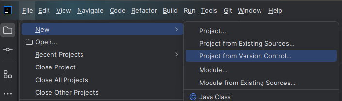
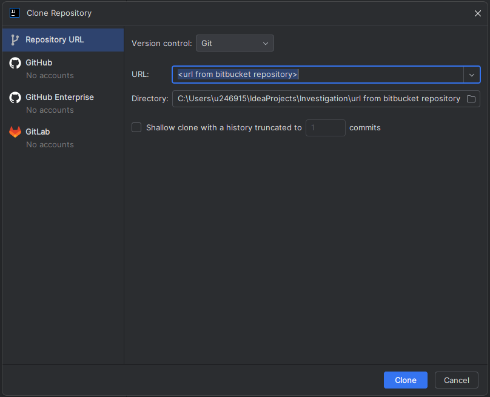
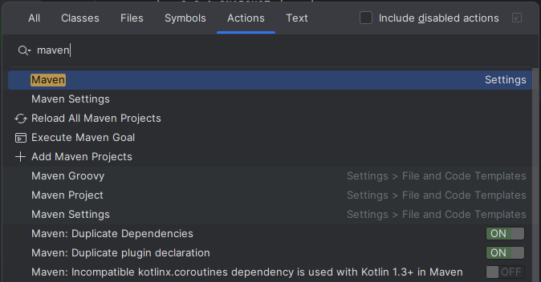

## Vorbereitung

### Repository und Maven Mirror einrichten


Falls du nicht in Ausbildung bei der SBB bist und deinen Code in einem Repository ablegen möchtest, musst du dir ein
eigenes Repository eröffnen, z.B. auf [BitBucket](https://bitbucket.org/), [GitHub](https://github.com/) oder
[Azure](https://azure.microsoft.com/en-us/products/devops/).


1. Erstelle ein neues
   [persönliches Repository](../../../../docs/99_shared/collaboration/source-repositories/personal-bitbucket/)
2. Klone das neue Repository mit IntelliJ IDEA

   

   

3. Richte das Repository ein, wie auf [code.sbb.ch](https://code.sbb.ch/) beschrieben (nachdem man das Repo erstellt hat)
4. Optional: Konfigure den [Maven Mirror von SBB](https://bin.sbb.ch/artifactory/mvn)

> Achtung: Der [Maven Mirror von SBB](https://bin.sbb.ch/artifactory/mvn) ist nur im VPN erreichbar. Mit konfiguriertem
> [Maven Mirror von SBB](https://bin.sbb.ch/artifactory/mvn) kann es beim Builden zu Problemen kommen, wenn man nicht
> mit dem VPN verbunden ist.

### Maven-Projekt aufsetzen

Erstelle ein neues Projekt, welches wir später für das Modul Unit-Testing verwenden werden.

1. Erstelle in IntelliJ IDEA die für Maven erforderliche Ordnerstruktur:
   - Im Root-Verzeichnis des Repositories eine [.gitignore Datei](../../../../docs/99_shared/collaboration/source-repositories/git/01_grundwissen/03_git-basics/#gitignore),
     angepasst für ein IntelliJ Maven Projekt.
   - Ordner src erstellen
   - Im Ordner src zwei Ordner erstellen: main und test
   - In den beiden Ordnern main und test jeweils zwei weitere Ordner erstellen: java und resources
   - Die Ordner markieren (Rechtsklick -> Mark Directory as...)
     - src/main/java -> Sources Root
     - src/main/resources -> Resources Root
     - src/test/java -> Test Sources Root
     - src/test/resources -> Test Resources Root
2. Lege im Root des Projektes eine Datei mit dem Namen pom.xml an und füge den folgenden Inhalt ein:

   ```xml
   <?xml version="1.0" encoding="UTF-8"?>
   <project xmlns="http://maven.apache.org/POM/4.0.0" xmlns:xsi="http://www.w3.org/2001/XMLSchema-instance"
            xsi:schemaLocation="http://maven.apache.org/POM/4.0.0 https://maven.apache.org/xsd/maven-4.0.0.xsd">
       <modelVersion>4.0.0</modelVersion>

       <groupId>Deine Group-ID</groupId>
       <artifactId>Deine Artifact-ID</artifactId>
       <version>0.0.1-SNAPSHOT</version>
       <name>Name des Projekts</name>
       <description>Beschreibung des Projekts</description>

       <properties>
           <project.build.sourceEncoding>UTF-8</project.build.sourceEncoding>
           <java.version>Java-Major-Version wählen, z.B. 21</java.version>
           <maven.build.timestamp.format>yyyy-MM-dd HH:mm</maven.build.timestamp.format>
           <timestamp>${maven.build.timestamp}</timestamp>
       </properties>

       <dependencies>
           <!-- Test -->
           <dependency>
               <groupId>org.junit.jupiter</groupId>
               <artifactId>junit-jupiter</artifactId>
               <version>5.6.2</version>
               <scope>test</scope>
           </dependency>
           <dependency>
               <groupId>org.junit.jupiter</groupId>
               <artifactId>junit-jupiter-api</artifactId>
               <version>5.6.2</version>
               <scope>test</scope>
           </dependency>
           <dependency>
               <groupId>org.junit.jupiter</groupId>
               <artifactId>junit-jupiter-engine</artifactId>
               <version>5.6.2</version>
               <scope>test</scope>
           </dependency>
           <dependency>
               <groupId>org.junit.jupiter</groupId>
               <artifactId>junit-jupiter-params</artifactId>
               <version>5.6.2</version>
               <scope>test</scope>
           </dependency>
           <dependency>
               <groupId>org.junit.vintage</groupId>
               <artifactId>junit-vintage-engine</artifactId>
               <version>5.6.2</version>
               <scope>test</scope>
           </dependency>
           <dependency>
               <groupId>org.junit.platform</groupId>
               <artifactId>junit-platform-engine</artifactId>
               <version>1.7.0-RC1</version>
               <scope>test</scope>
           </dependency>
           <dependency>
               <groupId>org.junit.platform</groupId>
               <artifactId>junit-platform-commons</artifactId>
               <version>1.7.0-RC1</version>
               <scope>test</scope>
           </dependency>
           <dependency>
               <groupId>org.mockito</groupId>
               <artifactId>mockito-core</artifactId>
               <version>4.1.0</version>
               <scope>test</scope>
           </dependency>
       </dependencies>

       <build>
           <plugins>
               <plugin>
                   <groupId>org.apache.maven.plugins</groupId>
                   <artifactId>maven-compiler-plugin</artifactId>
                   <configuration>
                       <compilerVersion>${java.version}</compilerVersion>
                       <source>${java.version}</source>
                       <target>${java.version}</target>
                   </configuration>
               </plugin>
           </plugins>
       </build>

       <developers>
           <developer>
               <id>Deine Personalnummer</id>
               <name>Dein Name</name>
               <email>Dein E-Mail</email>
               <organization>SBB</organization>
               <organizationUrl>https://www.sbb.ch</organizationUrl>
               <roles>
                   <role>Deine Rolle</role>
               </roles>
           </developer>
       </developers>
   </project>
   ```

3. Passe die GroupID und ArtifactID gemäss der Theorie an. Dabei kannst du für die GroupID ch.sbb.{dein_name} und für
   die ArtifactID die aktuelle Aufgabe wählen, also zum Beispiel `ch.sbb.johncarmack:J5`.
4. Passe die Java Version an: `<java.version>Java-Major-Version wählen, z.B. 21</java.version>`. Mit dem Befehl
   `mvn --version` oder `java --version` findest du heraus, welche Version verwendet wird (Achtung, als Version nur die
   erste Zahl von der Version nehmen).
5. Hinterlege das Projekt im IntelliJ als Maven-Projekt. Zu diesem Zweck Ctrl+Shift+A drücken und unter Aktion nach
   "Maven" suchen.

   Aus der Liste dann entweder "Add as Maven Project" oder "Add Maven Projects" wählen.

   Bei der ersten Aktion wird das Projekt direkt hinzugefügt, bei der zweiten muss das pom.xml noch ausgewählt werden.

   

6. Auf der rechten Seite in IntelliJ gibt es den Tab Maven, dort müsste das Projekt nun erscheinen.

Wenn alles geklappt hat, dann werden die definierten Abhängigkeiten aus dem POM in das lokale Repository heruntergeladen.

<details>
<summary>MAVEN Troubleshoot</summary>

Es kann sein, dass nach Ctrl+Shift+A und dem Auswählen als Maven Project der Maven Tab rechts nicht erscheint. Der Grund
wird wahrscheinlich ein Fehler im pom.xml sein.

Um den Fehler zu finden kannst du in IntelliJ eine Konsole öffnen und dort den Befehl `mvn install clean -e` ausführen.
Das `-e` gibt zusätzliche Informationen in der Konsole aus, falls es ein Problem gibt.

</details>

## Aufgaben

### Aufgabe 1 - Warnungen behandeln

Mit dem folgenden Befehl kannst Du die Maven Umgebung so aufsetzen, wie sie im pom.xml definiert ist:

```
mvn clean install -e
```

Dabei wirst Du womöglich feststellen, dass es mehrere Warnings gibt.

Schau Dir die Warnings an und passe das pom.xml an, damit die Warnings nicht mehr kommen. Falls Du nicht weisst, welche
Version Du für eine Dependency oder ein Plugin nehmen sollst, kannst Du im [Maven Repository](https://mvnrepository.com/)
nachschauen gehen.

### Aufgabe 2 - Dependencies aktualisieren

Im pom.xml wird z.B. `org.junit.jupiter:junit-jupiter` in der Version 5.6.2 verwendet. Diese ist aus dem Jahr 2020 und
hat zahlreiche Verbesserungen erfahren. Auch die anderen Dependencies sind schon recht alt.

Aktualisiere alle Dependencies mit Hilfe des Plugins `org.codehaus.mojo:versions-maven-plugin`:

- Installiere das Plugin in der pom.xml, den Xml-Code für das Plugin findest du im Maven Repository.

- Mit der Standard Konfiguration werden die Dependencies auf die aktuellste Version aktualisert. Das kann auch ein
  Snapshot oder ein Version mit Qualifier sein. Um nur Releases zu berücksichtigen kannst du folgende Konfiguration zum
  `org.codehaus.mojo:versions-maven-plugin` Plugin hinzufügen (damit werden alle Versionen ignoriert, welche ein '-'
  enthalten):

  ```
    <configuration>
        <ignoredVersions>.*-.*</ignoredVersions>
    </configuration>
  ```

- Mit dem folgenden Befehl kannst du testen, wie ein Update aussehen würde:

  ```
    mvn versions:display-dependency-updates
  ```

- Wenn du mit dem Resultat zufrieden bist, die pom.xml mit folgendem Befehl aktualisieren:
  ```
    mvn versions:use-latest-versions
  ```

### Aufgabe 3 - Remote Repository einrichten

- Erstelle auf deinem Rechner ein Verzeichnis (z.B. unter `C:\Development\Repository`)

- passe die Einstellungen in deinem Projekt so an, dass beim Befehl `mvn deploy` das Artefakt von deinem Projekt in
  den zuvor erstellten Ordner erstellt wird.

---

Hier kannst du [zurück zur Theorie](../../../../docs/02_java/07_maven).
