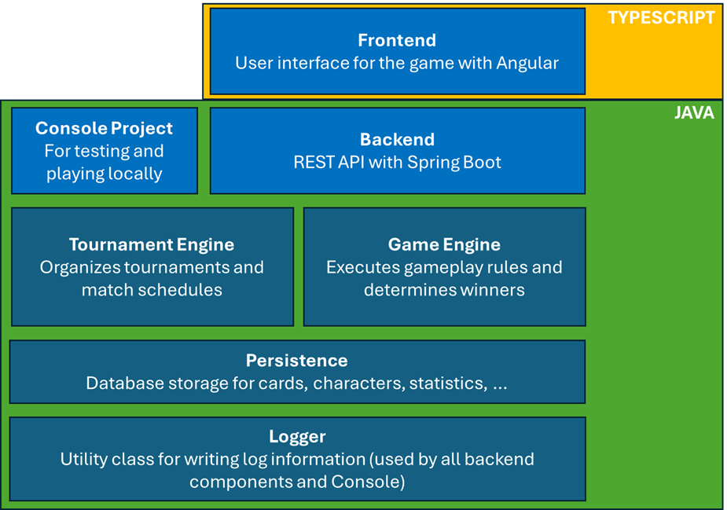

## Projekt 2025 – Online Game

Im Projekt 2025 ist das Ziel, ein einfaches Spiel zu realisieren, das online auf einer Webseite spielbar ist.  
Die einzelnen Teilprojekte orientieren sich am Ausbildungsstand und wachsen am Ende zu einer Gesamtlösung zusammen.

### Module

- **Logger**  
  Utility-Klasse zur Ausgabe von Informationen über den Programmablauf.  
  Erste Version ohne OOP, rein statisch.

- **Tournament Engine**  
  Package, das verschiedene Turnierarten unterstützt (z. B. Jeder-gegen-Jeden, KO-System, Weltmeisterschaft).  
  Teilnehmer und Spielorte können definiert werden, der Ablauf ist abrufbar oder via Callbacks/Dependency Injection steuerbar.

- **Game Engine**  
  Verantwortlich für den Spielablauf.  
  Zwei Implementierungen werden erstellt: _Trumpf-Quartett_ und ein _Fantasy-Kampf-Spiel_ (z. B. Elfen gegen Hexen).

- **Persistence**  
  Speicherung von Spielständen sowie Eigenschaften (z. B. Trumpfkarten, Fantasy-Figuren) in einer Datenbank.

- **Backend**  
  Anstelle der Konsole wird das Spiel über eine REST-API mit Spring Boot zugänglich.

- **Frontend**  
  Zum Abschluss erhält das Spiel ein ansprechendes Web-Frontend.

Das Lernprojekt erstreckt sich über rund **11 Monate** und läuft parallel zum Modulplan.  
Die Projektaufgaben orientieren sich jeweils am aktuellen Ausbildungsstand.

### Architektur Übersicht

### Varianten

Es stehen zwei Umsetzungen zur Auswahl:

- **Herr der Bits und Bytes** – lass Elfen, Gnome, Zauberer und Hexen digital gegeneinander kämpfen
- **Trumpf-Quartett** – wähle ein Thema (z. B. Schiffe, Autos, Blumen) und entwickle ein digitales Kartenspiel
