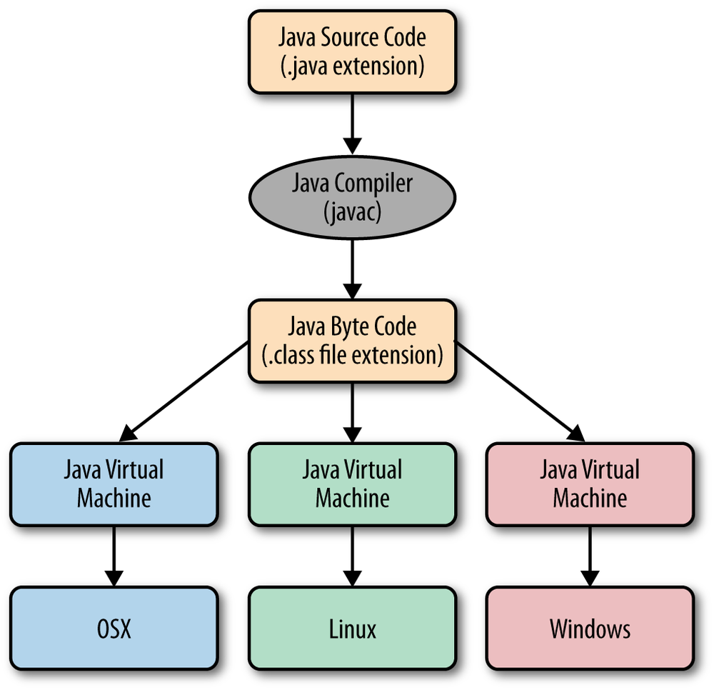

## Ziele

- Ich weiss, dass jede Anweisung mit einem Strichpunkt (auch bekannt als Semikolon: `;`) abgeschlossen werden muss.
- Ich weiss, dass geschweifte Klammern einen Block definieren und ich verwende sie in jeder Kontrollstruktur, um die Codeblöcke voneinander abzugrenzen.
- Ich kenne die `main`-Methode und weiss, warum eine Applikation nur EINE main-Methode haben sollte.
- Ich kenne die Methode `System.out.println` und kann sie anwenden.

### Cheatsheet zum Herunterladen

[Core Java Cheatsheet](./resources/cheatsheet.pdf)

---

## Einführung

### Was ist Java?

Java ist eine objektorientierte Programmiersprache, die schon seit über zwei Jahrzehnten grosse Popularität geniesst.
Die Entwicklung von Java begann Anfang der 1990er-Jahre beim US-amerikanischen Hard- und Softwarehersteller Sun Microsystems.
1995 wurde die erste Version veröffentlicht. 2010 wurde Sun Microsystems von Oracle übernommen.
Gegenwärtig erscheinen im Halbjahrestakt neue Java-Versionen; die nächste Version, Java 24, wird im März 2025 veröffentlicht.

---

### Wichtigste Merkmale von Java

#### Plattformunabhängigkeit: «Write once, Run anywhere»

Programmiersprachen wie Java können von einem Computer nicht interpretiert werden. Diese Sprachen sind speziell implementiert, dass sie für Entwickler einfach zu verstehen und schreiben sind.
Der **Compiler** ist ein Programm, das den von dir geschriebenen Code in eine andere Form umwandelt, die der Computer verstehen kann.
In Java wandelt der Compiler den Quellcode in Bytecode um.

**Bytecode** ist ein Zwischencode, der nicht direkt von der Hardware deines Computers ausgeführt wird, sondern von einer speziellen Software, der Java Virtual Machine (JVM).

Die **Java Virtual Machine** ist eine virtuelle Maschine, das heisst, sie simuliert einen Computer innerhalb deines Computers.
Die JVM kann den Bytecode ausführen, egal ob der simulierte Computer auf Windows, Linux oder Mac OS läuft.
Der Vorteil von Bytecode ist, dass er plattformunabhängig ist.
Das bedeutet, dass du deinen Java-Code einmal schreibst und dann auf jedem Betriebssystem ausführen kannst, das eine JVM unterstützt, ohne den Code anpassen zu müssen.

#### Mehrfach-Paradigma

Java ist in erster Linie eine **objektorientierte** Programmiersprache.
Das bedeutet, dass in Java fast alles als ein **Objekt** dargestellt wird.
Ein Objekt ist eine Art Bauplan, der verschiedene Eigenschaften (Daten) und Funktionen (Methoden) enthält.
Diese Objekte basieren auf sogenannten **Klassen**, die als Vorlagen für das Erstellen von Objekten dienen.

Stell dir vor, du programmierst ein Spiel, in dem Autos vorkommen.
Jedes Auto hat bestimmte Eigenschaften wie Farbe, Geschwindigkeit oder Marke.
Diese Eigenschaften kannst du in einer Klasse namens `Auto` festlegen.
Jedes einzelne Auto in deinem Spiel wäre dann ein Objekt, das auf dieser Klasse basiert – also eine **Instanz** (ein Exemplar) der Klasse `Auto`.
Somit haben zum Beispiel ein Ferrari und ein Fiat eine Geschwindigkeit und eine Farbe, jedoch sind diese Werte bei beiden unterschiedlich.

Ein Java-Programm besteht also aus vielen dieser Objekte, die zusammenarbeiten und miteinander kommunizieren, um Aufgaben zu erledigen.
Wenn wir ein Programm schreiben, beschreiben wir, wie diese Objekte miteinander interagieren sollen.

Java unterstützt aber auch andere Programmierparadigmen, das heisst, andere Arten, wie man ein Programm strukturieren kann, unter anderem:

- **Generische Programmierung**: Generische Programmierung erlaubt es, Methoden und Klassen so zu schreiben, dass sie mit verschiedenen Datentypen funktionieren. Statt für jeden Datentyp eine eigene Version zu schreiben, kannst du einen Platzhalter verwenden.
- **Parallele Programmierung**: Java ermöglicht es, dass mehrere Aufgaben gleichzeitig ausgeführt werden. Dies ist besonders nützlich, wenn Programme schneller und effizienter ausgeführt werden sollen.
- **Funktionale Programmierung**: Auch wenn Java hauptsächlich objektorientiert ist, unterstützt es teilweise auch funktionale Programmierung, bei der Funktionen wie Variablen behandelt und in andere Funktionen übergeben werden können. Hier wird weniger Fokus auf Objekte und Klassen gelegt.

#### Ausführbarer Bytecode

Eine kompilierte Java-Klasse, die bestimmte Voraussetzungen erfüllt (wie eine Main-Methode, siehe untern im Beispiel), kann direkt ausgeführt werden.
Applikationen und Klassenbibliotheken bestehen oft aus mehreren Klassen, die in einer JAR-Datei (Java-Archiv) zusammengefasst sind.
Diese Datei kann leicht verteilt und von der JVM ausgeführt werden. Eine JAR-Datei ist technisch gesehen eine komprimierte Datei im ZIP-Format.

#### Klassenpfad

Der Klassenpfad gibt der JVM an, wo sich die Java-Klassen befinden, die sie zum Ausführen benötigt.
Diese Klassen können in Ordnern oder in JAR-Dateien abgelegt sein.
Der Klassenpfad kann bei der Ausführung des Programms übergeben oder als Umgebungsvariable eingestellt werden.

#### Garbage Collector

Java kümmert sich automatisch um das Aufräumen nicht mehr benötigter Objekte im Speicher. Das sind also Daten, welche vom Programm nicht mehr verwendet werden.
Diese Aufgabe übernimmt der sogenannte Garbage Collector, der zur Laufzeit (also wenn das Programm läuft) überflüssige Objekte entfernt.
In anderen Programmiersprachen wie C oder C++ muss der Entwickler sich um das Aufräumen von ungenutzten Daten kümmern.
Dies kann zu Fehler im Programm führen und macht die Entwicklung aufwendiger.

#### Multithreading

Java unterstützt die parallele Ausführung mehrerer Threads (kleine Subprozesse) innerhalb eines Programms.
Dadurch können Aufgaben schneller und effizienter erledigt werden, besonders bei komplexen Anwendungen, welche eine grosse Anzahl an Daten bearbeiten.

---

### Code, Compile, Run

Als Java-Entwickler/in schreibst du ein Programm in eine Textdatei mit der Erweiterung `.java`.
Diese Datei enthält den Quellcode.
Der Compiler (`javac`) wandelt diesen Quellcode in eine `.class`-Datei um, die den Bytecode enthält.
Anschliessend führt die JVM den Bytecode aus.
Der Prozess von „Code schreiben“ über „kompilieren“ bis hin zum „ausführen“ sieht einfach aus, doch die eigentliche Arbeit übernimmt die JVM, die den plattformunabhängigen Bytecode ausführt:


---

## Hello World

Anhand des simplen Hello-World-Programms können wir bereits vieles über die zentralen Bestandteile einer Java-Anwendung erklären. Der folgende Quellcode ist in einer Datei mit dem Namen `HelloWorld.java` abgelegt.

```java
public class HelloWorld {
    public static void main(String[] args) {
        System.out.println("Hello, world!");
    }
}
```

1. **Klasse definieren**: Der Quellcode beginnt mit der Definition einer Klasse namens `HelloWorld`. Der Name der Klasse muss exakt mit dem Dateinamen übereinstimmen, also wie oben definiert: `HelloWorld.java`. Der Block der Klasse beginnt und endet mit geschweiften Klammern {}.

2. **Die `main`-Methode**: Die main-Methode ist der Startpunkt jedes Java-Programms. Sie wird als Erstes aufgerufen, wenn du dein Programm ausführst. Der Name der Methode ist immer main und ihre Signatur lautet:

   ```java
   public static void main(String[] args){}
   ```

   Dies bedeutet, dass die Methode öffentlich zugänglich (`public`) ist, zur Klasse selbst gehört (`static`) und sie keinen Rückgabewert hat (`void`).

3. **Ausgabe auf die Konsole**: Innerhalb der main-Methode befindet sich die Anweisung `System.out.println("Hello, world!");`. Diese Anweisung gibt den Text „Hello, world!“ in der Konsole aus. Jede Anweisung in Java endet mit einem Semikolon.

Jetzt kennst du die Grundstruktur eines Java-Programms! Probiere es aus, indem du dein erstes Programm schreibst und kompilierst.

 Jetzt bist du dran. Löse bitte die [Aufgabe 1](../../../../labs/L02_java/L03_java-grundlagen/L01_basicexercises/#aufgabe-1---ausgaben-auf-die-kommandozeile) in den Labs.
