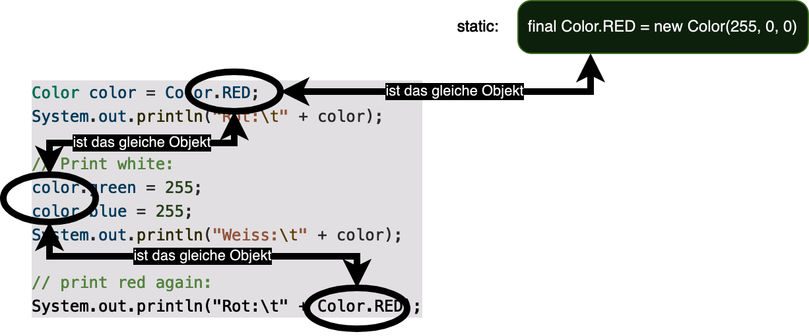

## Ziele

- Ich kann eine Möglichkeit aufzeigen, wie Felder nie überschrieben werden dürfen.
- Ich kann erklären, wie die Objekte von eigenen Klassen "unveränderlich" gemacht werden können.
- Ich kann auswendig erklären, welche Vorteile unveränderliche Klassen bieten.

## Felder unveränderlich machen

Manchmal wirst du in Klassen Felder haben, die sich nie ändern werden - und auch nie sollten. Damit sich ein Feld nicht ändern kann, kannst du das Keyword `final` vor dem Datentyp angeben. Im folgenden Beispiel haben wir eine Klasse für einen Schweizer Staatsbürger, der einen Namen besitzen kann, der sich ändern kann. Zusätzlich müssen alle BürgerInnen eine AHV-Nummer (`socialSecurityNumber`), die sich (im Normalfall) nie ändert:

```java
public class SwissCitizen {
    private String name;
    private final String socialSecurityNumber; // AHV-Nummer

    public SwissCitizen(String name, String socialSecurityNumber) {
        this.name = name;
        this.socialSecurityNumber = socialSecurityNumber;
    }
}
```

Das `final`-Keyword bewirkt bei Instanzvariablen, dass sie nur einmal gesetzt werden können - entweder direkt oder spätestens im Konstruktor.

Nachher darf der Wert dieser Variable nicht mehr geändert werden, wieso folgender Code zu einem Kompilierfehler führt:

```java
public class SwissCitizen {
    ...

    public static void main(String[] args) {
        var person = new SwissCitizen("Hans-Ruede Meier", "756.1234.5678.90");

        // Hans-Ruedi hat geheiratet :D
        person.name = "Hans-Ruedi Müller";
        person.socialSecurityNumber = "756.0000.0000.01"; // Gibt einen Compiler-Fehler
    }
}
```

Somit bietet das `final`-Keyword eine gute Möglichkeit an zu garantieren, dass ein Feld nicht später aus Versehen verändert wird.

## Veränderungen an Objekten - Immutable & mutable objects

In der Programmierung gibt es ein wichtiges Konzept, das "Unveränderlichkeit" (Englisch: Immutability) genannt wird. Unveränderlichkeit bedeutet, dass ein Objekt nie seine Werte ändert. Wenn wir diese Werte ändern wollen, müssen wir ein neues Objekt erstellen.

Das klassische Beispiel ist die Klasse `String`. Zeichenfolgen sind unveränderliche Objekte, sodass alle String-Operationen einen neuen String erzeugen.

```java
String alice = "alice";
alice.toUpperCase();
System.out.println(alice); // Output: alice --> unveränderlich!

String aliceCapitalLetters = alice.toUpperCase();
System.out.println(aliceCapitalLetters); // Output: ALICE
```

Unsere neudefinierte Klasse `Color` hingegen ist nicht unveränderlich:

```java
public class Color {
    private int red;
    private int green;
    private int blue;

    public Color(int red, int green, int blue) {
        this.red = red;
        this.green = green;
        this.blue = blue;
    }

    @Override
    public String toString() {
        return String.format("Color(%s, %s, %s)",  red, green, blue);
    }

    // Konstanten(?), damit Farben beim Namen genannt werden können:
    public static final Color RED = new Color(255, 0, 0);
    public static final Color GREEN = new Color(0, 255, 0);
    public static final Color BLUE = new Color(255, 0, 255);
    public static final Color YELLOW = new Color(255, 255, 0);

    public static final Color WHITE = new Color(255, 255, 255);
    public static final Color BLACK = new Color(0, 0, 0);
}
```

Da `Color` in diesem Beispiel veränderlich ist, kann jedes Feld verändert werden:

```java
// print color red:
Color color = Color.RED;
System.out.println("Rot:\t" + color);

// Print white:
color.green = 255;
color.blue = 255;
System.out.println("Weiss:\t" + color);

// print red again:
System.out.println("Rot:\t" + Color.RED);
```

Die letzte Zeile führt zu dieser Ausgabe, die falsch ist:

```
Rot:    Color(255, 255, 255)
```

Das Problem mit unserem Code ist, dass wir erwarten, dass `Color.RED` dem Wert von `new Color(255, 0, 0)` entspricht, da die statische Variable sogar mit `final` deklariert wurde. Und das würde auch jede(r) andere Entwickler(in) erwarten!

Das Problem war, dass wir immer wieder auf das gleiche Objekt zugegriffen haben, das wir auch bearbeitet haben, was dieses Diagramm verdeutlicht:



Möchten wir, dass `Color` diesen Erwartungen gerecht wird, dann müssen wir sie unveränderlich (`immutable`) machen. Dann ist jedes ihrer Felder unveränderlich. Dies geschieht mit dem `final`-Key-Word vor allen Feldern innerhalb der Klasse:

```java
public class Color {
    private final int red;
    private final int green;
    private final int blue;

    ...
}
```

Nun führt die Anweisung `color.green = 255;` zu einem Fehler, weil das Feld `green` unveränderlich ist und deshalb nicht geändert werden kann.

Der Vorteil von diesem Code ist nun, dass `Color.RED` immer einen Wert zurückgibt, der wirklich die Farbe Rot repräsentiert.

### Ein zweites Beispiel

Oft lohnt es sich, Klassen die dafür verwendet werden, um Daten in einem Objekt zwischen zu speichern, immutable zu definieren. Nehmen wir hierzu wieder die Klasse `Color`, die genau diesem Zweck dient.

Im ersten Beispiel gehen wir davon aus, dass `Color` veränderlich ist (also keine `final`-Keywords vor den Instanzvariablen). Hier bieten wir eine statische Methode an, die aus einer Farbe einen Grau-Wert produziert:

```java
 public static Color convertToGrayScale(Color color) {
    // Helligkeit berechnen (Grün wird als Heller empfunden als z.B. Blau):
    int luminance = (int) (
        0.299 * color.red +
        0.587 * color.green +
        0.114 * color.blue);

    // Bei einem Grauton haben alle Farbwerte den gleichen Wert:
    color.red = luminance;
    color.green = luminance;
    color.blue = luminance;

    return color;
}

public static void main(String[] args) {
    Color color = Color.RED;
    Color grayScale = convertToGrayScale(color);

    System.out.println("Rot:\t" + color);
    System.out.println("Gray Scale:\t" + grayScale);
}
```

Logischer Weise führt dieser Code zu einer unerwünschten Ausgabe in der Konsole. Offensichtlich ist der Fehler in der `convertToGrayScale(...)`-Methode, wo wir die Instanz-Variablen vom Parameter überschreiben, was wir nicht sollten. Obwohl dieses Beispiel den Fehler sehr offensichtlich begeht, ist das ein Fehler, der sehr oft passiert:

> Methoden, die einen neuen Wert berechnen oder holen (`get`), sollten im Normalfall bestehende Werte nicht bearbeiten. Sehr oft führt das dazu, dass Dinge passieren, die man als Aufrufer nicht erwartet und man muss Fehler an unerwarteten Stellen suchen, weil die Methode mehr macht als zu erwarten ist.

> Solche `convert...`- bzw. `get...`-Methoden sollten einen **neuen** Wert zurückgeben, anstatt einen bestehenden zu verändern. Ein Indiz dafür, dass dieses Prinzip verletzt wird, ist oft, dass eine `get...()`-Methode den Rückgabe-Wert `void` besitzt (hier nicht der Fall).

Oft ist es nicht so offensichtlich wie hier. Schreibt man die Klassen von Anfang an immutable, so ist der Code ganz generell viel weniger Fehler anfällig (erst recht, wenn der Code parallel auf mehreren Prozessoren läuft) und das Vorgehen führt dazu, dass zukünftiger Code automatisch lesbarer (aka "schöner") wird - was dir in Zukunft sicherlich viel Zeit ersparen wird.

Die gleiche `convertToGrayScale(color)` müsste mit der immutable-Version der Klasse umgeschrieben werden, damit kein Kompilierfehler auftritt (und nun funktioniert sie wie erwartet):

```java
public static Color convertToGrayScale(Color color) {
    // Helligkeit berechnen (Grün wird als Heller empfunden als z.B. Blau):
    int luminance = (int) (0.299 * color.red + 0.587 * color.green + 0.114 * color.blue);

    // Bei einem Grauton haben alle Farbwerte den gleichen Wert:
    return new Color(luminance, luminance, luminance);
}
```

Der Hauptunterschied mit `immutable` Klassen ist daher, dass so viel öfters neue Instanzen generiert werden.

---

 Jetzt bist du dran. Löse alle verbleibenden [OOP Aufgaben](../../../../labs/L02_java/L04_java-oop).
