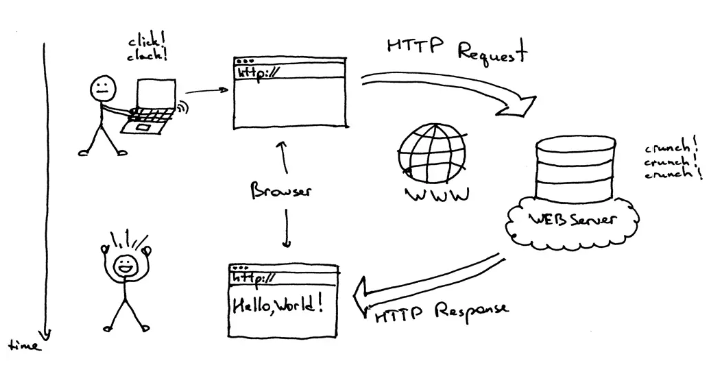
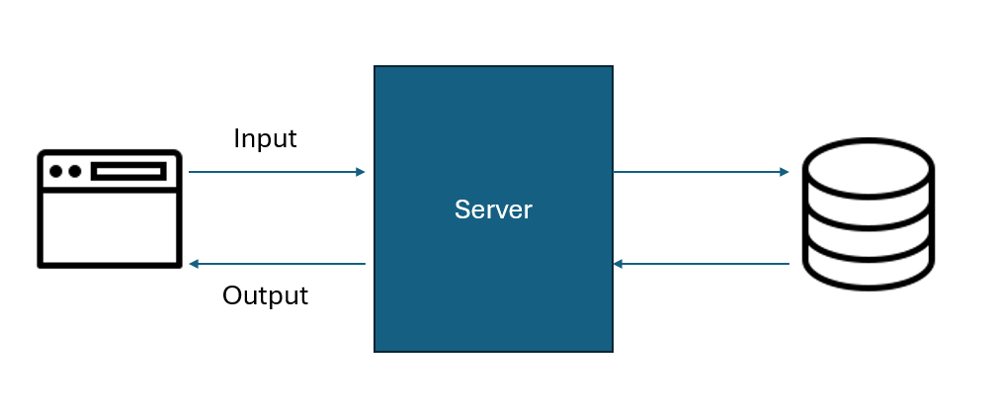
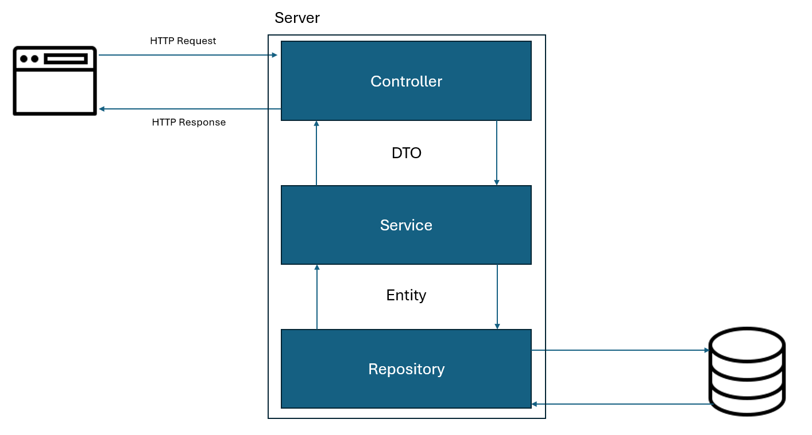

## Vom Kommandozeilentool zur Webapplikation

Bisher hast du Programme geschrieben, welche auf der Kommandozeile laufen. Dein Code könnte zum Beispiel so aussehen:

```java
public class HelloWorld {
    public static void main(String[] args) {
        System.out.println("Hallo, Welt!");
    }
}
```

Das ist perfekt, um Grundlagen zu üben – aber was, wenn du eine Anwendung entwickeln möchtest, die über einen Browser erreichbar ist? Wie funktioniert eine Webseite wie sbb.ch eigentlich? Wie können Nutzer:innen Züge suchen oder Tickets buchen?

Genau hier kommt das Internetprotokoll **HTTP** ins Spiel.

---

## HTTP: Wie dein Browser mit Servern spricht

HTTP (HyperText Transfer Protocol) ist ein Protokoll, mit dem Clients (z. B. dein Browser) und Server (z. B. sbb.ch) miteinander kommunizieren. Ursprünglich wurde es entwickelt, um HTML-Dateien von Servern abzurufen.

Wenn du https://sbb.ch im Browser öffnest, passiert Folgendes:

1. Dein Browser sendet eine HTTP-Anfrage an den Server.
2. Der Server antwortet mit Dateien – oft HTML, CSS oder JavaScript.
3. Dein Browser stellt daraus die Webseite zusammen, die du siehst.



Quelle: https://www.browserstack.com/guide/what-is-browser

---

## REST: Was, wenn du Daten statt Dateien möchtest?

Angenommen, du möchtest wissen, welche Züge heute von Zürich nach Bern fahren. Statt einer Webseite benötigst du nun reine Daten (z.B. eine Liste der Züge). Oder du möchtest neue Fahrten hinzufügen.

Hierfür nutzt man oft REST (**Representational State Transfer**).

REST beschreibt, wie Webservices aufgebaut sein sollen. Die wichtigsten HTTP-Methoden dafür sind:

- **GET** → Daten abrufen
- **POST** → Daten erstellen
- **PUT** → Daten aktualisieren
- **DELETE** → Daten löschen

Ein typischer REST-Endpunkt könnte so aussehen:

```
GET /api/zuege?von=Zürich&nach=Bern
```

Dazu benötigst du eine passende Methode, welche auf diesen Endpunkt mappt, auf deinem Server (also in deinem Programm). Spring nutzt dafür **Annotationen**:

```java
@RestController
@RequestMapping("/api/zuege")
public class ZugController {

    @Autowired
    private ZugService zugService;

    @GetMapping
    public List<Zugverbindung> suche(@RequestParam String von, @RequestParam String nach) {
        return zugService.findeZugverbindungen(von, nach);
    }
}
```

- **@RestController** markiert diese Klasse als REST-Controller - hier sollen also HTTP-Anfragen gemappt werden.
- **@RequestMapping** legt fest, auf welchen Pfad diese Klasse reagiert - also zum Beispiel `/api/zuege`.
- **@GetMapping** wird bei GET-Anfragen auf diesem Pfad, also `GET /api/zuege`, ausgeführt.
- **@RequestParam** liest URL-Parameter aus.

---

## Java-Objekte über HTTP senden: JSON & Jackson

Das Problem: Du arbeitest mit Java-Objekten – HTTP spricht aber nur Text.
Vielleicht möchtest du nicht immer nur ein paar Strings haben, sondern ganze Listen von Objekten.
Daher brauchen wir eine Möglichkeit, Objekte in Text zu verwandeln - und umgekehrt.

Hier hilft **JSON** (**JavaScript Object Notation**), ein einfaches Datenformat:

```json
{
  "von": "Zürich",
  "nach": "Bern",
  "zeit": 1743511904
}
```

Um JSON in Java zu nutzen, definieren wir ein DTO (**Data Transfer Object**):

```java
public record TravelRequestDto(
    String von,
    String nach,
    Integer zeit
) {}
```

Dank der Bibliothek **Jackson** geschieht die Umwandlung zwischen JSON und Java automatisch.
Wir können also das DTO als RequestBody (ähnlich wie RequestParam) definieren:

```java
@PostMapping("/reise")
public void handleTravelRequest(@RequestBody TravelRequestDto request) {
    // Zugriff auf Werte: request.von(), request.nach(), request.zeit()
}
```

Jackson wird nun, falls möglich, automatisch den gesendeten JSON-Text in ein `TravelRequestDto` mappen.

Eine POST-Anfrage mit Body könnte nun so aussehen:

```
POST /reise
Host: localhost
{
  "von": "Zürich",
  "nach": "Bern",
  "zeit": "09:00"
}
```

---

## CRUD mit Spring: Eine bewährte Struktur

Viele Webanwendungen haben dieselbe Grundstruktur – das **CRUD**-Prinzip:

- **Create** (POST)
- **Read** (GET)
- **Update** (PUT)
- **Delete** (DELETE)

Dadurch ist die Architektur vieler Webapplikation ähnlich:

1. Der Client ruft den Server mit Input auf.
2. Der Server verarbeitet die Daten und interagiert mit einer Datenbank.
3. Der Server schickt Output zurück an den Client.



Natürlich ist es möglich, all dies eigenständig umzusetzen.
Allerdings bedeutet das einen erheblichen Aufwand, und das Projekt kann schnell unübersichtlich werden.
Beispielsweise könnte an einer Stelle dieselbe Klasse sowohl die Anfrage entgegennehmen als auch die Datenbank abfragen, während anderswo eine klare Trennung vorgenommen wurde.
Dies führt zu Inkonsistenzen und erschwert langfristig die Wartung und Erweiterung des Projekts.

Spring bietet eine Struktur in drei Ebenen an:

- **Controller** → nimmt Anfragen entgegen.
- **Service** → Geschäftslogik, transformiert Daten.
- **Repository** → Zugriff auf Datenbanken.



**Controller**

```java
@RestController
@RequestMapping("/api/zuege")
public class ZugController {

    private final ZugService zugService;

    public ZugController(ZugService zugService) {
        this.zugService = zugService;
    }

    @GetMapping
    public List<ZugverbindungEntity> suche(@RequestParam String von, @RequestParam String nach) {
        return zugService.findeZugverbindungen(von, nach);
    }
}
```

Im Controller wird wie oben beschrieben das Mapping von HTTP-Anfragen gemacht.
Es gibt also unter `/api/zuege` ein Mapping für `GET` mit den Parametern `von` und `nach`.
Optimal sollte hier aus den zwei Parameter ein DTO erstellt werden.

**Service**

```java
@Service
public class ZugService {

    private final ZugRepository zugRepository;

    public ZugService(ZugRepository zugRepository) {
        this.zugRepository = zugRepository;
    }

    public List<ZugverbindungEntity> findeZugverbindungen(String von, String nach) {
        return zugRepository.findByVonUndNach(von, nach);
    }
}
```

Im Service befindet sich deine gesamte Geschäftslogik.
Das können beispielsweise Berechnungen der Fahrzeiten sein oder das Einbinden zusätzlicher Informationen wie Baustellen oder Verspätungen.
In manchen Fällen, wie im aktuellen Beispiel, wird jedoch lediglich das Repository aufgerufen, um direkt Daten abzufragen.

**Repository**

```java
public interface ZugRepository extends JpaRepository<Zugverbindung, Long> {
    List<ZugverbindungEntity> findByVonUndNach(String von, String nach);
}
```

Im Repository wird die Kommunikation zu der Datenbank definiert.
Du kennst bereits **JDBC**, in diesem Beispiel wird **JPA** verwendet, dazu mehr im nächsten Kapitel.

---

## JPA: Datenbankzugriff leicht gemacht

In Java kannst du natürlich auch direkt SQL schreiben. Aber das ist fehleranfällig und aufwendig.

Spring verwendet **JPA (Java Persistence API)**, um Objekte direkt in Datenbanktabellen zu speichern – ohne SQL schreiben zu müssen.

Beispiel:

```java
@Entity
@Table(name = "zugverbindung")
public class Zugverbindung {

    @Id
    @GeneratedValue
    private Long id;

    private String von;
    private String nach;
    private String zeit;

    // Getter, Setter...
}
```

Die Java-Klasse wird mit der Annotation `@Entity` markiert, wodurch sie genau einer Zeile in der Datenbanktabelle `zugverbindung` entspricht.
Dank dieser Annotation kann JPA automatisch die Tabelle erzeugen. Wenn du etwa alle Einträge aus der Tabelle abfragst, bekommst du eine `List<Zugverbindung>`, also eine Sammlung von Java-Objekten.
Im Repository kannst du Methoden wie `findAll()` oder `findByVonUndNach(String von, String nach)` verwenden.
Die dafür benötigten SQL-Abfragen werden automatisch von JPA generiert.

---

## Dependency Injection & IoC: Wer erstellt die Objekte?

Dir ist vielleicht aufgefallen, dass bei Controllern, Services und Repositories immer Annotationen wie `@Autowired` verwendet werden, aber nie Objekte manuell mit `new` erzeugt werden (z.B. `new ZugRepository()`).
Hier greift das Prinzip der **Inversion of Control (IoC)** und **Dependency Injection (DI)**: Anstatt dass du die Objekte selbst erzeugst, übernimmt Spring diese Aufgabe automatisch für dich.

```java
@Service
public class ZugService {

    private final ZugRepository repository;

    public ZugService(ZugRepository repository) {
        this.repository = repository;
    }
}
```

Spring sucht zur Laufzeit nach einer passenden Instanz von ZugRepository und übergibt sie automatisch. Das macht deinen Code testbar, modular und lesbar.
In diesem Beispiel wird es direkt im Konstruktor definiert ohne @Autowired - das ist eine weitere Möglichkeit, welche das Gleiche macht.

---

## Wieso brauche ich überhaupt noch `main`?

In Spring Boot startest du deine gesamte Anwendung mit einer simplen `main`-Methode:

```java
@SpringBootApplication
public class ZugApplication {
    public static void main(String[] args) {
        SpringApplication.run(ZugApplication.class, args);
    }
}
```

Die Annotation `@SpringBootApplication` sorgt automatisch dafür, dass Spring alle Klassen findet, welche als Komponenten (`@Controller`, `@Service`, `@Repository`) definiert sind.
Diese automatische Suche nennt sich **Component Scan** und erlaubt die Dependency Injection.

Damit kannst du einfach und schnell deine Webanwendung starten und musst dich nicht mehr um technische Details kümmern.

---

## Und wo kommt jetzt HTML ins Spiel?

Mit Spring Boot entwickelst du hauptsächlich **Backends** – also Anwendungen, die Daten verarbeiten, speichern oder bereitstellen.
Diese Anwendungen liefern oft keine komplette Webseite, sondern nur Daten im JSON-Format über eine REST-API.

Doch wie wird daraus eine sichtbare Webseite? Und was ist eigentlich der Unterschied zwischen **Frontend** und **Backend**?

Backend vs. Frontend

- **Backend**: Das ist der Teil der Anwendung, der „im Hintergrund“ läuft – etwa auf einem Server. Hier werden Daten gespeichert, verarbeitet und über eine API bereitgestellt. In unserem Fall ist das die Anwendung mit Spring Boot.
- **Frontend**: Das ist das, was Nutzer:innen im Browser sehen – z.B. Buttons, Eingabefelder oder Tabellen. Frontends werden meist mit HTML, CSS und JavaScript entwickelt.

Das Frontend spricht also mit dem Backend (z.B. dein REST-API mit Spring), um Daten abzuholen oder zu bearbetien – häufig über HTTP.
