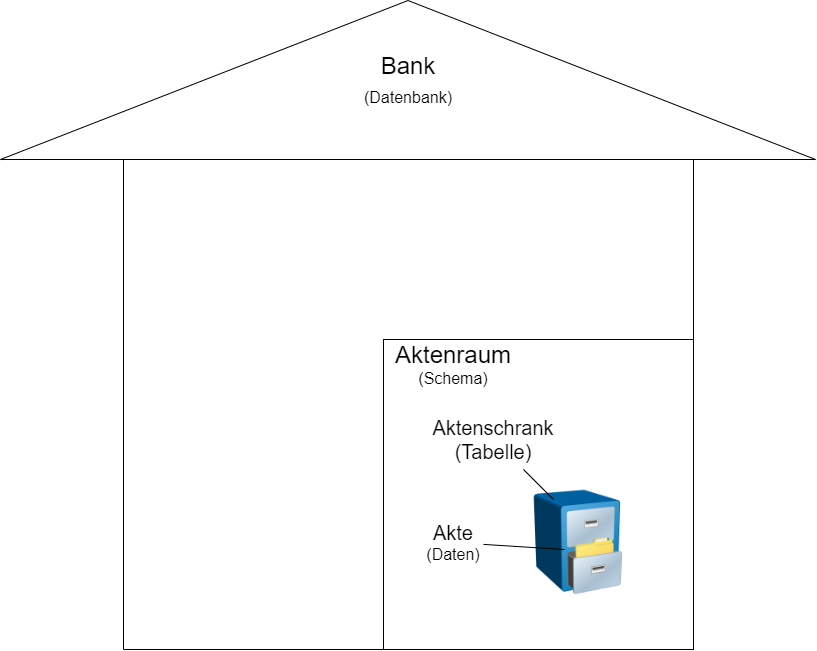
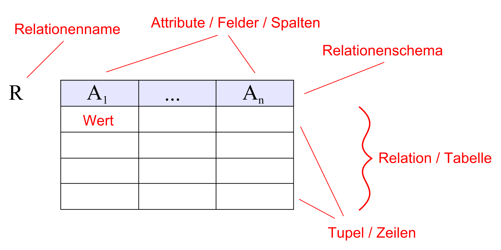

## Ziele

- Du kennst den allgemeinen Aufbau einer Datenbank und kannst ihn erklären.
- Du kennst den Unterschied zwischen relationalen und NoSQL-Datenbanken.
- Du weisst, wann welcher Datenbanktyp sinnvoll ist.
- Du kennst die wichtigsten Datentypen und ihren Nutzen.

## Was ist eine Datenbank?

Eine Datenbank ist ein System zur elektronischen Verwaltung von Daten. Grundsätzlich sagt der Name „Datenbank“ bereits, was sie ist: In einer Datenbank werden Daten in einer bestimmten Ordnung abgelegt. Ähnlich wie bei einer normalen Bank werden die Daten an einem klar definierten Ort gespeichert – fast so wie bei deinem Bankkonto, auf das jeweils der Lohn eingezahlt wird.

Eine Datenbank ist meist in Stufen aufgebaut, die wie folgt aussehen können:

- Ganz oben steht die Datenbank an sich. Sie ist vergleichbar mit dem Gebäude einer Bank, in dem sich die Infrastruktur sowie das Geld befinden.
- Die nächste Stufe ist das Schema. Dieses kann mit einem Raum verglichen werden, der viele verschiedene Aktenschränke enthält.
- Diese Aktenschränke entsprechen in einer Datenbank den Tabellen. Die Tabellen beinhalten schliesslich die verschiedenen Daten – wie zum Beispiel dein erwähntes Bankkonto mit deinem Kontostand.

Zusammenfassend ergibt sich folgender Aufbau:

### Schema und Tabelle

Ein Schema ist eine strukturierte Art und Weise, wie Daten organisiert werden. Es legt fest, wie die Datenbank aufgebaut ist und wie die Daten gespeichert und abgerufen werden können.

Eine Tabelle ist eine strukturierte Anordnung von Spalten und Zeilen, in der die eigentlichen Daten gespeichert werden.

Schemata und Tabellen helfen dabei, Daten organisiert und leicht zugänglich zu halten. Sie ermöglichen es, Daten effizient abzufragen, zu aktualisieren und zu verwalten. Darüber hinaus spielen sie eine wichtige Rolle bei der Sicherstellung der Sicherheit und Integrität der Daten, indem sie Zugriffsrechte und Einschränkungen festlegen.

Im nächsten Kapitel kannst du sehen, wie so eine Tabelle aussehen kann.

## Arten von Datenbanken

In diesem Kapitel soll ein kurzer Überblick über die verschiedenen Arten von Datenbanken sowie deren Vor- und Nachteile gegeben werden.

Die am häufigsten verwendeten Datenbankarten sind relationale _(SQL)_ und NoSQL-Datenbanken.  
Relationale _(SQL)_ Datenbanken werden am häufigsten eingesetzt und sind auch am bekanntesten.

> In den Übungen sowie in den Prüfungen werden ausschliesslich relationale _(SQL)_ Datenbanken verwendet.

### Relational _(SQL)_

Relationale Datenbanken sind ähnlich wie Excel-Tabellen aufgebaut. Der Name stammt vom Konzept der Relationen (Tabellen), die es ermöglichen, Daten logisch und strukturiert zu speichern und abzurufen.

Sie verwenden Tabellen, die jeweils Zeilen und Spalten enthalten _(auch Rows und Columns genannt)_.  
Pro Spalte _(Column)_, auch **Attribut** genannt, muss ein Datentyp festgelegt werden. Dieser Datentyp definiert, welche Art von Daten in dieser Spalte gespeichert werden kann.

Beispiel: Eine Spalte mit dem Namen „Alter“ hat einen numerischen Datentyp. Das bedeutet, dass ausschliesslich Zahlen in dieser Spalte eingegeben werden können.

Eine Zeile _(Row)_, auch **Tupel** genannt, enthält jeweils einen vollständigen Datensatz, wie beispielsweise alle Benutzerdaten.

_Quelle: [Wikipedia – Datenbanktabelle](https://de.wikipedia.org/wiki/Datenbanktabelle)_

#### Was ist SQL?

Wieso heisst es eigentlich **SQL**-Datenbank? SQL steht für **Structured Query Language** und ist eine standardisierte Sprache zur Verwaltung und Abfrage von Daten in relationalen Datenbanken.

Um sicherzustellen, dass SQL in verschiedenen Datenbanksystemen wie **MariaDB, PostgreSQL, MySQL oder SQL Server** ähnlich funktioniert, gibt es den **ANSI SQL-Standard**. ANSI (American National Standards Institute) hat SQL standardisiert, um eine einheitliche Syntax und grundlegende Funktionen für alle relationalen Datenbanken zu gewährleisten.

Allerdings implementieren viele Datenbanksysteme zusätzliche SQL-Erweiterungen, die nicht im ANSI-Standard enthalten sind. Deshalb kann sich die SQL-Syntax je nach System leicht unterscheiden. Im IT-Ninjas werden wir hauptsächlich mit **MariaDB** arbeiten.

Mehr Informationen zur SQL-Syntax findest du im Kapitel [SQL Syntax](../02_sql-syntax/).

#### SQL Datentypen

In diesem Teil werden kurz die wichtigsten Datentypen aufgelistet.
Je nach Datenbank können die Namen der Datentypen abweichen, sollten jedoch von der Funktionalität gleich sein.
In dieser Auflistung wurden die **MariaDB-Datentypen** verwendet:

| Typ-Name     | Beschreibung                                                                                                                                                       | Beispiel              |
| ------------ | ------------------------------------------------------------------------------------------------------------------------------------------------------------------ | --------------------- |
| INT          | Ganze Zahlen ohne Nachkommastellen im Bereich von -2.147.483.648 bis 2.147.483.647.                                                                                | 123                   |
| DECIMAL(p,s) | Genaue Dezimalzahlen mit festgelegter Genauigkeit _(p = Gesamtanzahl der Ziffern, s = Nachkommastellen)_, häufig in der Finanz- und Buchhaltungsbranche verwendet. | 1234.567              |
| CHAR(n)      | Zeichenkette mit fester Länge von n Zeichen, aufgefüllt mit Leerzeichen, falls kürzer.                                                                             | 'ABC'                 |
| VARCHAR(n)   | Zeichenkette mit variabler Länge bis maximal n Zeichen.                                                                                                            | 'OpenAI'              |
| DATE         | Datumsangaben im Bereich zwischen dem Jahr 1000 und 9999.                                                                                                          | '2023-05-31'          |
| TIME         | Zeitwerte im Bereich zwischen -838:59:59 und 838:59:59.                                                                                                            | '14:30:00'            |
| DATETIME     | Datum und Uhrzeit kombiniert, häufig für Zeitstempel in Anwendungen verwendet.                                                                                     | '2023-05-31 14:30:00' |
| BOOLEAN      | Wahrheitswerte (TINYINT 1), wobei 0 für FALSE und 1 für TRUE steht.                                                                                                | TRUE (intern 1)       |

Wenn du noch mehr über die einzelnen Datentypen erfahren möchtest, findest du unter diesem Link alle verfügbaren Datentypen in MariaDB:  
[Liste aller Datentypen (MariaDB)](https://mariadb.com/kb/en/data-types/)

### NoSQL

Im Gegensatz zu relationalen Datenbanken speichern NoSQL-Datenbanken Daten in Formaten wie Dokumenten,
Schlüssel-Wert-Paaren, Spalten oder Graphen. Dies ermöglicht es, unstrukturierte Daten effektiver zu speichern und
abzurufen. Dadurch können natürlich auch keine **Structured** Query Language Abfragen gemacht werden, deshalb NoSQL.

Wie erklärt gibt es viele verschiedene Ansätze bei NoSQL, deshalb gibt es auch keine gemeinsame Syntax wie es sie bei
SQL gibt. Bei den verschiedenen Anbietern kann sich also die Verwendung sehr unterscheiden. Auch wegen der verschiedenen
Speicherarten ist keine NoSQL Datenbank wie die andere.

_Quelle: https://www.geeksforgeeks.org/types-of-nosql-databases/_

### Wann verwende ich welche Datenbank?

Eine relationale Datenbank eignet sich gut für Anwendungsfälle, bei denen eine komplexe Datenstruktur mit starken
Beziehungen zwischen den Daten besteht, z. B. in Unternehmenssystemen oder Finanzanwendungen, da sie eine konsistente
und sichere Datenhaltung gewährleistet.

NoSQL-Datenbanken sind nützlich, wenn Flexibilität und Skalierbarkeit Priorität haben und wenn die Datenstruktur häufig
geändert werden muss oder es viele unstrukturierte oder semistrukturierte Daten gibt, wie beispielsweise in Big
Data-Anwendungen, sozialen Netzwerken oder Echtzeit-Analysen.
