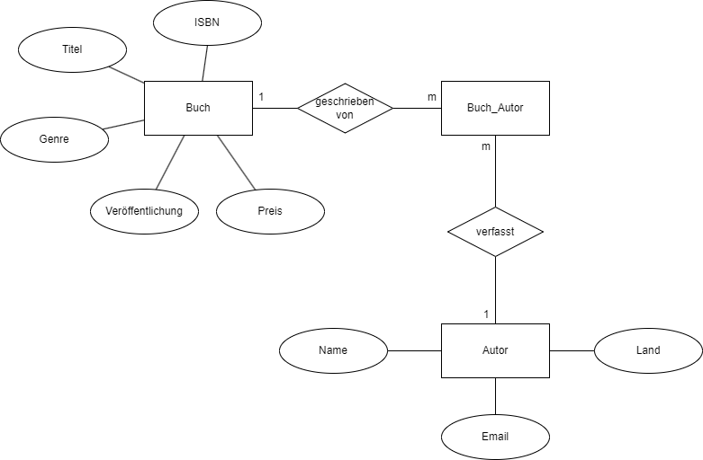

## Ziele

- Du weisst was Normalisierung ist und wieso sie wichtig ist.
- Du kannst die ersten drei Normalformen in eigenen Worten erklären.
- Du kennst den Unterschied zwischen den Begriffen ERM und ERD.
- Du kennst die verschiedenen Beziehungstypen im Bereich der Kardinalität.

## Normalisierung

Die Normalisierung in SQL ist ein Prozess, bei dem Datenbanktabellen in bestimmte **Normalformen** überführt werden, um die Datenintegrität und -konsistenz zu gewährleisten sowie Redundanzen zu minimieren.
Das Ziel ist es, Daten effizient, konsistent und strukturiert zu speichern, zu verwalten und abzufragen.

Was bedeutet das genau? Wir wollen zum Beispiel **doppelte (redundante) Daten** in der Datenbank vermeiden.
Das spart einerseits **Speicherplatz**, stellt aber andererseits auch sicher, das die **Integrität** gewährleistet ist.
Was passiert, wenn ich den gleichen User zweimal in einer Datenbank habe, und dann nur einen Eintrag davon bearbeite?
Dadurch kann es zu Anomalien (Fehler, unerwartetes Verhalten) kommen, die man im Design verhindern kann.

Ein Datenbankschema kann in unterschiedlichem Mass gegen Anomalien wie Inkonsistenzen oder Redundanzen geschützt werden.
Diese Abstufungen werden als Normalformen bezeichnet.
In den folgenden Abschnitten wirst du die erste, zweite und dritte Normalform kennenlernen.

### Erste Normalform (1NF)

Angenommen, wir haben eine Tabelle mit Kundendaten, die den Namen, die Adresse und die Telefonnummer enthält:

| Kundennummer | Kundenname | Adresse          | Telefonnummer |
| ------------ | ---------- | ---------------- | ------------- |
| 1            | Max        | Hauptstr. 1, 123 | 123456789     |
| 2            | Lisa       | Nebenstr. 5, 987 | 987654321     |

Du bekommst den Auftrag, alle Kunde von einer bestimmten Strasse oder einer bestimmten Postleihzahl aufzulisten.
Jetzt musst du immer die Adresse auslesen und splitten. Das geht einfacher.

Die erste Normalform (1NF) ist eine grundlegende Regel in der Datenbankentwicklung.
Sie stellt sicher, dass eine Tabelle nur atomare (nicht weiter teilbare) Werte enthält und keine wiederholten Gruppen von Attributen aufweist.
Das Ziel der 1NF ist es, Daten in ihre einfachsten, nicht weiter unterteilbaren Bestandteile zu zerlegen.

In der ersten Normalform muss jede Zelle einer Tabelle genau einen einzigen Wert enthalten.
Mehrwertige Attribute oder Attribute mit wiederholten Gruppen von Werten sind nicht erlaubt.
Falls mehrere Werte zu einem Attribut gehören, müssen diese in separate Zeilen oder Tabellen ausgelagert werden.

---

**Beispiel 1: Adressaufteilung**

Hier nochmal die gleiche Tabelle.

| Kundennummer | Kundenname | Adresse          | Telefonnummer |
| ------------ | ---------- | ---------------- | ------------- |
| 1            | Max        | Hauptstr. 1, 123 | 123456789     |
| 2            | Lisa       | Nebenstr. 5, 987 | 987654321     |

Diese Tabelle ist **nicht** in der ersten Normalform, weil die Adresse nicht in ihre einzelnen Bestandteile zerlegt ist.

Nach der Normalisierung in die 1NF sieht die Tabelle so aus:

| Kundennummer | Kundenname | Strasse   | Hausnummer | PLZ | Ort         | Telefonnummer |
| ------------ | ---------- | --------- | ---------- | --- | ----------- | ------------- |
| 1            | Max        | Hauptstr. | 1          | 123 | Musterort   | 123456789     |
| 2            | Lisa       | Nebenstr. | 5          | 987 | Beispielort | 987654321     |

---

**Beispiel 2: Liste in einer Spalte**

Angenommen, wir speichern die Lieblingsfarben von Kunden in einer Tabelle:

| Kundennummer | Kundenname | Lieblingsfarben  |
| ------------ | ---------- | ---------------- |
| 1            | Max        | Blau, Rot        |
| 2            | Lisa       | Grün, Gelb, Blau |

Du kennst ja Listen aus Java: Eine `List<String>` kann mehrere Werte in einer einzigen Variable speichern.
Doch in relationalen Datenbanken sollten Werte nicht als Listen innerhalb einer Spalte gespeichert werden.
Was ist, wenn du gerne alle Kunden auflisten möchtest, welche die Lieblingsfarbe Rot haben?
Nun muss du wieder alle Lieblingsfarben auslesen und splitten, bevor du eine Analyse machen kannst.

Stattdessen sollten sie auf mehrere Zeilen oder Tabellen aufgeteilt werden.
Die Spalte **Lieblingsfarben** enthält mehrere Werte in einer einzigen Zelle.
Dies verstösst gegen die 1NF, da die Werte nicht atomar sind.

**Lösung:** Wir normalisieren die Tabelle, indem wir jede Lieblingsfarbe in eine eigene Zeile auslagern:

| Kundennummer | Kundenname | Lieblingsfarbe |
| ------------ | ---------- | -------------- |
| 1            | Max        | Blau           |
| 1            | Max        | Rot            |
| 2            | Lisa       | Grün           |
| 2            | Lisa       | Gelb           |
| 2            | Lisa       | Blau           |

Nun entspricht die Tabelle der ersten Normalform (1NF), da jede Zelle genau **einen einzigen Wert** enthält.
Jetzt kannst du mit einem simplen `SELECT` und `WHERE` alle Benutzer auflisten, welche eine bestimmte Lieblingsfarbe haben.

**Aber**: Diese Tabelle entspricht noch nicht der zweiten Normalform (2NF). Dazu gleich mehr.

> **Fazit**
>
> Die erste Normalform (1NF) sorgt dafür, dass alle Daten **atomar** sind, also nicht weiter unterteilt werden können, und dass keine wiederholten Gruppen von Attributen existieren.
> Dies verbessert die Datenstruktur, minimiert Redundanzen und erhöht die Datenintegrität.
> Zudem wird das Abfragen mit SQL vereinfacht.

---

### Zweite Normalform (2NF)

Die zweite Normalform (2NF) stellt sicher, dass eine Tabelle keine **funktionalen Abhängigkeiten von einem Teil eines Primärschlüssels** enthält.
Das bedeutet, dass alle nicht-schlüsselbezogenen Attribute von einem **vollständigen Primärschlüssel** abhängig sein müssen.
Dadurch wird verhindert, dass in einer Tabelle Daten wiederholt gespeichert werden, die nicht direkt zur eigentlichen Entität gehören.

Eine Tabelle ist in der 2NF, wenn:

1. Sie bereits in der **1NF** ist (alle Attribute enthalten atomare Werte und es gibt keine Wiederholungen von Gruppen).
2. Alle nicht-schlüsselbezogenen Attribute vollständig vom gesamten Primärschlüssel abhängen und nicht nur von einem Teil davon.

---

**Beispiel 1: Bestellungen in einer Tabelle (Nicht in 2NF)**

Angenommen, wir haben eine Tabelle mit Kundendaten, die den Namen und die Telefonnummer enthält.
Zusätzlich speichern wir für jeden Kunden die bestellten Produkte und die jeweilige Menge in derselben Tabelle:

| Kundennummer | Kundenname | Telefonnummer | Produkt | Menge |
| ------------ | ---------- | ------------- | ------- | ----- |
| 1            | Max        | 123456789     | Schuhe  | 2     |
| 1            | Max        | 123456789     | Hemd    | 1     |
| 2            | Lisa       | 987654321     | Hose    | 3     |
| 2            | Lisa       | 987654321     | Jacke   | 2     |

**Problem:**

- Die **Kundennummer** ist der Primärschlüssel, aber die **Kundenname** und **Telefonnummer** hängen **nicht von Produkt oder Menge ab**. Sie sind ausschliesslich von der Kundennummer abhängig.
- Wenn ein Kunde mehrere Produkte bestellt, werden seine Daten **mehrfach gespeichert** → **Redundanz**.
- Änderungen an Kundendaten müssen an mehreren Stellen vorgenommen werden → **Anomalien**.

**Lösung:**
Um die 2NF zu erreichen, müssen wir die Daten in **separate Tabellen** aufteilen:

**Kundentabelle:**

| Kundennummer | Kundenname | Telefonnummer |
| ------------ | ---------- | ------------- |
| 1            | Max        | 123456789     |
| 2            | Lisa       | 987654321     |

**Bestellungstabelle:**

| Bestellnummer | Kundennummer | Produkt | Menge |
| ------------- | ------------ | ------- | ----- |
| 1             | 1            | Schuhe  | 2     |
| 2             | 1            | Hemd    | 1     |
| 3             | 2            | Hose    | 3     |
| 4             | 2            | Jacke   | 2     |

Jetzt sind die Kundendaten in einer separaten Tabelle gespeichert und müssen **nicht mehr für jede Bestellung wiederholt werden**.
Die Bestellungen sind über die **Kundennummer** mit den Kundendaten verknüpft.

---

**Beispiel 2: Lieblingsfarben aus der 1NF (Nicht in 2NF)**

Im vorherigen Abschnitt zur 1NF hatten wir eine Tabelle mit Lieblingsfarben:

| Kundennummer | Kundenname | Lieblingsfarbe |
| ------------ | ---------- | -------------- |
| 1            | Max        | Blau           |
| 1            | Max        | Rot            |
| 2            | Lisa       | Grün           |
| 2            | Lisa       | Gelb           |
| 2            | Lisa       | Blau           |

##### Problem:

- **Kundenname** hängt nur von der **Kundennummer** ab und hat **keine direkte Verbindung zu Farben**.
- Wenn ein Kunde mehrere Farben bevorzugt, wird der Name mehrfach gespeichert → **Redundanz**.

##### Lösung:

Wir teilen die Tabelle in **Kundendaten** und **Lieblingsfarben** auf:

**Kundentabelle:**

| Kundennummer | Kundenname |
| ------------ | ---------- |
| 1            | Max        |
| 2            | Lisa       |

**Lieblingsfarben-Tabelle:**

| KundenfarbeID | Kundennummer | Lieblingsfarbe |
| ------------- | ------------ | -------------- |
| 1             | 1            | Blau           |
| 2             | 1            | Rot            |
| 3             | 2            | Grün           |
| 4             | 2            | Gelb           |
| 5             | 2            | Blau           |

Nun entspricht die Datenstruktur der **2NF**, da sich die **Lieblingsfarben** und **Kunden** in separaten Tabellen befinden und alle Attribute **vollständig von ihrem jeweiligen Schlüssel abhängig sind**.

> **Fazit**
>
> Die zweite Normalform (2NF) verbessert die Struktur der Datenbank, indem sie sicherstellt, dass **alle nicht-schlüsselbezogenen Attribute vollständig vom gesamten Primärschlüssel abhängen**.
> Dies reduziert **Redundanzen**, vermeidet **Änderungsanomalien** und erleichtert die Datenpflege.

---

### Dritte Normalform (3NF)

Die dritte Normalform (3NF) baut auf der zweiten Normalform (2NF) auf und stellt eine weitere Anforderung an die Strukturierung der Daten.

Das Ziel der 3NF ist es sicherzustellen, dass **keine funktionalen Abhängigkeiten zwischen Nicht-Schlüsselattributen bestehen**.
Das bedeutet, dass alle Nicht-Schlüsselattribute **ausschliesslich vom Primärschlüssel** abhängig sein müssen und nicht von anderen Nicht-Schlüsselattributen.
Also: Alle Nicht-Schlüsselattribute hängen nur von dem PK ab und nicht untereinander. Nicht-Schlüsselattribute dürfen keinen Einfluss auf andere Nicht-Schlüsselattribute haben.

Eine Tabelle ist in der 3NF, wenn:

1. Sie bereits in der **2NF** ist.
2. **Jedes Nicht-Schlüsselattribut vollständig vom Primärschlüssel abhängt** (keine Abhängigkeiten zwischen Nicht-Schlüsselattributen bestehen).

Um die 3NF zu erreichen, müssen die Daten weiter aufgeteilt und in separate Tabellen organisiert werden.
Jede Tabelle sollte dabei einen spezifischen Informationsaspekt abbilden.
Die Tabellen sind über **Fremdschlüssel** miteinander verknüpft.

---

**Beispiel 1: Online-Shop (Nicht in 3NF)**

Wir haben eine Ausgangstabelle, die alle Informationen eines Online-Shops speichert.
Diese ist jedoch noch nicht normalisiert:

| Kundenummer | Name | Telefonnummer | ProduktId | Produktname | Bestellmenge | Gesamtpreis |
| ----------- | ---- | ------------- | --------- | ----------- | ------------ | ----------- |
| 1           | Max  | 123456789     | 101       | Schuhe      | 2            | 50.00       |
| 1           | Max  | 123456789     | 102       | Hemd        | 1            | 30.00       |
| 2           | Lisa | 987654321     | 103       | Hose        | 4            | 80.00       |
| 2           | Lisa | 987654321     | 104       | Jacke       | 3            | 75.00       |

##### Probleme:

- **Produktname und Gesamtpreis sind nicht direkt vom Primärschlüssel abhängig.**
- Der **Gesamtpreis kann aus der Bestellmenge und dem Produktpreis berechnet werden**, weshalb er nicht direkt gespeichert werden sollte.
- **Produktname hängt von der Produkt-ID ab**, nicht von der Bestellnummer → Diese Daten sollten ausgelagert werden.

##### Lösung:

Um die **2NF** zu erreichen, trennen wir die Daten in drei Tabellen:

**Kundentabelle:**

| Kundenummer | Name | Telefonnummer |
| ----------- | ---- | ------------- |
| 1           | Max  | 123456789     |
| 2           | Lisa | 987654321     |

**Produkttabelle:**

| ProduktId | Produktname | Produktpreis |
| --------- | ----------- | ------------ |
| 101       | Schuhe      | 25.00        |
| 102       | Hemd        | 30.00        |
| 103       | Hose        | 20.00        |
| 104       | Jacke       | 25.00        |

**Bestellungstabelle (2NF erreicht, aber noch nicht 3NF):**

| Kundenummer | ProduktId | Bestellmenge | Gesamtpreis |
| ----------- | --------- | ------------ | ----------- |
| 1           | 101       | 2            | 50.00       |
| 1           | 102       | 1            | 30.00       |
| 2           | 103       | 4            | 80.00       |
| 2           | 104       | 3            | 75.00       |

Nach dieser Aufteilung ist die zweite Normalform erreicht, aber **noch nicht die dritte**, da der **Gesamtpreis von Produktpreis und Bestellmenge abhängt**, nicht vom Primärschlüssel.

**Um die 3NF zu erreichen, müssen wir den Gesamtpreis entfernen**, da dieser berechnet werden kann:

**Bestellungstabelle (Jetzt in 3NF):**

| Kundenummer | ProduktId | Bestellmenge |
| ----------- | --------- | ------------ |
| 1           | 101       | 2            |
| 1           | 102       | 1            |
| 2           | 103       | 4            |
| 2           | 104       | 3            |

Nun entspricht die Datenbank der dritten Normalform (3NF), da **alle Nicht-Schlüsselattribute nur vom Primärschlüssel abhängig sind**.

> **Fazit**
>
> Die dritte Normalform (3NF) stellt sicher, dass **alle Nicht-Schlüsselattribute ausschliesslich vom Primärschlüssel abhängig sind und keine funktionalen Abhängigkeiten zwischen Nicht-Schlüsselattributen bestehen**.
> Dadurch werden:
>
> - **Datenredundanzen weiter reduziert**.
> - **Änderungsanomalien vermieden**.
> - **Datenbankabfragen effizienter**.

---

Für den Einstieg reichen die ersten drei Normalformen meist aus.
Höhere Normalformen wie die **Boyce-Codd-Normalform (BCNF)** oder die **vierte Normalform (4NF)** sind komplexer und werden in speziellen Anwendungsfällen eingesetzt.

## Datenbankdesign

In diesem Abschnitt betrachten wir die beiden Begriffe **ERM (Entity-Relationship-Modell)** und **ERD (Entity-Relationship-Diagramm)**.
Es ist wichtig, den Unterschied zwischen den beiden zu verstehen.

### Entity-Relationship-Modell (ERM)

Ein **ERM** ist eine Modellierungstechnik, die verwendet wird, um die Beziehungen zwischen verschiedenen **Entitäten** in einem System zu beschreiben.
Dabei wird das Datenbanksystem in **Textform** dokumentiert, bevor es visuell dargestellt wird.
Ziel ist es, die Datenbank **so einfach und klar wie möglich** zu beschreiben, um später ein **ERD** daraus abzuleiten.

Ein ERM besteht aus:

- **Entitäten (Tabellen)**: Die zentralen Objekte des Systems, die Daten speichern.
- **Beziehungen (Relations)**: Die Verknüpfungen zwischen den Entitäten.

#### Beispiel eines einfachen ERMs:

**Entitäten:**

| Entität-Name | Beschreibung                                                                                                   |
| ------------ | -------------------------------------------------------------------------------------------------------------- |
| Student      | Jeder Student hat eine eindeutige ID, einen Namen, ein Geburtsdatum und Kontaktdaten.                          |
| Kurs         | Jeder Kurs hat eine eindeutige ID, einen Titel, eine Anzahl von Kreditpunkten und einen zugeordneten Dozenten. |

**Beziehungen:**

| Beziehungs-Name | Beschreibung                                                                                                                                                                                 |
| --------------- | -------------------------------------------------------------------------------------------------------------------------------------------------------------------------------------------- |
| Einschreibung   | Diese Beziehung zeigt die Verbindung zwischen Studenten und Kursen an. Jede Einschreibung hat eine eindeutige ID und ist mit einem bestimmten Studenten und einem bestimmten Kurs verknüpft. |

---

### Entity-Relationship-Diagramm (ERD)

Ein **ERD** ist eine grafische Darstellung eines **ERM**, die die Beziehungen zwischen Entitäten und deren Attributen visualisiert.
Es stellt die **Struktur und das Verhalten eines Systems** formal dar.

#### Hauptbestandteile eines ERD:

- **Entitäten** (Tabellen), dargestellt als **Rechtecke**.
- **Attribute**, dargestellt als **Ovale**.
- **Beziehungen**, dargestellt als **Rauten** mit Verbindungslinien.
- **Kardinalitäten**, die angeben, wie viele Entitäten miteinander verknüpft sind (z. B. 1:1, 1:n, m:n).

Durch ein ERD wird **klar definiert, welche Daten in der Datenbank benötigt werden** und wie sie strukturiert sind.

---

### ERD-Erstellung mit draw.io

Es gibt viele verschiedene Zeichenprogramme zur Erstellung von ERDs.
Eine besonders empfehlenswerte Web-Applikation ist **[draw.io](https://draw.io)**, da:

- Kein Download erforderlich ist.
- Diagramme online gespeichert und geteilt werden können.
- Es eine intuitive Benutzeroberfläche für ERD-Erstellungen bietet.

Das spätere ERD in diesem Kurs wird ebenfalls mit **draw.io** erstellt.

Ein besonders wichtiger Aspekt beim Erstellen eines ERD sind die **Kardinalitäten**.
Diese zeigen an, wie viele Entitäten miteinander in Beziehung stehen.

Lassen uns diese nun genauer betrachten.

### Kardinalität

Die **Kardinalität** in einem **Entity-Relationship-Modell (ERM)** beschreibt die Beziehung zwischen zwei Entitäten und gibt an, wie viele Instanzen einer Entität mit einer oder mehreren Instanzen einer anderen Entität in Verbindung stehen können.

Es gibt verschiedene Methoden, um die Kardinalität einer Beziehung darzustellen.
In diesem Kurs verwenden wir hauptsächlich die **[Chen-Notation](https://de.wikipedia.org/wiki/Chen-Notation)**.
Alternativ kann auch die **[Martin-Notation](https://de.wikipedia.org/wiki/Martin-Notation)** genutzt werden.

#### Kardinalitätsarten in der Chen-Notation:

| Notation                                          | Beschreibung                                                                                                                                                                                                                                         |
| ------------------------------------------------- | ---------------------------------------------------------------------------------------------------------------------------------------------------------------------------------------------------------------------------------------------------- |
| **1:1 (1 zu 1)**                                  | Jede Entität der ersten Entitätsmenge steht mit genau einer Entität der zweiten Entitätsmenge in Beziehung – und umgekehrt.                                                                                                                          |
| **1:c (1 zu [0 oder 1])**                         | Jede Entität der ersten Entitätsmenge kann mit höchstens einer Entität der zweiten Entitätsmenge in Beziehung stehen. Jede Entität der zweiten Entitätsmenge steht jedoch mit genau einer Entität der ersten Entitätsmenge in Beziehung.             |
| **1:m (1 zu [mindestens 1])**                     | Jede Entität der ersten Entitätsmenge steht mit mindestens einer Entität der zweiten Entitätsmenge in Beziehung. Jede Entität der zweiten Entitätsmenge steht mit genau einer Entität der ersten Entitätsmenge in Beziehung.                         |
| **1:mc (1 zu [beliebig vielen])**                 | Jede Entität der ersten Entitätsmenge kann mit beliebig vielen Entitäten der zweiten Entitätsmenge in Beziehung stehen. Jede Entität der zweiten Entitätsmenge steht jedoch mit genau einer Entität der ersten Entitätsmenge in Beziehung.           |
| **c:c ([0 oder 1] zu [0 oder 1])**                | Jede Entität der ersten Entitätsmenge kann mit höchstens einer Entität der zweiten Entitätsmenge in Beziehung stehen – und umgekehrt.                                                                                                                |
| **c:m ([0 oder 1] zu [mindestens 1])**            | Jede Entität der ersten Entitätsmenge steht mit mindestens einer Entität der zweiten Entitätsmenge in Beziehung. Jede Entität der zweiten Entitätsmenge kann jedoch mit höchstens einer Entität der ersten Entitätsmenge in Beziehung stehen.        |
| **c:mc ([0 oder 1] zu [beliebig vielen])**        | Jede Entität der ersten Entitätsmenge kann mit beliebig vielen Entitäten der zweiten Entitätsmenge in Beziehung stehen. Jede Entität der zweiten Entitätsmenge kann jedoch mit höchstens einer Entität der ersten Entitätsmenge in Beziehung stehen. |
| **m:m ([mindestens 1] zu [mindestens 1])**        | Jede Entität der ersten Entitätsmenge steht mit mindestens einer Entität der zweiten Entitätsmenge in Beziehung – und umgekehrt.                                                                                                                     |
| **m:mc ([mindestens 1] zu [beliebig vielen])**    | Jede Entität der ersten Entitätsmenge kann mit beliebig vielen Entitäten der zweiten Entitätsmenge in Beziehung stehen. Jede Entität der zweiten Entitätsmenge steht mit mindestens einer Entität der ersten Entitätsmenge in Beziehung.             |
| **mc:mc ([beliebig viele] zu [beliebig vielen])** | Jede Entität der ersten Entitätsmenge kann mit beliebig vielen Entitäten der zweiten Entitätsmenge in Beziehung stehen – und umgekehrt.                                                                                                              |

---

### Beispiel: Kardinalitäten in einem ERD

Ein klassisches Beispiel für Kardinalitäten ist eine **Buchdatenbank**, die **Bücher** und **Autoren** verwaltet.

Hier sind einige typische Beziehungen:

- **Ein Buch kann von mehreren Autoren geschrieben werden.** (m:m-Beziehung)
- **Ein Autor kann mehrere Bücher geschrieben haben.** (m:m-Beziehung)

> Für die Kardinalitäten in diesem Beispiel gäbe es auch weitere Möglichkeiten.
>
> Was ist, wenn ein Autor kein Buch geschrieben hat? Die Beziehung müsste m:mc sein, aber kann jemand ein Autor sein, wenn er kein Buch hat?
>
> Das hängt ganz von den Anforderungen ab, vielleicht möchte man bestimmte Autoren erfassen, aber ihre Bücher nicht.
>
> Beim Buch gilt natürlich das genau gleich. Was ist, wenn wir ein Buch haben, für das der Autor unbekannt ist oder nicht in der DB?
> Du als Softwareentwickler musst entscheiden, ob diese Fälle in deiner Applikation abgedeckt werden.

---

### Wichtiger Hinweis zu m:n-Beziehungen:

**Viele-zu-Viele-Beziehungen (m:m, mc:m, ...) benötigen normalerweise eine Zwischentabelle**, da ansonsten keine eindeutige Verbindung zwischen den Tabellen hergestellt werden kann. Diese Zwischentabelle enthält die Fremdschlüssel der beiden verknüpften Tabellen und kann zusätzlich eigene Attribute wie das Erstellungsdatum der Beziehung enthalten.

#### Beispiel einer Zwischentabelle für die Buchdatenbank:

| BuchID | AutorID |
| ------ | ------- |
| 1      | 101     |
| 1      | 102     |
| 2      | 101     |
| 3      | 103     |

Diese zusätzliche Tabelle ermöglicht eine **eindeutige Zuordnung** zwischen Büchern und Autoren.

---

### Fazit

Die Kardinalität ist ein wichtiger Bestandteil des **Entity-Relationship-Modells (ERM)** und beschreibt, wie Entitäten miteinander verknüpft sind. Das Verständnis der Kardinalitäten hilft, eine **optimale Datenbankstruktur** zu entwickeln, die **Redundanzen vermeidet** und **Datenkonsistenz sicherstellt**.

 Jetzt bist du dran. Löse bitte die [Aufgaben zu Datenbanken](../../../labs/04_database) in den Labs.
