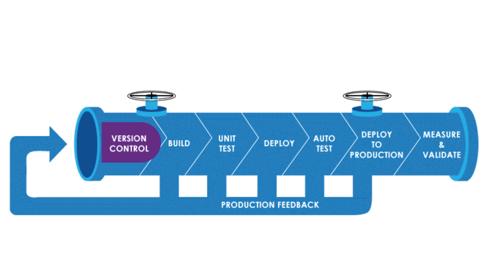
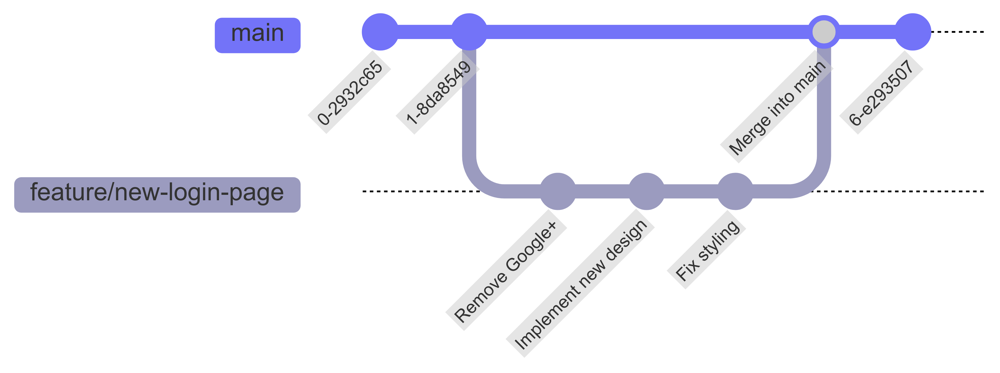
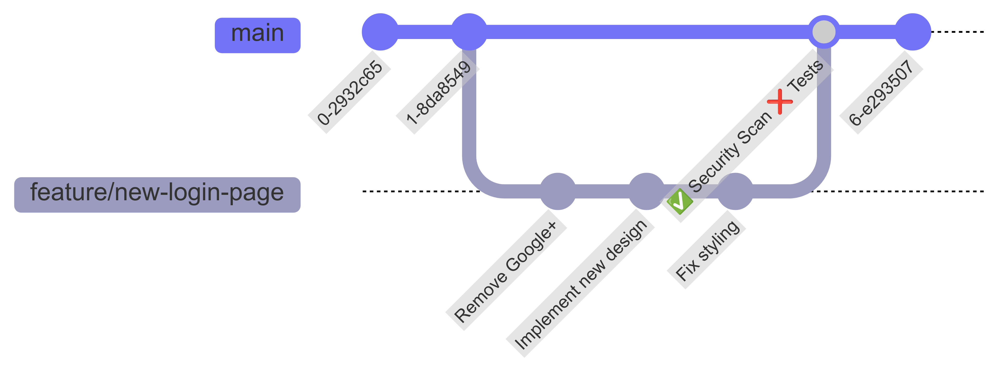
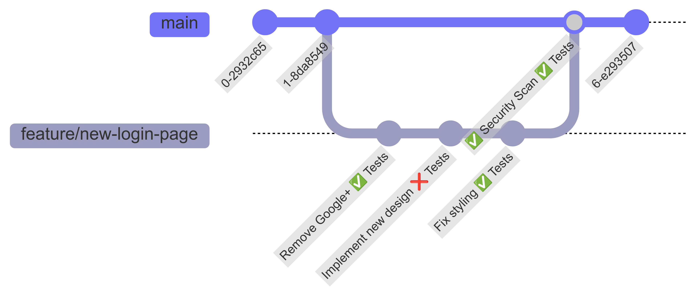
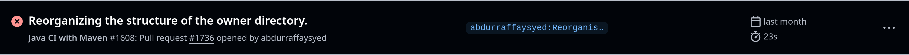

#### Ziele

- Ich kann den Begriff Continuous Integration erklären.
- Ich kann einen typischen Aufbau eine CI-Pipeline erklären.
- Ich kenne typische Aufgaben einer CI-Pipeline.

## Continuous Integration

Continuous Integration, oder kurz CI, heisst auf Deutsch so viel wie "Fortlaufende Integration". Es beschreibt die Praxis, Codeänderungen oft und regelmässig in die Code-Basis zu integrieren. Dazu gehört auch das Testen dieser Änderungen sowie andere Checks, wie etwa Security Scans. Da dies mühsame Arbeit ist, passiert das meistens vollautomatisiert in einer sogenannten Pipeline. Diese Pipelines heissen so, da der Code wie durch ein (oder mehrere) Rohre muss, welche diese Checks ausführen und das Ventil zudrehen können, sollte etwas nicht gut sein.



Das Ausführen so einer Pipeline passiert entweder nach einem bestimmten Ereignis, z.B. einem Push auf einen Git-Branch, oder periodisch, jede Nacht um 3:00. Damit das möglich ist, wird sie nicht auf dem Computer des Entwicklers, sondern auf einem separaten CI-Server ausgeführt. So kann sichergestellt werden, dass nichts vergessen geht und die Ergebnisse transparent sind.

Wichtig ist, dass das fortlaufende Integrieren von Änderungen nicht heisst, dass nach jeder Änderung eine neue Version der Software verfügbar ist. Das kann der Fall sein (siehe [Continuous Deployment](../03_continuous-deployment/_index)), muss aber nicht. Vielmehr geht es darum, dass die Änderungen jeweils klein und gut getestet sind.

### Beispiel einer CI-Pipeline

Als Beispiel nehmen wir eine Anwendung, welche eine neue Login-Page bekommen soll. Der/Die Entwickler:in macht also einen neuen Branch `feature/new-login-page`. Auf diesem nimmt er/sie seine/ihre Änderungen vor und mergt - sobald fertig - diese wieder in den `main`-Branch. Vor dem Mergen können andere Entwickler:innen noch Tests ausführen oder einen Security-Scan laufen lassen. Da dies jedoch manuell gemacht werden muss, geht das oft vergessen oder wird aus Faulheit nicht umgesetzt.



<!--
gitGraph
    commit
    commit
    branch feature/new-login-page
    checkout feature/new-login-page
    commit id: "Remove Google+"
    commit id: "Implement new design"
    commit id: "Fix styling"
    checkout main
    merge feature/new-login-page id: "Merge into main"
    commit
-->

Mithilfe einer CI-Pipeline können wir diese zwei Aufgaben automatisiert ausführen nach (oder idealerweise noch vor) einem Merge. Pipelines können also dazu dienen, langweilige, wiederkehrende Arbeiten zu verrichten und Entwickler:innen zum Einhalten von Standards zu bewegen. Durch die Pipeline merken wir z.B., dass mehrere Unit-Tests fehlschlagen. Dazu hat die Pipeline ganz einfach den Maven-Command `mvn clean test` ausgeführt und geschaut, ob jeder Test grün ist. So wie es ein:e Entwickler:in auch auf seiner/ihrer Maschine tun kann.



<!--
gitGraph
    commit id: "0-2932c65"
    commit id: "1-8da8549"
    branch feature/new-login-page
    checkout feature/new-login-page
    commit id: "Remove Google+"
    commit id: "Implement new design"
    commit id: "Fix styling"
    checkout main
    merge feature/new-login-page id: "✅ Security Scan ❌ Tests"
    commit id: "6-e293507"
-->

Das hätte der/die Entwickler:in merken können, wenn er/sie nach jedem Commit die Tests ausgeführt hätte. Da dies aber manuelle und langweilige Arbeit ist, hat er/sie das natürlich nicht gemacht. Werden die Tests stattdessen auch in einer Pipeline nach jedem `git push` ausgeführt, merkt der/die Entwickler:in schneller, dass sein/ihr Code noch nicht gut ist.



<!--
gitGraph
    commit id: "0-2932c65"
    commit id: "1-8da8549"
    branch feature/new-login-page
    checkout feature/new-login-page
    commit id: "Remove Google+ ✅ Tests"
    commit id: "Implement new design ❌ Tests"
    commit id: "Fix styling ✅ Tests"
    checkout main
    merge feature/new-login-page id: "✅ Security Scan ✅ Tests"
    commit id: "6-e293507"
-->

Es muss also nicht für jedes Ereignis die gleiche Pipeline ausgeführt werden. Der Security-Scan kann etwa mehrere Minuten dauern, weshalb er nicht bei jedem `git push`, sondern nur vor einem Merge ausgeführt wird. Grosse Projekte können dutzende solcher Pipelines haben für verschiedene Anlässe und Zwecke.

### Anwendungszwecke von CI-Pipelines

- **Testing**  
   Die wahrscheinlich häufigste Verwendung ist das automatiserte Ausführen von Tests. Das kann von Unit-Tests bis hin zu E2E-Tests alles sein. Ein Vorteil davon ist, dass die Entwickler:innen das nicht mehr manuell machen müssen. Ein weiterer ist, dass die Tests beschleunigt werden können, etwa durch das Aufteilen der Tests auf viele Maschinen. Es wird auch vermieden, dass die Tests auf einem Entwickler-Laptop laufen, auf einem anderen aber nicht und nun nicht klar ist, ob die Tests gut sind oder nicht. Es gilt, was in der CI-Pipeline passiert.
- **Durchsetzen von Standards**
  Ebenfalls sehr häufig werden Pipelines eingesetzt, um gewisse Standards zu überprüfen. Dazu gehört etwa, ob der Code richtig formatiert ist oder genügend Tests geschrieben wurden.
- **Security Checks**
  Niemand hat Zeit, sich alle Meldungen über Hacks oder Sicherheitslücken durchzulesen und herauszufinden, ob diese auf die eigene Software zutreffen. Eine Pipeline kann stattdessen jede Nacht einen automatisierten Scan durchführen und so die Entwickler am nächsten Morgen benachrichtigen.
- **Bauen von Artefakten**
  Docker-Container oder JARs können durch die Pipelines automatisch generiert und richtig versioniert werden. So sind sie für ein späteres Deployment bereit oder können sogar in einer anderen Pipeline verwendet werden.

### Umsetzen einer CI-Pipeline

Es gibt viele Möglichkeiten eine CI-Pipeline umzusetzen. Gewisse sind eigenständige Tools wie [Jenkins](https://www.jenkins.io/) oder [CircleCI](https://circleci.com/). Viele Plattformen bauen direkt ihre eigenen Lösungen ein, wie etwa [GitLab](https://docs.gitlab.com/ee/ci/) oder [GitHub](https://github.com/features/actions). Für diesen Guide benutzen wir GitHub. Viele der Konzepte können aber auch auf andere Tools übertragen werden.

GitHub stellt sogenannte Actions oder Workflows als CI-Lösung zur Verfügung. Das sind [YAML](https://geekflare.com/de/what-is-yaml/)-Dateien, welche in `.github/workflows` abgelegt werden. Jede Datei ist dabei ein "Workflow" und kann beliebig benannt werden, solange sie auf `.yml` oder `.yaml` endet. Vorhandene Workflows werden im [Actions](https://github.com/it-ninjas/labs/actions)-Tab eines Repositories angezeigt.

#### Simpler Workflow

Ein simpler Workflow könnte etwa in `.github/workflows/hello-world.yaml` gespeichert sein und so aussehen:

```yaml
name: GitHub Actions Hello World
on: [push]
jobs:
  hello-world:
    runs-on: ubuntu-latest
    steps:
      - run: echo "Hello world!"
      - run: echo "🐧 This job is now running on a ${{ runner.os }} server hosted by GitHub!"
      - run: echo "🔎 The name of your branch is ${{ github.ref }}, your repository is ${{ github.repository }} and this workflow was triggered by ${{ github.actor }}"
      - name: Check out repository code
        uses: actions/checkout@v4
      - name: Execute multiple commands
        run: |
          echo "One line"
          echo "Another one"
```

Dieser Workflow besteht aus folgenen Elementen:

- `name` Der Name des Workflows.
- `on` Wann der Workflow ausgeführt werden soll. Das kann von einem `git push` bis zum Erstellen eines neuen Issues alles Mögliche sein, wobei GitHub hier [eine gute Dokumentation dazu hat](https://docs.github.com/en/actions/writing-workflows/choosing-when-your-workflow-runs/events-that-trigger-workflows). In unserem Fall wird der Workflow bei jedem `git push` ausgeführt.
- `jobs` Eine Liste mit Aufgaben, welche der Workflow ausführen soll. Jeder Job hat dabei einen eindeutigen Namen, hier `hello-world`.
- `runs-on` Definiert, auf was für einem Computer der Workflow ausgeführt werden soll. Standardmässig ist das ein Ubuntu-Linux, Windows und OSX sind aber ebenfalls möglich.
- `steps` Eine Liste mit Anweisungen, welche nacheinander in diesem Job ausgeführt werden.

Ein ganz simpler Step, wie z.B. `run: echo "Hello world!"`, macht nichts anderes als den Befehl `echo "Hello World!"` auszuführen.

Um ein wenig mehr Dynamik in die Sache zu bringen, können wir Teile eines Befehls mit dieser Syntax ersetzen: `${{ dein.variable.name }}`.

```sh
echo "🐧 This job is now running on a ${{ runner.os }} server hosted by GitHub!"
```

wird somit zu

```sh
echo "🐧 This job is now running on a ubuntu-latest server hosted by GitHub!"
```

Damit man nicht alles selber schreiben muss, kann man auch einfach bereits erstellte "Steps" benutzen. GitHub nennt diese "Actions" und bietet diese in [einem Marktplatz](https://github.com/marketplace?type=actions) an. Es lohnt sich, zuerst zu schauen, ob jemand schon eine Action geschrieben hat, bevor man sich selber die Mühe macht.
Ein Beispiel davon ist dieser Step hier:

```yaml
- name: Check out repository code
  uses: actions/checkout@v4
```

`name` ist wie der Step heisst. `uses` gibt an, dass wir die [Checkout Action](https://github.com/marketplace/actions/checkout) benutzen wollen. Dieser Befehl macht ein `git clone` des Repositories und kann in fast jedem CI-Workflow angetroffen werden.

Falls es mal doch keine Action gibt, welche den Zweck erfüllt, können mehrere Befehle mit dieser Syntax auch über mehrere Zeilen geschrieben werden. Das macht die Sache etwas übersichtlicher.

```yaml
- name: Execute multiple commands
  run: |
    echo "One line"
    echo "Another one"
```

#### Testing Workflow

Ein einfacher Workflow für das Testen einer Spring Boot App mit Maven könnte so aussehen:

```yaml
name: Testing with Maven
on: [push]

jobs:
  test:
    runs-on: ubuntu-latest
    steps:
      - uses: actions/checkout@v4
      - name: Set up JDK
        uses: actions/setup-java@v4
        with:
          java-version: 21
          distribution: "temurin"
          cache: maven
      - name: Test
        run: mvn clean verify
```

Dieser Workflow macht in dieser Reihenfolge:

- ein `git clone`
- installiert Java mit der Version 21
- führt die Tests mit dem Befehl `mvn clean verify` aus

Sollte es zu einem Fehler in den Tests kommen, wird der Workflow fehlschlagen und den Entwickler informieren.

