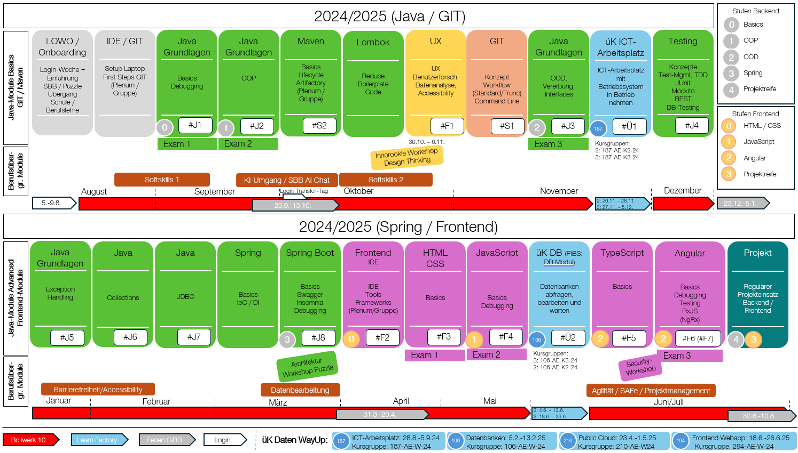

## Übersicht Ausbildungsprogramm

Das Ausbildungsprogramm 2024/2025 besteht aus diversen einzelnen Ausbildungs-Modulen.

Das Wissen aus jedem technischen Modul wird durch Selbst-Studium erworben und bei Bedarf eigenständig durch zusätzlich gesuchtes Wissen ergänzt.
Nahezu jedes Modul bringt seine eigenen Übungen (Labs) mit. Einige der Module müssen durch ein Exam abgeschlossen werden.
Die Resultate deiner Übungen und Exams besprichst du immer mit einer/einem Praxisbildner:in im Rahmen eines Reviews.
Er/Sie wird dir Feedback geben und dir idealerweise die Freigabe für das nächste Modul erteilen.
Gewisse Module bieten freiwillige Challenges an, bei denen du dein Wissen mit anderen messen kannst.

Das Ziel des technischne Ausbildungsprogramms ist

- das Erlernen der Programmiersprache Java
- das Erwerben von Kenntnissen zu Maven und Testing
- das Erwerben von Kenntnissen zum Spring Framework und zu Spring Boot
- das Erlernen von HTML/CSS und JavaScript
- das Erlernen der Programmiersprache Typescript und des Web-Frameworks Angular

im begleiteten Selbst-Studium innerhalb des ersten Lehr-/Studienjahres.

Berufsübergreifende Module finden in Form von Workshops und Erfahrungstransfers statt. Diese Module sind nicht in den IT-Ninjas aufgeführt.

---

### Absprung zu den Debugging-Seiten

- [Debugging von Java Code in IntelliJ](java/java-grundlagen/debugging)
- [Frontend-Debugging](web/javascript/24_debugging/)

### Absprung zu den Testing-Seiten

- [Testing Konzepte / JUnit / Mockito](java/java-testing/)
- [Spring Boot Testing](java/spring-framework/spring-boot-testing/09_spring-boot-testing)
- [Rest-Schnittstellen testen](java/spring-framework/rest-endpoints/08_java-rest-testing.md)
- [Angular Testfiles](web/angular/02_7_angular_unit_test/)
