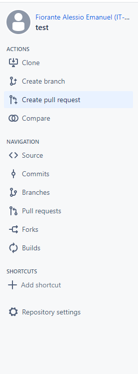
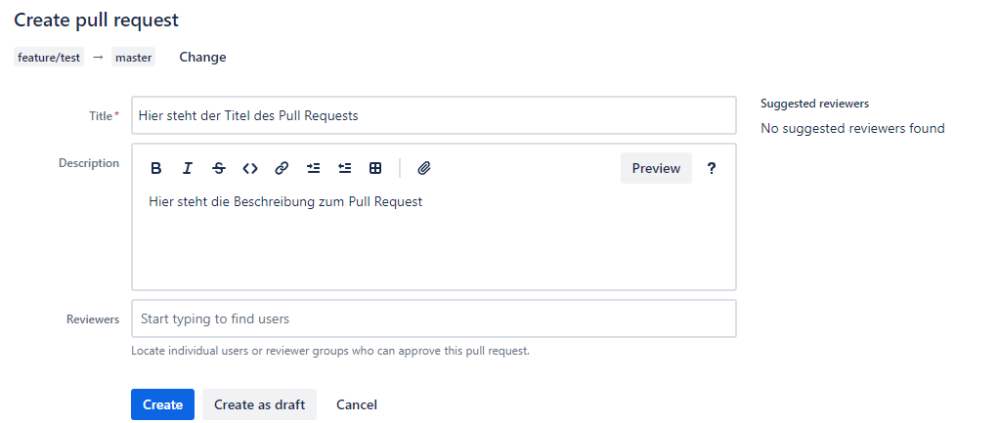
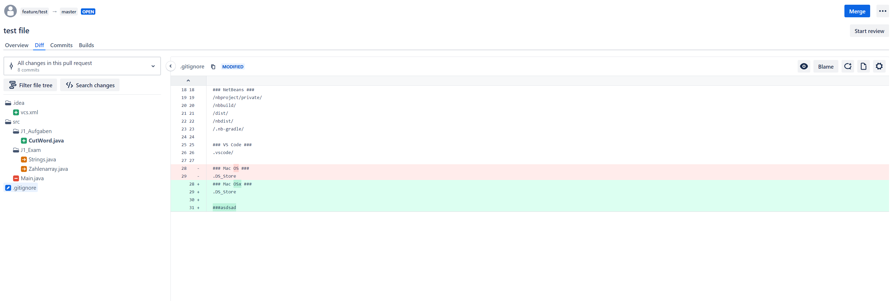
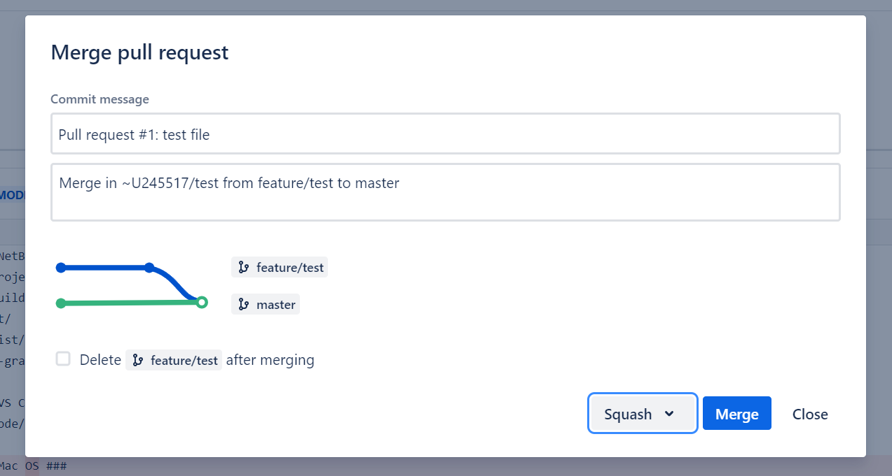
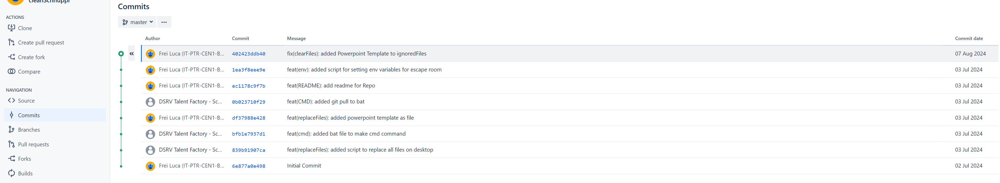

In der SBB wird primär das intern gehostete Bitbucket verwendet. Dieses Modul widmet sich dem Bitbucket der SBB.

## Ziele

- Ich kenne das von der SBB gehostete Bitbucket.
- Ich kann im Bitbucket einen Pull Request erstellen und mir dessen Diff anzeigen.

## Pull Request (PR) erstellen und mergen

Um einen Pull Request in BitBucket zu erstellen, muss im Web in der linken Navigationsleiste unter `ACTIONS` die Option `Create pull request` ausgewählt werden.

Hier hat man nun die Möglichkeit einen Branch auszuwählen, welcher Änderungen hat (Source Branch), und den Ziel Branch (Destination Branch) festzulegen, dort wo die Änderungen hinzugefügt werden sollen.

Auf der folgenden Seite kann ein Titel und eine Beschreibung für den Pull Request gesetzt werden. Ebenfalls können hier Reviewers hinzugefügt werden.

Da nun alle Einstellungen vorgenommen wurden, kann der Pull Request erstellt werden.

### Diff

Wenn nun eine andere Person diesen PR öffnet und verstehen möchte was geändert wurde, öffnet sie diesen und geht in der oberen Navigation auf die Option `Diff`.

Der hier angezeigte Vergleich wird Diff (kommt von Difference) genannt. Er zeigt dir zwei Versionen von Dateien eines Git-Repository an. Dabei werden links die modifizierten(Blauer Stift), neuen (grünes Plus-Zeichen), gelöschten (rotes Minus-Zeichen) und verschobenen (oranger Pfeil) Dateien angezeigt.
Bei einer modifizierten Datei werden die geänderte Zeilen wie folgt hervorgehoben:

- Grün markiert neue Zeilen, die hinzugefügt wurden.
- Rot zeigt gelöschte Zeilen.

### Pull Request mergen

Wenn man einen Pull Request schliessen möchte, kann man das über den oben rechts angezeigten Knopf `Merge`.
Es öffnet sich ein Dialog-Fenster, in welchem man den Titel und die Beschreibung des Commits definieren kann.

Man kann noch weitere Einstellungen vornehmen. Beispielsweise kann man festlegen, dass der Branch anschliessend gelöscht wird.

Empfohlen ist die Option `Squash` zu nutzen, welche links neben dem blauen Knopf per Dropdown ausgewählt werden. Diese kombiniert alle Commits des Branches zu einem einzelnen Commit, welcher anschliessend in den Target-Branch gemerged wird.

## Commit History

Wenn man links in der Navigationsleiste auf `Commits` klickt, kann man sich die History des Projektes anhand der vergangenen Commits anzeigen lassen. Hier sind alle merged Pull Requests aber auch Commits welche direkt auf Master gemacht wurden ersichtlich.

Von jeder Änderung ist der Autor, der Commit Hash, die Commit Message und das Datum ersichtlich. Die History ermöglicht es den Nutzern, den Verlauf von Änderungen nachzuverfolgen und auf frühere Versionen des Repositorys zurückzugreifen.

## Forking

Ein Fork ist eine Kopie eines bestehenden Git-Repositories. Wenn du ein Repository forkst, erstellst du eine eigene Version davon, die unabhängig vom Original ist. Diese Kopie befindet sich in deinem eigenen Account und ermöglicht es dir Änderungen vorzunehmen, ohne das ursprüngliche Projekt zu beeinflussen.

In Bitbucket findest du die Möglichkeit zum Forken in der linken Navigationsleiste, wenn du dich in einem Repository befindest.
