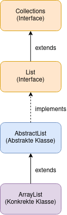
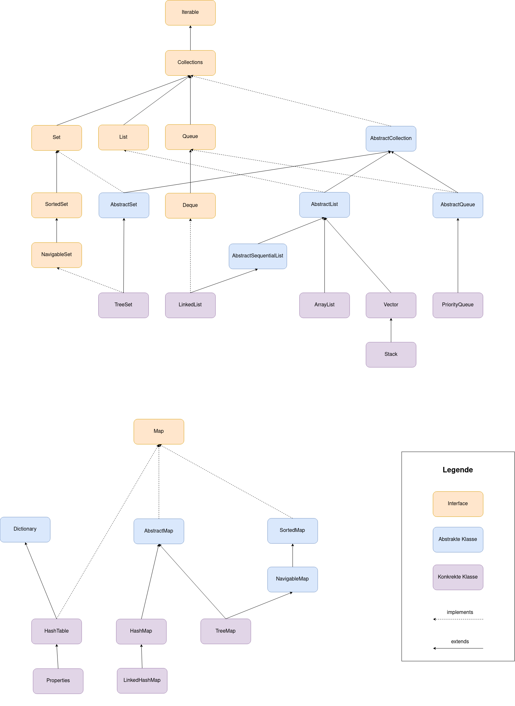

#### Ziele

- Ich kann erklären, was Collections sind.
- Ich kenne grob den Aufbau des Collection-Frameworks.
- Ich kenne die wichtigsten Interfaces und ihreMerkmale: `List`, `Set`, `Queue`, `Map`.
- Ich verstehe den Einsatz der Hash-Funktion zur Performance-Verbesserung.
- Ich kenne die wichtigsten Implementierungen und ihre Einsatzmöglichkeiten: `ArrayList`, `HashSet`, `HashMap`.
- Ich verstehe die Funktionsweise und Anwendung der Klasse `ArrayList`.
- Ich verstehe die Funktionsweise und Anwendung der Klasse `HashSet`.
- Ich verstehe die Funktionsweise und Anwendung der Klasse `HashMap`.
- Ich verstehe die Funktionsweise und Anwendung der Klasse `Stack`.
- Ich kenne die Funktionsweise und den Unterschied zwischen den Klassen `Queue` und `Deque` und kann diese anwenden.
- Ich verstehe die Funktionsweise und Anwendung der Klasse `LinkedList`.

#### Voraussetzungen

- Gute Grundlagenkenntnisse von Java-Anwendungen.

---

## Einleitung

Beim Programmieren müssen wir oft Daten speichern bzw. Informationen verwalten, um gewisse Probleme zu lösen.
In diesem Modul werden wir das Java Collection Framework anschauen, weil dieses Framework uns die Werkzeuge zum
effizienten Verwalten von Informationen liefert.

Eine **Collection** ist ein Objekt, das eine Sammlung von Objekten darstellt, d.h. mehrere Elemente zu einer Einheit
zusammenfasst. In der Regel enthält eine Collection Datenelemente, die zusammen eine natürliche Gruppe bilden, wie z.B.
eine Fussballmannschaft, die eine "Sammlung" von Fussballspielern ist, d.h. Fussballspieler enthält. Collections bieten
uns im Allgemeinen die Möglichkeit neue Elemente hinzuzufügen, Elemente zu löschen und sonst die Elemente zu verwalten.

Ein bekanntes Beispiel für eine Collection ist die `ArrayList` Klasse, wobei eine ArrayList eine Liste von Objekten
darstellt, welche skalierbar ist. Die `ArrayList` Klasse liefert uns beispielsweise die Methode `add`, mit welcher
Elemente an das Ende einer Liste angefügt werden kann:

```java
List<String> farben=new ArrayList<String>();
farben.add("rot");
farben.add("blau");
farben.add("gelb");
farben.add("orange");
```

Oder sie liefert uns die Methode `remove`, welche Elemente aus der Liste entfernt:

```java
List<String> farben=new ArrayList<String>();
farben.add("rot");
farben.add("blau");
farben.add("gelb");
farben.remove("blau");
```

Wir werden die ArrayList Klasse später noch genauer anschauen.

Das **Java Collection Framework** ist eine Menge von Interfaces und Klassen, die allgemein wiederverwendbare
Collection-Datenstrukturen liefern. Es bietet uns also sowohl Interfaces, die Collection-Typen definieren, als auch
Klassen, die diese implementieren an. Obwohl es als Framework bezeichnet wird, funktioniert es im Grunde wie eine Library.

Das Java Collections Frameworks stellt für uns **Hochleistungsimplementierungen** von Datenstrukturen und Algorithmen
bereit, um Sammlungen von Objekten beliebiger Datentypen darzustellen. Da wir diese Funktionalität nicht immer selbst
programmieren müssen, reduziert sich für uns der Programmieraufwand markant.

Das Java Collection Framework befindet sich im Paket `java.util`.

Wir haben die **ArrayList** Klasse (java.util.ArrayList) als Beispiel für eine Collection gesehen. Die ArrayList Klasse
repräsentiert eine **Collection vom Typ List** (implementiert also das Interface `java.util.List`) und wird mithilfe von
zugrunde liegenden Arrays implementiert, deshalb auch der Name ArrayList. Es gibt aber auch andere Klassen, die Collections vom Typ `List` darstellen. Wir werden später einige davon noch kennenlernen.



## Theorie

---

Das **Java Collection Framework** ist eine einheitliche Architektur zur Darstellung und Bearbeitung von Collections, welche
folgendes enthält:

- **Interfaces**: Dies sind abstrakte Datentypen, die verschiedene Collections darstellen.
  Mithilfe von Interfaces können Collections unabhängig von den Details ihrer Implementierung bearbeitet werden.
  Die Interfaces bilden in Java die Hierarchie aller Collections.

- **Implementierungen/Klassen**: Dies sind die konkreten Implementierungen der Collection-Interfaces.
  Im Grunde handelt es sich um wiederverwendbare Datenstrukturen mit konkreten Implementierungen.

- **Algorithmen/Methoden**: Dies sind die Methoden, die nützliche Algorithmen,
  wie z. B. Hinzufügen, Löschen, Suchen und Sortieren, von Objekten in Collections durchführen.
  Viele Methoden und Algorithmen sind für verschiedene Arten der Collections wiederverwendbar.

Die Interfaces in der folgenden Abbildung (`Collection`, `Set`, `List`, `Queue`, `Deque`, `Map` ...)
bilden die **Grundlage des Collection Frameworks**. Durch diese grundlegenden Interfaces bildet sich eine Hierarchie
innerhalb des Collection Frameworks:



Auf dieser Grafik ist zu sehen, dass zum Beispiel:

- Sets spezielle Typen von Collections sind. SortedSets wiederum sind spezielle Typen von Sets.
- Lists sind spezielle Typen von Collections. ArrayLists sind spezielle Typen von Lists.

In der Abbildung sieht man zudem, dass das Collection Framework aus **zwei verschiedenen Teilen** besteht:
Zum einen die **Collections** und zum anderen die **Maps**. Maps stellen somit keine "echten" Collections dar. Maps sind
trotzdem Datenstrukturen zur Darstellung von Sammlungen von Objekten als eine Einheit.

---

## Collection

Eine `Collection` ist ein Objekt, dass eine Sammlung von Objekten darstellt, d.h. mehrere Elemente zu einer Einheit zusammenfasst.
In der Regel enthält eine Collection Datenelemente, die zusammen eine natürliche Gruppe bilden, wie z.B. eine Fussballmannschaft, die eine “Sammlung” von Fussballspielern ist, d.h. Fussballspieler enthält.
Collections bieten uns im Allgemeinen die Möglichkeit neue Elemente hinzuzufügen, Elemente zu löschen und sonst die Elemente zu verwalten.

**Allgemeine Methoden:**  
`size()`, `isEmpty()`, `contains(Object element)`, `add(E element)`, `remove(Object element)`, `clear()`, `iterator()`

**Sammelmethoden:**  
`containsAll(Collection<?> c)`, `addAll(Collection<? extends E> c)`, `removeAll(Collection<?> c)`, `retainAll(Collection<?> c)`

### List

Eine [List](https://docs.oracle.com/javase/8/docs/api/java/util/List.html) ist eine geordnete Sequenz, welche duplizierte Elemente erlaubt.
Zusätzlich zu den geerbten Methoden der `Collection` bietet die `List` folgende an:

**Elemente auf Basis ihrer Position zugreifen:**  
`get`, `set`

**Suche nach einem bestimmten Element in der Liste:**  
`indexOf`, `lastIndexOf`

**Iteriert durch die Liste:**  
`listIterator`

**Ein Teilbereich der Liste erstellen:**  
`sublist`

> Folgend sind zwei gängige `List` Implementierungen:
>
> - **[ArrayList](https://docs.oracle.com/javase/8/docs/api/java/util/ArrayList.html)** welche in Normalfall die leistungsfähigere Implementation ist. Sie basiert auf einem primitiven Array.
> - **[LinkedList](https://docs.oracle.com/javase/8/docs/api/java/util/LinkedList.html)** welche in bestimmten Situation die effizientere Lösung sein kann.

### Set

Ein [Set](https://docs.oracle.com/javase/8/docs/api/java/util/Set.html) ist eine Collection, in welche man ein Element nur einmal hinzufügen kann.
Das Set enthält die Funktionen der Collection, stellt aber sicher, dass doppelte Elemente verhindert werden.
Die `equals` und `hashCode` Funktionen spielen dabei eine wichtige Rolle.
Sie definieren, wann zwei Elemente als gleich gelten.

**Elemente hinzufügen, löschen und Infos abfragen:**  
`add()`, `contains()`, `remove()`, `clear()`, `size()`, `isEmpty()`

**Sammelmethoden:**  
`addAll()`, `removeAll()`, `containsAll()`

**Zugriff wie auf eine Collection:**  
`iterator()`

> Folgend sind 3 gängige `Set` Implementationen:
>
> **[HashSet](https://docs.oracle.com/javase/8/docs/api/java/util/HashSet.html) - Schnell, aber unsortiert**
>
> - Speichert Elemente in keiner bestimmten Reihenfolge.
> - Sehr schnell beim Einfügen und Suchen.
>
> **[TreeSet](https://docs.oracle.com/javase/8/docs/api/java/util/TreeSet.html) – Sortiert, aber langsamer**
>
> - Speichert Elemente aufsteigend sortiert.
> - Einfügen und Suchen dauert länger.
>
> **[LinkedHashSet](https://docs.oracle.com/javase/8/docs/api/java/util/LinkedHashSet.html) – Reihenfolge bleibt erhalten**
>
> - Speichert Elemente in der Reihenfolge, in der sie hinzugefügt wurden.
> - Schneller als TreeSet, aber etwas langsamer als HashSet.

### Map

Eine [Map](https://docs.oracle.com/javase/8/docs/api/java/util/Map.html) ist ein Objekt, dass **Schüssel (keys) auf Werte (values) zuordnet**.
Eine Map kann nicht zwei gleiche Schlüssel enthalten.
Jeder Schlüssel zeigt genau auf einen Wert.
Das Interface Map definiert Grundfunktionen für das Einfügen, Lesen, Löschen, Abfragen von Schlüsseln usw.

Zusätzlich zu den vererbten Methoden der `Collection` bietet die `List` folgende an:

**Elemente auf Basis ihrer Position zugreifen:**  
`put()`, `get()`, `containsKey()`, `containsValue()`

**Sammelmethoden:**  
`putAll()`

**Zugriff wie auf eine Collection:**  
`keySet()`, `entrySet()`, `values()`

> Folgend sind 3 gängige Implementationen von `Map`:
>
> **[HashMap](https://docs.oracle.com/javase/8/docs/api/java/util/HashMap.html) – Schnell, aber unsortiert**
>
> - Speichert Schlüssel-Wert-Paare in keiner bestimmten Reihenfolge.
> - Sehr schnell beim Einfügen und Suchen.
>
> **[TreeMap](https://docs.oracle.com/javase/8/docs/api/java/util/TreeMap.html) – Sortiert, aber langsamer**
>
> - Speichert Schlüssel **nach ihrer natürlichen Ordnung** oder mit einem Comparator.
> - Einfügen und Suchen dauert länger.
>
> **[LinkedHashMap](https://docs.oracle.com/javase/8/docs/api/java/util/LinkedHashMap.html) – Reihenfolge bleibt erhalten**
>
> - Speichert Schlüssel in der Reihenfolge, in der sie hinzugefügt wurden.
> - Schneller als `TreeMap`, aber etwas langsamer als `HashMap`.

## Performanz

Das **Collection-Framework** nutzt intensiv die **Hash-Funktion**.
Klassen wie `HashSet` oder `HashMap` verwenden die Hash-Funktion zur Steigerung der Performanz.

### Hash-Funktion

Alle Java Klassen erben von der Klasse `java.lang.Object` die Methode `public int hashCode()`.
Diese liefert ein Hash Code von der eigenen Instanz zurück.
Bei Java ist dieser ein `Integer`.

> **Hashing** bezeichnet die Umwandlung einer Zeichenfolge in einen numerischen Wert oder Schlüssel mit fester Länge, der in der Regel kürzer ist. Das bedeutet also, aus einem Java Objekt mit verschiedenen Attributen wird eine Zahl berechnet. Immer, wenn das gleiche Objekt wieder berechnet wird, erhält man die gleiche Zahl.

Der Java Hash Code ist nicht immer eindeutig.
Es kann also vorkommen, dass unterschiedliche Instanzen verschiedener Klassen denselben Hash-Code zurückgeben.
In der Praxis ist das jedoch kein Problem, da der Hash-Code lediglich für eine **Vorselektion** genutzt wird.
Das bedeutet, wenn die Hash Codes nicht gleich sind, sind die Objekte definitiv nicht gleich. Sind die Hash Codes gleich, werden trotzdem noch die Objekte direkt vergleicht.

#### Verwendung

Schauen wir uns die Verwendung von `Set` an:
Bei einem Set können wir mit der Methode `contains(Object o)` abfragen, ob ein Objekt in einem Set vorhanden ist.
Das Set muss somit jedes Objekt mit dem Objekt vergleichen, welches wir der Methode `contains` übergeben.
Falls ein Objekt jedoch viele **Instanzvariablen** (oder Attribute) besitzt – die wiederum Objekte sein können –,
wäre ein direkter Vergleich potenziell aufwendig.

- **Bei einer Handvoll Objekte im `Set` ist das vernachlässigbar.**
- **Bei mehreren tausend Objekten würde die Suche jedoch deutlich ineffizienter.**

Die Klasse `HashSet` verfolgt daher eine optimierte Strategie:

1. Beim Hinzufügen eines neuen Objekts berechnet `HashSet` dessen Hash-Code mit der Methode hashCode().
   Dieser Hash-Code wird gespeichert.
2. Bei der Methode `contains(Object o)` wird der Hash-Code des übergebenen Vergleichsobjekts berechnet.
   Anschliessend wird dieser mit den gespeicherten Hash-Codes verglichen (Integer-Vergleich).
3. Da der Java-Hash-Code nicht eindeutig ist, erfolgt bei Übereinstimmung zusätzlich ein Vergleich mit der Methode `equals(Object o)`,
   um sicherzustellen, dass es sich tatsächlich um dasselbe Objekt handelt.

> Mit dem Hash Code Strategie kann das `HashSet` die allermeisten Vergleiche auf ein Integer-Vergleich reduzieren.

#### Anforderung an die Hash Berechnung

Was ist die Anforderung an die Java `hashCode()` Methode?

> 1. Die Berechnung muss schnell sein.
> 2. Der Hash Code sollte in der Praxis meistens eindeutig sein.
