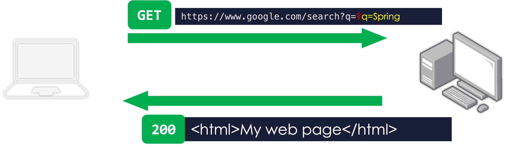
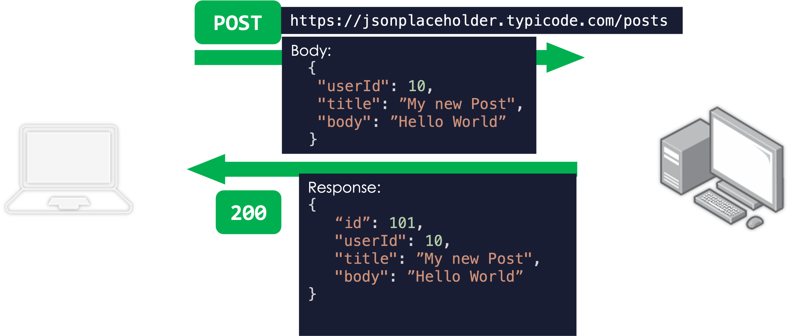

# RESTful-Interfaces / HTTP(s)
In diesem Kapitel wirst du mit der Welt da draussen kommunizieren!

Die Grundlagen hierzu, die wir hier anschauen werden, handeln um HTTP(S)-Requests ("Anfragen").

Eine HTTP(S)-Anfrage tätigst du z.B., wenn du eine Webseite mit einem Browser lädst. Rufst du z.B. die Website https://www.google.ch/ auf, dann erledigt dein Browser u.A. folgende Schritte für dich:
* Nachschauen, welcher Server sich hinter der Domaine "www.google.ch" befindet (DNS-Abfrage).
* Verbindungsaufbau zu diesem Server (TCP).
* HTTP-GET-Request an den Server. Folgende Daten werden von deinem Browser mitgeliefert:
    * HTTP-Methode: "GET"
    * URL: "www.google.ch/"
    * HEADER-Daten/Meta-Daten (wie z.B. welcher Browser du verwendest, Anmeldedaten, usw.)

Ist die Anfrage erfolgreich, schickt dir der Server eine _Response_ (Antwort). Diese Response wird in diesem Falle eine Website im HTML-Format sein. Diese Antwort beschreibt, wie die Website aufgebaut ist und welcher Inhalt sie hat.

HTML musst du noch nicht kennen, vertiefen wirst du dich darin im "[HTML und CSS](https://labs.it-ninjas.ch/docs/web/html_css/01_html_intro/)"-Teil.


## Die Request-URL
"Googlest" du nach dem Begriff "Spring", dann landest du auf dieser Seite: https://www.google.com/search?q=Spring

Schaust du diese URL genauer an, dann kannst du erkennen, dass diese URL eine bestimmte Struktur aufweist:
* `https://`: Dieser Teil beschreibt, welches Protokoll verwendet werden soll. In diesem Fall wird das verschlüsselte HTTPS-Protokoll verwendet.
* `www.google.com`: Das ist der Host/der Server. An diesen Server soll die Anfrage geschickt werden.
* `/search`: Das ist der _Path_ der Website.
* `?q=Spring`: Das ist ein Parameter, der in der URL mitgegeben wurde. Als Entwickler:in könnten wir sagen: es wurde eine Variable `q` mit dem Wert `"Spring"` übergeben. `q` steht hierbei für "query", also "abfragen".

## Eine GET-Abfrage
Schauen wir uns noch einmal das Beispiel mit der Google-Seite an, wo wir nach "Spring" gesucht haben: https://www.google.com/search?q=Spring.

Geben wir diese URL im Browser ein, dann sendet der Browser dem entsprechenden Server automatisch eine sogenannte _GET_-Anfrage.

Folgende Grafik zeigt vereinfacht den Flow:



* An den Server, der hinter "www.google.com" steht, wird folgende HTTP-Anfrage geschickt:
    * HTTP Methode: GET
    * URL: https://www.google.com/search?q=Spring

* Ist die Seite erreichbar, dann erhalten wir die Website als HTML zurück.
* Zusätzlich teilt uns der _Status Code_ `200` mit, dass die Anfrage problemlos funktioniert hat.

Genau diese Anfrage können wir auch in Java ausführen.

Um HTTP-Requests durchzuführen, benötigst du eine Dependency wie `okhttp`. Installiere diese, indem du folgende Dependency im `pom.xml` innerhalb der `<dependencies>` hinzufügst und dann via `mvn install` installierst (bzw. bei IntelliJ: "View" -> "Tool Window" -> "Maven" und dann im neuen Tab auf der Seite den Projektnamen aufklappen und innerhalb von "Lifecycle" dann "install" ausführen): 
```xml
<dependency>
  <!-- HTTP Client: -->
  <groupId>com.squareup.okhttp3</groupId>
  <artifactId>okhttp</artifactId>
  <version>4.12.0</version>
</dependency>

<dependency>
    <!-- JSON in ein Objekt konvertieren: -->
    <groupId>com.fasterxml.jackson.core</groupId>
    <artifactId>jackson-databind</artifactId>
    <version>2.13.0</version>
</dependency>
```

Nun kannst du die HTTP-GET-Anfrage im Java-Code wie folgt ausführen:

```java
import okhttp3.OkHttpClient;
import okhttp3.Request;
import okhttp3.Response;

...

public static void main(String[] args) throws IOException {

  OkHttpClient client = new OkHttpClient();

  Request request = new Request.Builder()
      .url("https://www.google.com/search?q=Python")
      .get()
      .build();

  try (Response response = client.newCall(request).execute()) {
    System.out.println(response.body().string());
  }

}
```

Dieser Code gibt dir dann den HTML-Code der aufgerufenen Seite zurück.

Mit einem HTML kannst du vielleicht noch nicht viel anfangen. Stattdessen könnte eine Anfrage auch ein _JSON_ zurückgeben - das ist ähnlich wie XML eine Repräsentation von einem Programmier-Objekt.

Folgende Anfrage gibt ein JSON zurück, welches wir dann auch gleich in ein Array von `Island`-Objekte laden. Dieses Beispiel soll zeigen, dass Daten aus REST-Schnittstellen sehr einfach in Java-Klassen eingeladen werden können:

```java
import java.io.IOException;
import com.fasterxml.jackson.annotation.JsonProperty;
import com.fasterxml.jackson.databind.ObjectMapper;

import okhttp3.OkHttpClient;
import okhttp3.Request;
import okhttp3.Response;

public class Island {
    @JsonProperty("name")
    protected String name;
    @JsonProperty("country")
    protected String country;
    @JsonProperty("imageUrl")
    protected String imageUrl;

    public static void main(String[] args) throws IOException {

        OkHttpClient client = new OkHttpClient();

        Request request = new Request.Builder()
                .url("https://raw.githubusercontent.com/it-ninjas/labs/master/static/files/json/islands.json")
                .get()
                .build();

        try (Response response = client.newCall(request).execute()) {

            Island[] islands = new ObjectMapper().readValue(response.body().string(), Island[].class);
            for (Island island : islands) {
                System.out.println(island.name);
            }
        }

    }

}
```

## POST-Request
Beim GET-Request hast du bereits die Grundlagen von HTTP-Anfragen angeschaut. Du hast gesehen, dass du spezifische Daten in der URL angeben konntest.

In vielen Situationen möchtest es vermeiden, die Daten in der URL mitgeben zu müssen. Hierfür können die Daten von der URL (nach dem "?") in den sogenannten _Request-Body_ verschoben werden.

Bei der `requests.post(...)`-Funktion kannst du die Daten direkt beim `data`-Argument mitgegen. Sind deine Daten als Dictionary vorhanden, dann kannst du diese stattdessen als `json`-Argument übergeben. Einer dieser Werte wird dann in den Request-Body gepackt.

Im nachfolgenden Beispiel senden wir einen Request an die JSONPlaceholder-API. Das Ziel ist es, einen neuen "Post" zu erstellen. Das mitgelieferte Dictionary repräsentiert einen solchen Post:

```java
RequestBody body = RequestBody
        .create("{ \"userId\": 10, \"title\": \"My new Post\", \"body\": \"Hello World\" }",
                MediaType.parse("application/json"));

Request request = new Request.Builder()
        .url("https://jsonplaceholder.typicode.com/posts")
        .post(body)
        .build();

try (Response response = new OkHttpClient().newCall(request).execute()) {
    System.out.println(response.body().string());
}
```

Die POST-Anfrage hat wie folgt ausgesehen:



Im letzten Beispiel mussten wir die HTTP-POST-Methode verwenden und durften nicht GET verwenden. Dies hatte diese beiden Gründe:
1. `GET` lässt keinen HTTP-Body zu (bzw. ist nicht der Sinn von GET). `POST` hingegen schon.
2. Die JSONPlaceholder-API erwartet für diesen Zweck die `POST`-Methode.

## Weitere HTTP-Methoden
GET- und POST sind die bekanntesten HTTP-Methoden. Du kennst nun den wichtigsten Unterschied von beiden Methoden: wo werden die Daten mitgegeben.

Die Information, ob es sich um einen GET- oder POST-Request handelt, wird der Server sehen können. Als Schlussfolgerung kann der Server einen anderen Code ausführen je nach Methode.

Neben GET und POST gibt es noch viele weitere. Die Methoden werden meistens so gewählt, dass sie mit dem Zweck der Anfrage übereinstimmen:

| Methode   | Zweck                                                                     |
| --------- | ------------------------------------------------------------------------- |
| GET       | Daten abfragen.                                                           |
| POST      | Daten senden, um etwas Neues zu erstellen.                                |
| PUT       | Daten ersetzen bzw. erstellen wenn noch nicht präsent.                    |
| PATCH     | Ähnlich wie PUT, aktualisiert aber nur spezifizierte Werte.               |
| DELETE    | Löscht bestimmte Daten.                                                   |
| OPTIONS   | Abfrage, welche HTTP-Methoden für einen bestimmten Pfad verfügbar sind.   |

Eine bessere Übersicht erhältst du hier: https://developer.mozilla.org/en-US/docs/Web/HTTP/Methods

## HTTP-Status-Code

Wenn eine Anfrage erfolgreich war, dann erhältst du meistens den Status-Code `200` ("OK") oder `201` ("Created"). Kennen tust du bestimmt auch den Status-Code `404` "Not Found".

Solche Status Codes geben darüber Auskunft, ob ein Request funktioniert hat bzw. was der Status des Requests ist.

Eine lustige Seite, auf welcher du die einzelnen Status-Codes nachschauen gehen kannst, ist z.B. https://http.cat/. Eine seriösere Seite ist https://developer.mozilla.org/en-US/docs/Web/HTTP/Status.

Zusammengefasst bedeuten diese Status-Codes kategorisch folgendes:

| Code  | Type                        | Beispiel                                                        |
| ----- | --------------------------- | --------------------------------------------------------------- |
| 2XX   | Success (erfolgreich)       | Anfrage war erfolgreich, Daten wurden gespeichert.              |
| 3XX   | Redirection (Weiterleitung) | User muss sich zuerst einloggen.                                |
| 4XX   | Client Error (Fehler desjenigen, der anfragt) | Fehlerhafter Request, Path nicht verfügbar.   |
| 5XX   | Server Error                | Auf dem Server ist ein Fehler aufgetreten.                      |