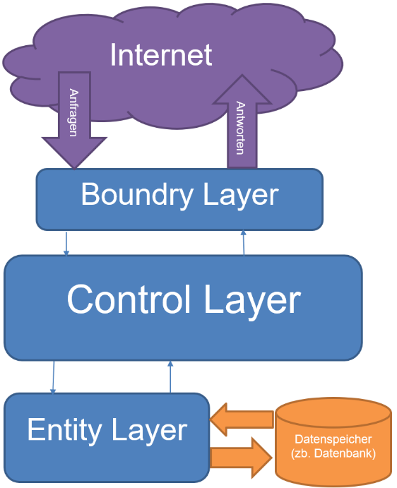

#### Ziele

* Ich kann am Beispiel Spring erklären, was ein "Framework" ausmacht, indem ich Unterschiede zu einer gewöhnlichen externen Library aufzählen kann.
* Ich kenne einige Vor- und Nachteile aufzählen, wenn ein Frameworks im Projekt eingesetzt wird.
* Ich kann erläutern, welche Zuständigkeiten die folgenden Module im Spring-Framework haben: Core, Data-Access, Web.
  welche Aufgaben sie erfüllen.
* Ich bin mit den bedeutendsten Spring-Projekten (Spring-Boot, Spring-Cloud, Spring-Security) vertraut, und kann erklären, wann welche eingesetzt werden. 
  und weiss wofür ich diese einsetzen kann.
* Ich verstehe das Konzept hinter "Inversion of Control" (IoC), indem ich erklären kann, auf welche Art und Weise es in Spring eingesetzt wird.
* Ich kann mind. 2 Arten auflisten, wie "Dependency-Injection" (DI) dazu verwendet werden kann, um Variablen automatisch einen Wert zuzuweisen.```
  Constructor-Based, Setter-Based, Field-Based) um DI in Spring zu benutzen.
* Ich kann das Konzept hinter `@Bean`s in Spring skizzieren und ich kann erläutern, wie `@Bean`s definiert und verwendet werden können.
* Ich kann den Scopes einer "Spring-Beans" ändern. (z.B. Singleton, Session, Application
  usw.).
* Ich kenne die am häufigsten verwendeten Spring-Bean-Annotationen `@Service`, `@Configuration`,
  `@Component`, `@Repository`, `@Controller` und weiss, wie ich diese einsetze und welchem Zweck sie
  dienen.
* Ich weiss, was "Wiring" ist und wie es in Spring gemacht wird.
* Ich kann in Spring-Projekten sogenannte Properties setzen und abfragen.
* Ich kenne Anwendungsfälle, in welchen Spring-Profiles verwendet werden und wie ich sie setzen kann.

---

### Framework

Ein Framework kann die Grundstruktur für Applikationen vorgeben.
Es stellt Funktionen, Bibliotheken und Regeln bereit, um den Entwicklungsprozess zu erleichtern und zu beschleunigen. Häufig gibt es eine standartisierte Struktur und Methodik vor, um eine gewisse Konsistenz und Qualität des Codes und der Software sicherzustellen.

## Spring Framework

Das Spring Framework ist eine umfassende Plattform, die weit über die Entwicklung einfacher Web-Applikationen 
hinausgeht. Sie bietet ein breites Spektrum an Funktionalitäten und Unterstützung für die Entwicklung von 
Enterprise-Anwendungen, Webanwendungen und Microservices.

### Module

Das Spring-Framework besteht aus verschiedenen Modulen, die unterschiedliche Aufgaben erfüllen und in Kategorien wie 
Core, Data Access, Web usw. organisiert sind.

[comment]: <> (Bildlink funktioniert auf website, nicht in md!)


Quelle: https://docs.spring.io/spring-framework/docs/3.0.0.M4/reference/html/images/spring-overview.png

Das Core-Modul umfasst essenzielle Funktionen wie Dependency Injection. Das Beans-Modul beinhaltet alles, was zur 
Erstellung von Beans benötigt wird.

Das JDBC-Modul bietet ein JDBC-Interface für den Datenbankzugriff. Das ORM-Modul ermöglicht den Zugriff auf 
Object-Mapping-APIs wie JPA, JDO, Hibernate. Das OXM-Modul ermöglicht den Zugriff auf 
Objekt/XML-Speicher-Implementierungen.

Das Web-Modul ist für die Kommunikation mit der Außenwelt (Internet) verantwortlich.

Weitere Informationen finden sich in der offiziellen
[Dokumentation](https://docs.spring.io/spring-framework/docs/3.0.0.M4/reference/html/ch01s02.html).

### Spring Projekte

Es gibt verschiedene Spring-Projekte, die auf dem Spring Framework aufbauen und dessen Anwendungsmöglichkeiten 
erweitern. Zu diesen gehören z. B. Spring Security, Spring Shell, Spring Boot, die jeweils spezifische 
Funktionalitäten bereitstellen.

Mehr dazu auf [GitHub Spring Projects](https://github.com/spring-projects).


#### Spring Boot

[Spring Boot](../new-spring-boot-doc.md) vereinfacht das normale Spring Framework. Mit dem Spring Initializer können Abhängigkeiten wie 
Datenbanktreiber oder Software für die Cloud-Infrastruktur ausgewählt werden, was die manuelle Konfiguration des 
Projekts überflüssig macht. Spring Boot ist jedoch kein Ersatz für das Spring Framework, sondern vereinfacht die 
Konfiguration.

## Design-Pattern
Design-Patterns sind wiederverwendbare Vorlagen für die Anwendungsentwicklung und sind nicht spezifisch für eine 
Programmiersprache. Es gibt verschiedene Arten, z. B. Kreationsmuster, Strukturmuster und Verhaltensmuster, die auch in 
Spring genutzt werden.

### Inversion of Control (IoC)
Inversion of Control (IoC) bedeutet, dass die Steuerung der Erstellung und Verwaltung von Objekten an ein Framework oder eine Bibliothek delegiert wird,
anstatt dass die Anwendung selbst diese Kontrolle hat. 
Im Fall von Spring übernimmt der Spring-Container die Kontrolle über die Erstellung und Verwaltung von Objekten (Beans),
anstatt dass die Anwendung diese Aufgaben selbst durchführt. 
Dies ermöglicht eine lose Kopplung zwischen den Komponenten einer Anwendung und erleichtert die Testbarkeit, 
Wartbarkeit und Erweiterbarkeit des Codes.

### Dependency Injection (DI)
Dependency Injection (DI) ist ein Designmuster, das verwendet wird, um Abhängigkeiten zwischen Objekten zu verwalten. 
Anstatt dass ein Objekt seine eigenen Abhängigkeiten erstellt oder findet, werden diese von einer externen Entität bereitgestellt. 
Spring verwendet Dependency Injection, um die Abhängigkeiten von Beans zu verwalten.

Es gibt zwei Hauptmethoden der Dependency Injection in Spring:

#### Konstruktorinjektion (Constructor Injection):
Bei der Konstruktorinjektion werden die Abhängigkeiten über den Konstruktor einer Klasse eingeführt. 
Das bedeutet, dass die erforderlichen Abhängigkeiten als Parameter im Konstruktor einer Klasse übergeben werden. 
Beim Erstellen einer Bean im Spring-Container wird der passende Konstruktor aufgerufen und die benötigten Abhängigkeiten werden automatisch injiziert.

Beispiel in Java:
```java
   public class MyClass {
       private MyDependency dependency;

       public MyClass(MyDependency dependency) {
           this.dependency = dependency;
       }
   }
```

#### Feldinjektion (Field Injection):
Bei der Feldinjektion werden die Abhängigkeiten direkt in die Felder einer Klasse injiziert. 
Dies geschieht durch die Verwendung von Annotations wie `@Autowired` in Spring. 
Der Spring-Container erkennt die annotierten Felder und injiziert automatisch die entsprechenden Abhängigkeiten.

Beispiel in Java:
```java
   public class MyClass {
       @Autowired
       private MyDependency dependency;
   }
```

Beide Methoden haben ihre Vor- und Nachteile. Konstruktorinjektion wird oft als bevorzugte Methode betrachtet, da sie die Abhängigkeiten klarer macht und die Klasse in einen konsistenten Zustand bringt, bevor sie verwendet wird. Field Injection ist jedoch kürzer und kann in bestimmten Fällen praktisch sein, insbesondere wenn es sich um einfache Abhängigkeiten handelt.

### Singleton

Das Singleton Design Pattern stellt sicher, dass von einer Klasse nur eine Instanz existiert. Im Kontext von Spring 
können Singleton-Beans erstellt werden, aber es ist wichtig zu beachten, dass dies innerhalb des Spring-Containers 
gilt, nicht systemweit.


### Beans

Beans sind Kernkomponenten in der Spring-Welt. Sie repräsentieren die grundlegenden Bausteine, die vom Spring 
IoC-Container verwaltet werden. Eine Bean ist ein von Spring verwaltetes und instanziiertes Objekt, 
das in einem Spring-Container erstellt wird. Beans werden in der Regel durch Konfigurationsmetadaten definiert,
z. B. durch XML-Dateien, Annotationen oder Java-basierte Konfiguration. 
Diese Beans werden dann vom Spring-Framework erstellt, verwaltet und bereitgestellt. 
Sie können verschiedene Aufgaben erfüllen, wie die Datenbankkonnektivität, 
die Geschäftslogik oder die Präsentationsschicht einer Anwendung. 
Der Spring-Container verwaltet den Lebenszyklus der Beans und bietet Funktionen wie Abhängigkeitsinjektion,
Transaktionsmanagement und Aspektorientierte Programmierung.

#### Erstellung von Beans

Beans können auf verschiedene Weisen erstellt werden:

- **XML-Konfiguration:** Historisch gesehen wurden Beans oft in XML-Dateien definiert. Hier wird beschrieben, wie der Container diese Instanzen erstellt und verwaltet.

  ```xml
  <bean id="exampleBean" class="com.example.ExampleClass">
      <property name="someProperty" value="Wert"/>
  </bean>
  ```

- **Java-Konfiguration:** Mit Annotationen und Java-Klassen kann die Konfiguration von Beans lesbarer und flexibler gestaltet werden.

  ```java
  @Configuration
  public class AppConfig {
      @Bean
      public ExampleClass exampleBean() {
          return new ExampleClass();
      }
  }
  ```

#### Bean-Scopes

Beans haben verschiedene Scopes, die ihr Lebenszyklus bestimmen:

- **Singleton:** Es wird nur eine Instanz pro Container erzeugt. Dies ist der Standard-Scope in Spring.
- **Prototype:** Für jeden Aufruf zur Bean-Anforderung wird eine neue Instanz erstellt.
- **Request, Session, Application:** Spezifische Scopes für Webanwendungen, um den Lebenszyklus der Beans an HTTP-Anforderungen oder Sitzungen zu binden.

#### Verwendung von Beans

Beans werden normalerweise über Injektionen verwendet, um Abhängigkeiten zwischen verschiedenen Komponenten einer 
Anwendung zu verwalten. Dies geschieht via Dependency Injection:

```java
@Component
public class ExampleService {
    private final ExampleRepository repository;

    public ExampleService(ExampleRepository repository) {
        this.repository = repository;
    }

    // ...
}
```

Hier wird `ExampleRepository` als Abhängigkeit von `ExampleService` injiziert. Die `@Component`-Annotation wird für dieses Beispiel verwendet, damit die Abhängigkeiten via Dependency Injection eingefügt werden.

Beans sind flexibel, wiederverwendbar und ermöglichen die Modularität von Anwendungen.


In der folgenden offiziellen Dokumentation zu der `@Bean`-Annotation findest du weitere Beispiele, wie Beans verwendet werden:
* [Using the Bean Annotation](https://docs.spring.io/spring-framework/docs/current/reference/html/core.html#beans-java-bean-annotation)

##### Scope

Der Scope eines Beans besagt, wann und wie ein Bean erstellt wird.

Hier eine Liste der Scopes:

| Scope       | Beschreibung                                                                                   |
|-------------|------------------------------------------------------------------------------------------------|
| singleton (Standard) | Singleton besagt, dass es immer nur eine Instanz eines Beans gibt, welche dann geteilt wird. Es wird daher nur **eine** Bean-Instanz in jedem IoC-Container.  Mehr [hier](#singleton). |
| prototype   | Erstellt bei jeder Abhängigkeit eine neue Bean-Instanzen.                                            |
| request     | Erstellt für jeden HTTP Request eine Bean Instanz.                                             |
| session     | Erstellt für jede HTTP `Session` eine Bean Instanz.                                            |
| application | Erstellt für jeden `ServetContext` eine Bean Instanz.                                          |
| websocket   | Erstellt für jeden `WebSocket` eine Bean Instanz.                                              |

Die beiden wichtigsten Scopes sind `singleton` und `prototype`.


Der Scope wird durch die `@Scope` Annotation festgelegt.  
Hier ein Beispiel:

```java
@Configuration
public class MyConfiguration {
    @Bean
    @Scope("prototype")
    public Encryptor encryptor() {
        // ...
    }
}
```

Weitere Information
hier: https://docs.spring.io/spring-framework/docs/current/reference/html/core.html#beans-factory-scopes

### REST
REST (Representational State Transfer) ist ein Designkonzept für das Internet, das Regeln und Standards definiert, 
wie Webdienste miteinander kommunizieren. Es basiert auf dem Austausch von Daten über das HTTP-Protokoll und verwendet 
einheitliche Methoden wie GET, POST, PUT und DELETE, um auf Ressourcen zuzugreifen und mit ihnen zu interagieren. 
REST betont die Verwendung von klaren, eindeutigen URLs und fördert eine zustandslose Kommunikation, was bedeutet, 
dass jede Anfrage alle benötigten Informationen enthält, um verstanden zu werden, ohne auf vergangene Anfragen 
zurückgreifen zu müssen.

Hier eine kurze Übersicht der REST-Methoden:
* GET: Wird genutzt, um Daten von einem bestimmten Ort abzurufen. Beispielsweise das Abrufen von Informationen über Benutzerprofile einer Social-Media-Plattform.
* POST: Um neue Daten an den Server zu senden, beispielsweise beim Ausfüllen eines Formulars und Absenden der Informationen.
* PUT: Zum Aktualisieren von bestehenden Ressourcen, indem neue Daten an einen bestimmten Ort gesendet werden.
* DELETE: Wird genutzt, um eine spezifische Ressource auf dem Server zu entfernen, wie das Löschen eines Benutzerkontos von einer Plattform.

> Hinweis: Eigentlich ist REST _kein_ Designpattern, jedoch hat es Ähnlichkeiten dazu.

## Spring Struktur



Die Meisten modernen Webapplikationen bestehen aus 3 Schichten:

| Layer                 | Beschreibung                                                                                                          |
| --------------------- | --------------------------------------------------------------------------------------------------------------------- |
| Boundary (Grenze)     | Auf dieser Schicht wird die Kommunikation mit der Aussenwelt abgewickelt.                                             |
| Control (Verwaltung)  | Auf dieser Schicht sind alle Klassen und deren Logik.                                                                 |
| Entity (Speicher)     | Auf dieser Schicht wird alles abgewickelt, was mit Datenspeicherung und Auslesung zu tun hat (z.B. mit Repositories). |

Spring hat verschiedene Annotationen für verschiedene Aufgaben. Mit der `@Component` Annotation wird
eine generische Spring Komponente dargestellt. Alle anderen Annotationen sind ebenfalls Komponenten.
Sie grenzen nur ab, was sie genau machen. Mit der `@Configuration` Annotation werden Komponenten für die
Konfiguration definiert. Mit der `@Repository` Annotation werden Komponenten, welche mit der Datenspeicherung zu
tun haben definiert. Mit der `@Controller` Annotation werden Komponenten, welche mit der Kommunikation mit
der Aussenwelt zu tun haben definiert. In der `@Service` Annotation werden Komponenten, welche mit der Kontrolllogik zu
tun haben definiert.

### Die Schichten (Layer) in Spring
#### Boundary Layer

In diesem Layer definieren wir unsere REST Ressourcen. Hier ein Beispiel einer Order-Klasse in einem
Webshop:

```java

@RestController
@RequestMapping("/orders")
public class OrderResource {
    private final OrderService orderService;
    
    public OrderResource(OrderService orderService) {
        this.orderService = orderService;
    }
    
    @GetMapping
    public List<Order> findAll() {
        return orderService.findAll();
    }
    
    @GetMapping("/{id}")
    public Order findById(@PathVariable Long id) {
        return orderService.findById(id).orElseThrow(EntityNotFoundException::new);
    }
    
    @PostMapping
    public Order save(@RequestBody Order order) {
        return orderService.save(order);
    }
    
    @PutMapping("/{id}")
    public Order update(@PathVariable Long id, @RequestBody Order order) {
        return orderService.update(id, order);
    }
    
    @DeleteMapping("/{id}")
    public ResponseEntity delete(@PathVariable Long id) {
        orderService.delete(id);
        return ResponseEntity.ok().build();
    }
}
```

Dies ist eine Rest-Resource und sie wird definiert mit der Annotation `@RestController`. Die
Annotation `@RequestMapping("/orders")` legt fest, dass alle Aufrufe, wessen URL mit `"/orders"` beginnen, diesen Rest-Controller
verwenden sollen.

Schauen wir uns dies doch ein bisschen genauer an:

```java
@GetMapping("/{id}")
public Order findById(@PathVariable Long id){
    return orderService.findById(id).orElseThrow(EntityNotFoundException::new);
}
```

Mit der `@GetMapping` Annotation bestimmen wir, dass alle Anfragen auf dem `orders/id` Pfad von der
annotierten Methode gehandelt werden, wenn die HTTP-Methode `GET` verwendet wurde. `@PathVariable` bestimmt, dass die ID als Path-Variable (also in der URL)
angegeben wird. Das bedeutet, dass ein Aufruf auf `/orders/12` das gleiche Ergebnis hat wie `findByID(12)`.

```java
@PutMapping("/{id}")
public Order update(@PathVariable Long id,@RequestBody Order order){
    return orderService.update(id,order);
}
```

Die Annotation `@RequestBody` wird verwendet, um anzugeben, dass der Parameter `order` aus dem Request-Body des 
HTTP-Requests gelesen werden soll.

#### Control Layer

Der Control Layer bildet den Kern aller Anwendungen und enthält dessen Geschäfts-Logiken. Auf der
technischen Ebene ist der Control Layer die grundlegendste Schicht.
Die Control Layer könnte wie folgt aussehen:

```java
@Service
@Transactional
public class OrderService {
    private final OrderRepository orderRepository;

    public OrderService(OrderRepository orderRepository) {
        this.orderRepository = orderRepository;
    }

    public List<Order> findAll() {
        return (List<Order>) orderRepository.findAll();
    }

    public Optional<Order> findById(Long id) {
        return orderRepository.findById(id);
    }

    public Order save(Order order) {
        return orderRepository.save(order);
    }

    public Order update(Long id, Order order) {
        Order toUpdate = orderRepository.findById(id).orElseThrow(EntityNotFoundException::new);
        toUpdate.setName(order.getName());
        return toUpdate;
    }

    public void delete(Long id) {
        orderRepository.deleteById(id);
    }
}
```

Diese Klasse besitzt nur zwei Annotationen nämlich `@Service` und
`@Transactional`. Die `@Service` Annotation markiert Beans als Holder
der Businesslogik. `@Transactional` sagt einfach, dass alle Funktionen in der Klasse in einer
einzigen Transaktion ausgeführt werden sollen. Das musst du vorläufig aber noch nicht verstehen.
Durch die Constructor Injection wird hier auch noch die Bean `OrderRepository` injected.

#### Entity Layer

Der Entity Layer ist für die Datenspeicherung zuständig. Auf diesem Layer gibt es die zwei Hauptbestandteile
Entity und Repository. Entities sind Klassen, die eine Datenbank-Tabelle repräsentieren. Die Repositories hingegen verwalten
diese Entities.

Auch hier wird mit Annotation gearbeitet, um die Funktionalität umzusetzen. Die `@Entity` Annotation sagt, dass es
sich bei dieser Klasse um ein Entity handelt.

Die `@Table` Annotation sagt, auf welcher Tabelle in der Datenbank diese Klasse gespeichert wird
(Schreibweise `@Table(name = "tabellenNamen")`).

Die `@GeneratedValue` Annotation besagt, dass dieser Wert in der Tabelle/Datenbank automatisch generiert wird.

Die `@Id` Annotation sagt, dass dieses Feld als Primärschlüssel in der Tabelle fungiert.

Hier ist ein Beispiel:

```java
@Entity
@Table(name = "orders")
public class Order {
    @Id
    @GeneratedValue
    Long id;
    String name;

    public Long getId() {
        return id;
    }

    public void setId(Long id) {
        this.id = id;
    }

    public void setName(String name) {
        this.name = name;
    }

    public String getName() {
        return this.name;
    }
}
```

Damit wir auf die Daten zugreifen können, brauchen wir ein Repository. Dazu können wir ein Interface
implementieren, welches `CrudRepository` extended. Das `CrudRepository` hat schon viele Methoden
implementiert, deshalb müssen wir keine eigenen implementieren.

Hier ein Beispiel:

```java
@Repository
public interface OrderRepository extends CrudRepository<Order, Long> {
}
```

Du fragst dich vielleicht, wo die Daten gespeichert werden. Normalerweise macht Spring eine temporäre
Datenbank, welche jedoch nach Abschluss des Programmes wieder gelöscht wird. Wenn man die Daten nicht
jedes Mal neu schreiben will, kann man sie in einer "richtigen" Datenbank speichern. Dazu müssen wir
die Spring Konfiguration ändern.

Spring lädt die Konfiguration von einer Datei mit dem Namen `application.properies` bzw. `application.yaml`. Diese Datei befindet sich im
`resources`-Ordner (oft im Ordner "src/main" oder "src/test").

Folgende 5 Konfigurationen werden oft im Zusammenhang mit Datenbanken benötigt:

| Konfiguration                         | Beschreibung                                                                                      |
| ------------------------------------- | ------------------------------------------------------------------------------------------------- |
| `spring.datasource.url`               | gibt die URL der Datenbank an (Format:`jdbc:[datenbanktyp]://[server]:[port]/[datenbank]`)        |
| `spring.datasource.username`          | gibt den Benutzername an, mit dem die Verbindung zur Datenbank aufgebaut werden soll.             |
| `spring.datasource.password`          | gibt das Passwort der Datenbank an.                                                               |
| `spring.datasource.driver-class-name` | gibt an, welcher Datenbanktreiber verwendet wird (muss als Maven-Dependency hinzugefügt werden)   |
| `spring.jpa.hibernate.ddl-auto`       | beschreibt, wie Spring mit der Datenbank umgehen soll. `update` z.B. sorgt dafür, dass fehlende Spalten oder dergleichen automatisch erstellt werden und dass nie Sachen gelöscht werden. `create-drop` erstellt die Datenbank und löscht die Objekte nachher. `none` belässt die Datenbank. |

Hier ist eine beispiel Konfiguration mit einer Mariadb Datenbank:

```properties
spring.datasource.url=jdbc:mariadb://localhost:3306/order
spring.datasource.username=spring
spring.datasource.password=1234
spring.datasource.driver-class-name=org.mariadb.jdbc.Driver
spring.jpa.hibernate.ddl-auto=update
```

##### Repository

Eines der am häufigsten verwendeten Design-Patterns (siehe oben) ist das Repository Design-Pattern.
Es ist ein Interface, welches dafür zuständig ist, uns Zugang zu den Daten in der Datenbank zu bereiten.
Man kann es sich ein wenig, wie einen Bibliothekar vorstellen. Er gibt uns die Bücher zurück, die wir
wollen, ohne dass wir wissen, wie er sie uns beschafft. Wir kennen nur die API, also die Befehle
und welche Resultate wir erwarten können.

```java
public interface ArticleRepository {
    List<Article> readAll();
    
    List<Article> readLatest();
    
    List<Article> readByTags(Tag... tags);
    
    Article readById(long id);
    
    Article create(Article article);
    
    Article update(Article article);
    
    Article delete(Article article);
}
```

Meistens wird das Interface im Hintergrund vom Framework implementiert und wir müssen nichts dafür
tun, ausser den richtigen Methodennamen und Rückgabewert zu wählen, damit Spring weiss, was es implementieren soll.

### Profile

In Spring kann man verschiedene Profile erstellen. Damit kann man sicherstellen, dass bestimmte `@Bean`s
nur entsprechend gesetzt werden, wenn eine bestimmte Bedingung zutrifft. Die Datenbank soll zum Beispiel nur Beispieldaten
laden, wenn das `Dev`-Profil aktiv ist, ansonsten soll eine richtige Datenbank verwendet werden.

Mit der `@Profile` Annotation kann man einer Klasse oder Methode (Beans) sagen, ob sie bei einem
Profil läuft. Das standard Profil ist `default`, wenn irgendein Profil aktiv ist, wird das `default`
Profil deaktiviert.
Hier ist ein Beispiel:

```java
@Component
@Profile("test")
public class TestString {
    @Bean
    public String test() {
        return "test";
    }
}
```

Im Beispiel lädt die Komponente `TestString` nur, wenn das Profil `test` aktiv ist.  
Bei der `@Profile`-Annotation kann man auch logische Operatoren wie "Und" (`&`) , "Oder" (`|`) und "Nicht" (`!`) benutzen.
Hier ein Beispiel:

```java
@Component
public class Demo {
    @Bean
    @Profile("default")
    public String defaultString() {
        return "Standard Profil";
    }
    
    @Bean
    @Profile("test | test2")
    public String testString() {
        return "Test Test";
    }
    
    @Bean
    @Profile("!(default | test | test2)")
    public String rewoltString() {
        return "None of the above";
    }
}
```

In diesem Beispiel werden die Methoden angesteuert. Wenn das Profil `default` aktiv ist, wird
die `defaultString` Methode geladen, wenn das Profil `test` oder `test2` aktiv ist, wird
die `testString` Methode geladen, wenn keines der obengenannten Profile aktiv ist, wird
die `rewoltString`-Methode geladen.

In Spring kann man Mehrere Profile aktivieren. Die Profile können mit dem Program gesetzt werden.  
Beispiel hier:

```java
AnnotationConfigApplicationContext ctx=new AnnotationConfigApplicationContext();
        ctx.getEnvironment().setActiveProfiles("test");
        ctx.register(SomeConfig.class,StandaloneDataConfig.class,JndiDataConfig.class);
        ctx.refresh();
```

Die Profile können auch über die `spring.profiles.active` Property aktiviert werden.
Beispiel hier:

```properties
spring.profiles.active="test"
```

Bei beiden Möglichkeiten wurde das Profil `test` aktiviert. Weitere Informationen in
der [offiziellen Dokumentation](https://docs.spring.io/spring-framework/docs/current/reference/html/core.html#beans-definition-profiles).