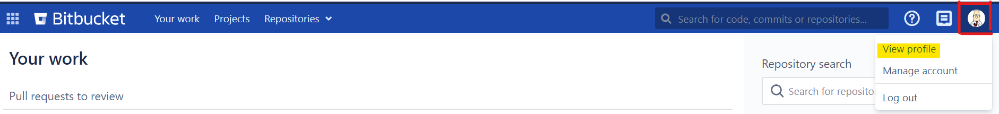
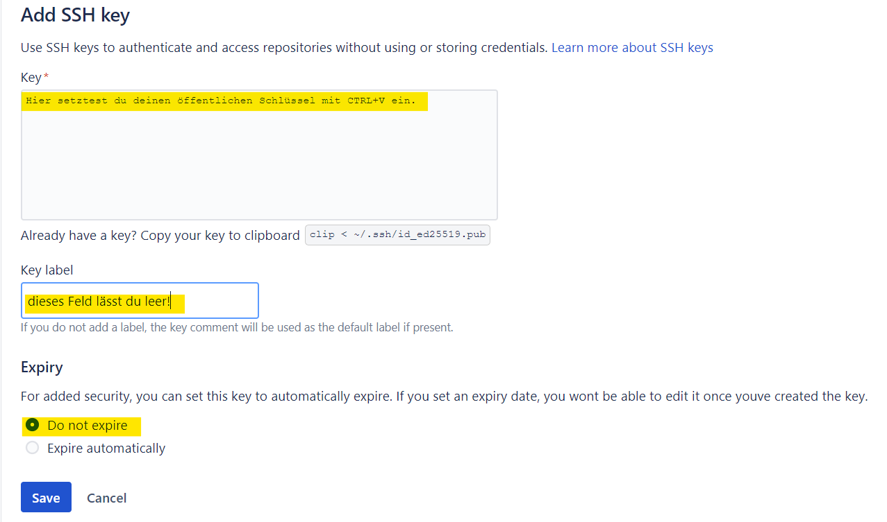

## Ziele

- Ich weiss, wie ich Git in meinem Betriebssystem installiere.
- Ich kenne das von der SBB gehostete Bitbucket.
- Ich habe ein persönliches GIT-Repository erstellt


## Inhalt

- [Git unter Linux installieren](#git-unter-linux-installieren)
- [Git unter Windows installieren](#git-unter-windows-installieren)


## Installation

### Überprüfe die Installation

Verwende den folgenden Befehl, um zu überprüfen, ob git bereits installiert ist:

```
git --version
```

### Git unter Linux installieren

- Debian basierte Linux (Ubuntu): `sudo apt install git`
- Redhat basierte Linux (Fedora, Rocky Linux): `sudo dnf install git`

Überprüfe die Installation mit `git --version`.

### Git unter Windows installieren

1.  Navigiere zum [Git für Windows Installer](https://git-scm.com/download/win) und lade die neuste Version herunter.
2.  Folge den Installationsanweisungen bis die Installation abgeschlossen ist.
    - Es wird empfohlen während der Installation Git Bash zu installieren
      
    - Es wird empfohlen während der Installation den PATH zu ändern.
      
3.  Öffne Git Bash
4.  Schreibe `git --version` zum Überprüfen, ob Git erfolgreich installiert wurde.

### Git personalisieren

Nach der Installation von Git sollte als erstes der Name und die Email Adresse konfiguriert werden,
da diese beiden Angaben bei jedem Commit benötigt werden:

```bash
git config --global user.name "u123456"
git config --global user.email "u123456@sbb.ch"
# Für Windows zusätzlich:
git config --global core.autocrlf true
git config --global core.longpaths true
```

### Warum du Git ab heute verwenden wirst

Stell dir folgendes Szenario vor:
Du arbeitest mit deinem Computer seit mehreren Stunden um deine Hausaufgaben, welche morgen fällig werden, zu erledigen.
Du speicherst deine Anpassungen immer wieder, damit diese nicht verloren gehen.
Plötzlich stürzt dein Computer ab und startet nicht wieder.
Zum Glück, hast du noch ein altes Laptop, welcher funktionstüchtig ist und womit du morgen in die Schule gehen kannst.
Nur, was ist mit deinen Hausaufgaben? Die ganze Arbeit ist verloren und du musst wieder von Anfang an beginnen. Grrr....

Wenn du deine Arbeit nicht nur auf deinem Computer, sondern auch irgendwo anders gespeichert hättest (z.B. Dropbox, Google-Drive usw.),
wäre es ganz einfach die Arbeit auf deinem Ersatz-Computer von dort aus herunterzuladen und dort weiterzumachen, wo du aufgehört hast.

Und hier ein weiteres Szenario:
Du arbeitest an einem Computer-Programm. Es funktioniert. Nun musst du etwas Neues in dem Programm einbauen.
Du arbeitest ein paar Stunden dran und am Schluss merkst du, dass was bisher einwandfrei funktioniert hat, jetzt gar nicht funktioniert.
Du willst die Änderungen rückgängig machen, weisst aber nicht wie der Code vor der Änderungen ausgesehen hat. Grrr....

Wenn du deine ursprüngliche Arbeit als eine Art "Snapshot" irgendwo abgelegt hättest bevor du mit den Änderungen begonnen hast,
so hättest du ganz einfach auf diesen "Snapshot" zurückgreifen können und den alten, funktionierenden Zustand wiederherstellen können.

Diese zwei, in der Realität nicht ganz seltenen, Szenarien sind nur zwei Gründe, warum du ab heute mit Git und mit dem Git-Tool "Bitbucket" arbeiten wirst.
Git ist ein Software-System, das es ermöglicht, den Arbeitszustand in einem sog. **lokalen Repository** aufzubewahren und diesen bei Bedarf (z.B. im zweiten Szenario) wiederherzustellen.
Bitbucket ist ein Git-Cloud-Tool, welches sog. **Remote-Repositories** in der Cloud zur Verfügung stellt.
Diese Remote-Repositories sind im Wesentlichen eine Kopie der lokalen Repositories und dienen unter anderem auch als Backup der Arbeit ausserhalb der eigenen Maschine.

Später im Ausbildungsprogramm wirst du mehr über Git und seine weitere Anwendungszwecke erfahren.
Hier geht es aber in erster Linie um das Backup deiner Arbeit, damit du bei einem Computerabsturz nicht alles von vorne machen musstest.

### Persönliches Bitbucket Repository einrichten

Um deine Arbeit ausserhalb deines Computers zu sichern, wirst du in den nächsten Abschnitten ein
Remote Git-Repository in Bitbucket erstellen und einrichten.  
Anschliessend, wirst du dieses Repository bei dir (lokal) "klonen", sodass du auch ein lokales
Repository hast, womit du auch ohne Internetverbindung arbeiten kannst.

#### Remote Repository erstellen

1. Klicke auf den folgenden Link, um Bitbucket in deinem Browser zu öffnen: [Bitbucket](https://code.sbb.ch/)
2. Wenn du noch nicht eingeloggt bist, folge den Anweisungen auf der Login-Seite
3. Nach dem Login wirst du oben rechts ein, vermutlich, noch leeres Profil-Bild sehen. Klicke darauf und wähle **View Profile** (Profil anzeigen) aus  
   
4. Auf deiner Profilseite, klickst du nun den **Create repository** (Neues Repository erstellen) Schaltfläche
5. Gib im geöffneten Formular deinem Repository einen Namen (z.B. "ausbildungsprogramm") und lasse die andere Felder leer. Anschliessend klicke auf **Create Repository** (Repository erstellen).

Bitbucket erstellt nun das Repository für dich und du wirst automatisch zu deinem, noch leeren, Repository geführt.
Herzliche Gratulation! Du hast soeben dein erstes Git-Repository erstellt.

#### SSH-Schlüssel für dein Repository erstellen

Ein SSH-Schlüssel ist ein Zugriffsberechtigungsnachweis für das SSH-Netzwerkprotokoll (Secure Shell).
Dieses authentifizierte und verschlüsselte sichere Netzwerkprotokoll wird für die Remote-Kommunikation zwischen Computern verwendet.

SSH verwendet ein Schlüsselpaar, um einen sicheren Handshake zwischen Remote-Parteien zu initiieren.
Das Schlüsselpaar enthält einen öffentlichen und einen privaten Schlüssel.
Den öffentlichen Schlüssel kannst du dir als **Schloss** und den privaten Schlüssel als **Schlüssel** für dieses Schloss vorstellen.

##### SSH Schlüssel-Paar erstellen:

Öffne ein Git-Bash Terminal und gib folgenden Befehl ein. Verwende hierfür deine E-Mail-Adresse:

```bash
ssh-keygen -t rsa -b 4096 -C "u123456@sbb.ch"
```

Danach wirst du aufgefordert, eine Datei anzugeben, in der der Schlüssel gespeichert werden soll.
Drücke hier die Eingabetaste (Enter), um den Standardspeicherort zu übernehmen.
Bei der nächsten Eingabeaufforderung wirst du nach einer sicheren Passphrase gefragt.
Auch hier kannst du die Eingabetaste verwenden, um keine Passphrase zu definieren (oder du wählst dir eine Passphrase aus).

Deine SSH-Schlüsselpaar-Dateien sind nun in deinem Standardverzeichnis (auf Windows: C:\Users\<deine-uNummer>\.ssh) vorhanden:
Der private Schlüssel ist in der Datei **id_rsa** abgelegt.
Der öffentliche Schlüssel ist in der Datei **id_rsa.pub** abgelegt.

##### Öffentlicher Schlüssel in Bitbucket ablegen

Als letzter Schritt legst du deinen öffentlichen SSH-Schlüssel wie folgt in Bitbucket ab:

1. Öffne ein Git-Bash Terminal und navigiere zum Speicherort deines SSH-Schlüsselpaars
2. Gib folgenden Befehl ein, um deinen Schlüssel im Terminal auszugeben:

```bash
C:\Users\u123456\.ssh> cat id_rsa.pub
```


3. Markiere die Ausgabe und kopiere sie zum Clipboard (CTRL+C)
4. [Klicke hier, um deinen öffentlichen Schlüssel ins Bitbucket hinzuzufügen](https://code.sbb.ch/plugins/servlet/ssh/account/keys)
5. Klicke die "Add key" Schaltfläche, fülle das geöffnete Formular wie folgt aus und drücke anschliessend die "Save" Schaltfläche:  
   

Somit hast du die SSH-Konfiguration abgeschlossen und du kannst dieses Protokoll beim Klonen benutzen.

### Repository lokal klonen

Dein erstelltes Repository befindet sich nun auf dem Bitbucket-Server.  
Damit du diesen Repository aus deinem Computer benutzen kannst, musst du jetzt dieses lokal "klonen".  
Klonen bedeutet hier einerseits lokal kopieren und andererseits eine Verbindung zwischen Remote- und Lokal-Repository herzustellen, um die Arbeit zwischen den beiden synchronisieren zu können.

Da du jetzt einen Ort hast, an dem du deine Arbeitsdateien hinzufügen und sichern kannst, muss es auch eine Möglichkeit geben,  
von deinem lokalen System (also direkt von deinem Computer und nicht nur über Browser) darauf zuzugreifen.  
Um dies einzurichten, kopierst du das Bitbucket-Repository auf dein System.  
Bei Git wird dieser Kopiervorgang als **Klonen** bezeichnet.  
Wenn du ein Repository klonst, erstellst du eine Verbindung zwischen dem Bitbucket-Server (den Git als "origin" kennt) und deinem lokalen System.


#### Ordner für deine Repositories anlegen

Bevor du dein Repository klonen wirst, erstellst du nun ein Ordner, welcher dieses Repository (und später auch weitere Repositories) beinhalten wird.

**Aufgabe**  
Erstelle den Ordner "local*repos" unter deinem Startverzeichnis (bei Windows unter *"C:\\Users\\\<dein Benutzername\>"\_)

```bash
C:\> cd Users\e123456 # e123456 ist der Benutzername auf dieser Maschine
C:\Users\e123456> mkdir local_repos # erstellt den Ordner "local_repos" unter dein Startverzeichnis
C:\Users\e123456> cd local_repos # ins Ordner local_repos navigieren
C:\Users\e123456\local_repos> # fertig...
```

#### Repository klonen

Um dein Repository zu klonen und mit der lokalen Instanz arbeiten zu können, installiere zuerst [IntelliJ IDEA](03_intellij_idea.md)!

