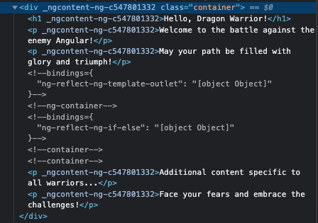

### Was ist ein Template?
In Angular ist das Template der Teil eines Components, der die Benutzeroberfläche definiert. Es ist im Wesentlichen das HTML, das vom Component angezeigt wird und mit der Benutzer interagieren kann.

Das Template kann jedoch mehr als nur HTML enthalten. Es kann auch Angularspezifische Syntax wie [Directives](./03_7_ts_directives), [Pipes](/04_2_ts_pipes), [Interpolationen](/04_1_ts_data_binding#interpolation) und [Bindings](/04_1_ts_data_binding) enthalten, die die Funktionalität und das Verhalten des Components bestimmen.

```html
<div *ngIf="condition; else elseBlock">Content to render when condition is true.</div>
<ng-template #elseBlock>Content to render when condition is false.</ng-template>
```

### ng-container &  ng-template
Durch die Verwendung von `ng-container` und `ng-template` kann der HTML-Code in Components besser strukturiert, lesbarer und wiederverwendbarer gemacht werden. Sie bieten eine flexible Möglichkeit, Inhalte bedingt anzuzeigen, dynamische Templates zu erstellen und den Code effizienter zu gestalten.

`ng-container` und `ng-template` erzeugen kein zusätzliches HTML-Element im DOM, das bedeutet das man nur den HTML-Code innerhalb der beiden im DOM sieht und nur von diesen welche aktiv sind.
Dies eignet sich gut, wenn man andere Directives wie `*ngIf`, `*ngFor` oder `*ngSwitch` verwenden möchte.

Um das `else`-Statement in Kombination mit `ngIf` zu verwenden, definiert man einen Template-Verweis (Referenz) mit einem #-Präfix und verwendet ihn in einem `ng-template`. Somit kann man sagen das wenn die Condition nicht zutrifft man ein anderes Template anzeigen möchte.

Wenn man `ng-container` und `ng-template` verwendet ist vielfach auch ein `*ngTemplateOutlet` im Spiel. `*ngTemplateOutlet` ist auch ein Directive, welche verwendet wird, um ein Template an einer bestimmten Stelle in einem Template eines Components einzusetzen. Es wird verwendet, wenn man nicht mit einer Condition arbeiten muss.


```typescript
import { Component } from '@angular/core';

@Component({
    // ..
})
export class AppComponent {
  condition = true;
}
```
```html
    <body>
        <ng-container *ngIf="condition; else elseTemplate">
            <p>container</p>
            <ng-container *ngTemplateOutlet="contentTemplate"></ng-container>
        </ng-container>

        <ng-template #contentTemplate>
            <p>contentTemplate</p>
        </ng-template>

        <ng-template #elseTemplate>
            <p>elseTemplate</p>
        </ng-template>
    </body>
```

Wenn der obenstehende Code gerendert wurde, sieht man das im DOM nun nur der body-tag und die beiden p-tags zusehen sind, das `ng-container` und `ng-template` nicht.
 

