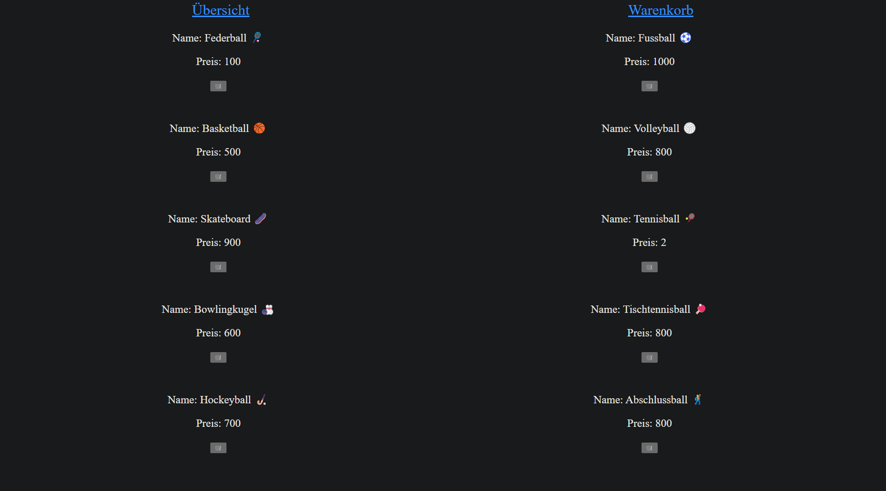
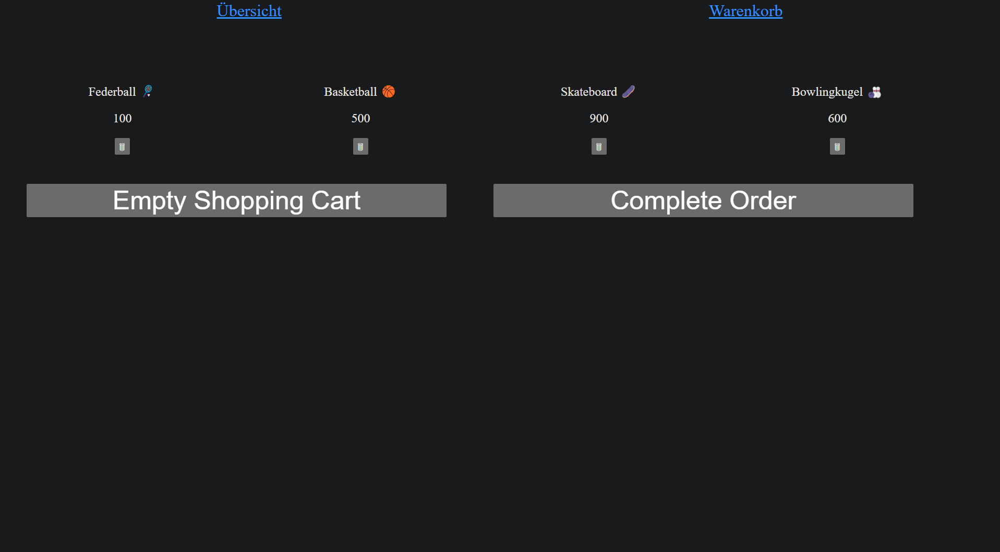

## Ziele

- in diesem Abschnitt sollen die Lösungen zu den (optionalen) NgRx-Labs genauer beleuchtet werden.

Wenn du du die Labs zu NgRx noch nicht gemacht hast, musst du dir diese Dokumentation nicht anschauen.

Wir gehen hier Schritt für Schritt die Aufgaben des NgRx-Labs durch, um zum Einen den Lösungsfindungsweg genauer anzuschauen, zum Anderen aber auch, um potenzielle Unklarheiten aus dem Weg zu räumen, die bei der Erarbeitung der Aufgabe aufgekommen sein könnten.

## Aufgabe 1 - Aufgabenstellung

Im Rahmen der ersten Aufgabe des Labs galt es, in einer neuen Angular-Applikation mit NgRx einen Counter zu erstellen, mit dem man:

- Den Wert des Counters inkrementieren kann (`Wert + 1`)
- Den Wert des Counters dekrementieren kann (`Wert - 1`)
- Den Wert des Counters zurücksetzen kann (`Wert auf 0`)

Die Umsetzung dieser Anforderungen gehen wir nun Stück für Stück durch. Wir beginnen mit den Actions.

## Aufgabe 1- Actions erstellen

Als erstes gilt es, die jeweiligen Actions für die drei oben beschriebenen Anwendungsfälle zu definieren. Für die Actions solltest du eine Datei `counter.actions.ts` erstellen, in der du die Actions erstellen kannst.
Die fertigen Actions sehen dann aus wie folgt:

```typescript
import { createAction } from "@ngrx/store";

export enum ActionTypes {
  INCREMENT = "[Counter Component] Increment",
  DECREMENT = "[Counter Component] Decrement",
  RESET = "[Counter Component] Reset",
}

export const increment = createAction(ActionTypes.INCREMENT);
export const decrement = createAction(ActionTypes.DECREMENT);
export const reset = createAction(ActionTypes.RESET);
```

Gehen wir das also einmal durch:
In der Aufgabenstellung war es vorgesehen, dass die verschiedenen Actions in ein Enum ausgelagert werden. So sind diese direkt alle über `ActionTypes` verfügbar. Dafür kannst du einfach die einzelnen Actions in ein Enum wrappen, wie es im Code oben gemacht wurde.
Der String nach dem `=` wird jeweils hinzugefügt, um die Action in Kontext zur Applikation zu stellen. In diesem Fall sagen sie also aus, dass im `CounterComponent` der Wert entweder inkrementiert, dekrementiert oder resettet wurde.

Nun haben wir bereits das Grundgerüst für die Actions, diese können aber noch nicht verwendet werden. Um das zu Ändern, müssen wir diese zu exportierbaren Actions machen, was im zweiten Abschnitt des Codebeispiels oben passiert.
Für jede Action, die wir definieren wollen, müssen wir eine entsprechende exportierbare Konstante erstellen. Relevant ist hierbei das Keyword `createAction`, welches die Actions erste wirklich als solche definiert.

Haben wir nun für jede Action eine entsprechende Definition vorgenommen, können wir mit dem nächsten Schritt fortfahren, den Reducers.

## Aufgabe 1 - Reducers erstellen

Damit nun beim Aufrufen der Actions, die wir definiert haben, auch etwas passiert, müssen wir die für die Actions entsprechendne Reducers erstellen.
Der entsprechende Code-Block in der Datei `counter.reducer.ts`, die du erstellt haben solltest, sieht aus wie folgt:

```typescript
import { createReducer, on } from "@ngrx/store";
import { increment, decrement, reset } from "./counter.actions";

export const initialState = 0;

export const counterReducer = createReducer(
  initialState,
  on(increment, (state) => state + 1),
  on(decrement, (state) => state - 1),
  on(reset, (state) => 0),
);
```

Gehen wir das mal Schritt für Schritt durch: Auf der vierten Zeile wird eine exportierbare Konstante `initialState` definiert. Diese gibt den Ausgangswert unseres Counters an, in diesem Fall `0`.
Interessant wird es aber ab Zeile 6: Hier wird eine exportierbare Konstante `counterReducer` definiert, welche dann die eigentlichen Reducer mit der Funktion `createReducer()` erstellt.
Die Funktion nimmt (in unserem Fall) insgesamt 4 Argumente entgegen:

- Den initialen Zustand
- Den Reducer für das Inkrementieren des Counters
- Den Reducer für das Dekrementieren des Counters
- Den Reducer für das Resetten des Counters

Der `initialState` wird hierbei als Ausgangswert für den Counter mitgegeben. Die jeweiligen Reducer entsprechen jeweils den Actions, die wir in der Datei `counter.actions.ts` definiert haben.
Die Definition funktioniert jeweils wie folgt: Der Reducer wird in die Funktion `on()` verpackt. Als erstes Argument wird hierbei die Action angegeben, die als Auslöser für den Reducer fungiert. (Wie du auf Zeile 1 sehen kannst, werden die jeweiligen Actions direkt aus `counter.actions` importiert.)
Insofern also eine der Actions getriggert wird, wird als nächstes der `state` ausgelesen. Dieser beshreibt den derzeitigen Zustand des Counters, den wir mit den Reducers mutieren wollen.
Zuletzt wird dann auch schon die entsprechende Mutation durchgeführt; Im Falle der Inkrementation wird der state um 1 erhöht, im Falle der Dekrementation um 1 verringert und im Falle des Zurücksetzens auf 0 gesetzt.

Das heisst also: Prinzipiell wartet der `Reducer` ab, bis eine bestimmte `Action` aufgerufen wird und `mutiert` dann entsprechend den `state`.

## Aufgabe 1 - Component

Der nächste Schritt nach dem Erstellen der Reducers ist es, den entsprechenden Component zu erstellen, von dem aus die Logik für den Counter ausgelöst werden kann.
Der Component, den du im Rahmen der Aufgabe erstellt haben solltest, sollte aussehen wie folgt:

```typescript
import { Component } from "@angular/core";
import { Store } from "@ngrx/store";
import { Observable } from "rxjs";
import { increment, decrement, reset } from "../counter.actions";
import { AsyncPipe } from "@angular/common";

@Component({
  selector: "app-my-counter",
  templateUrl: "./my-counter.component.html",
  imports: [AsyncPipe],
})
export class MyCounterComponent {
  count$: Observable<number>;

  constructor(private store: Store<{ count: number }>) {
    this.count$ = store.select("count");
  }

  increment() {
    this.store.dispatch(increment());
  }

  decrement() {
    this.store.dispatch(decrement());
  }

  reset() {
    this.store.dispatch(reset());
  }
}
```

```html
<button (click)="increment()">Increment</button>

<div>Current Count: {{ count$ | async }}</div>

<button (click)="decrement()">Decrement</button>

<button (click)="reset()">Reset Counter</button>
```

Gehen wir auch diesen Code mal Schritt für Schritt durch: Der Component ist grundsätzlich aufgebaut wie jeder andere. Er besteht aus einer `HTML`-Datei, einer `(S)CSS`-Datei, einer `TS`-Datei und einer `spec.ts`-Datei und beinhält einen Constructor.
Interessant wird es ab Zeile 11: Dort wird ein Obvservable `count$` (achte hierbei auf das `$` am Ende der Variable => Best Practice bei der Benennung von Observables!) definiert, welches uns anschliessend zur Darstellung des Counts nutzen wird.
Im Konstruktor auf Zeile 13 wird eine private Variable `store` instanziert, welche die Zahlen-Variable `count` in diesem erstellt.

Der `Store` dient in NgRx als "Eimer" für die `States` und ist applikationsweit zugänglich. Diese `States` werden dann auf Befehl der `Actions` von den `Reducern` mutiert.

Auf Zeile 14 wird dann direkt beim Erstellen des Components dem Observable `count$` der derzeitige Zustand der Variable `count` aus dem Store zugeschrieben, welcher zu diesem Zeitpunkt beim `initalState`, also bei `0` liegen sollte.
Hiermit ist die Vorbereitung auch schon erledigt, womit wir nun zur Component-Logik weiterkönnen. In unserem Fall mussten 3 Funktionen definiert werden:

- increment()
- decrement()
- reset()

Die Logik in diesen gehen wir nun ebenfalls kurz durch. Innerhalb der Funktionen wird der im Constructor instanzierte Store genutzt und dessen Methode `dispatch()` aufgerufen. Diese Methode wird verwendet, um im Store eine Action auszulösen.
In unseren 3 Fällen wären das die Actions `increment()`, `decrement()` und `reset()`.

Alles was nun noch bleibt, ist das Template. (Siehe oben) Dieses besteht aus 4 Bestandteilen:

- Jeweils ein `button`-Element pro Funktion
- Ein `div`-Element, welches den derzeitigen Zustand des Counters anzeigt.

In den jeweiligen Buttons muss jeweils lediglich das `(click)`-Event abgefangen werden, woraufhin die jeweilige Funktion aufgerufen wird.

## Aufgabe 1 - app.config.ts anpassen

Seit in Angular standardmässig standalone-Component verwendet werden und somit normalerweise kein AppModule mehr exisitert, muss für das korrekte Funktionieren der Reducer eine Anpassung in der `app.config.ts`-Datei gemacht werden, nämlich die folgende:

```typescript
import {
  ApplicationConfig,
  importProvidersFrom,
  provideZoneChangeDetection,
} from "@angular/core";
import { provideRouter } from "@angular/router";

import { routes } from "./app.routes";
import { provideStore, StoreModule } from "@ngrx/store";
import { counterReducer } from "./aufgabe-1/counter.reducers";

export const appConfig: ApplicationConfig = {
  providers: [
    provideZoneChangeDetection({ eventCoalescing: true }),
    provideRouter(routes),
    provideStore(),
    importProvidersFrom(StoreModule.forRoot({ count: counterReducer })),
  ],
};
```

Für uns relevant sind die beiden letzten provider in der `appConfig`. Zum einen muss der Store provided werden, zum anderen müssen aber auch Provider für die Reducer importiert werden.
Auf der letzten Zeile innerhalb `forRoot` müssen also **alle** Reducer hinzugefügt werden, ansonsten funktioniert gar nichts.
Hast du das alles gemacht (und natürlich den MyCounterComponent im `app.component.html` hinzugefügt, damit dieser angezeigt wird) dürfte der Counter wie gewünscht funktionieren.

## Aufgabe 2 - Aufgabenstellung

Gehen wir nun weiter zur zweiten Aufgabe. Das Ziel der Aufgabe ist es, einen Online-Shop mit einer Produkübersicht und einem Warenkorb zu erstellen. Dabei sollen die Produktdaten in als Mockdaten über einen Service bereitgestellt werden.
Zudem soll es möglich sein, mithilfe von Routing zwischen den beiden Ansichten hin- und herzuwechseln.

Ein Produkt besteht aus 2 Attributen:

- Name
- Preis

In der Produktübersicht sollen alle Produkte angezeigt werden, indem Sie aus dem angesprochenen Service geholt werden. Für jedes Produkt soll ein Button bestehen, mit welchem man dieses zum Warenkorb hinzufügen kann.
Der Warenkorb soll alle Produkte anzeigen, welche in der Produktübersicht zu diesem hinzugefügt wurden. Der Warenkorbzustand soll hierbei mithilfe von NgRx verwaltet werden. Die folgenden Aktionen sollen im Kontext des Warenkorbs ausgeführt werden können:

- Hinzufügen von Produkten in den Warenkorb
- Entfernen von Produkten aus dem Warenkorb
- Asugabe einer Liste aller Produkte im Warenkorb

Zudem soll es ebenfalls möglich sein, den Kaufprozess per Knopfdruck abzuschliessen (Und somit den Warenkorb leeren), womit ebenfalls die folgende Funktionalität dazukommt:

- Leeren des Warenkorbs

Wir gehen die Lösung, gleich wie bei der ersten Aufgabe, nun Schritt für Schritt durch:

## Aufgabe 2 - Actions

Wie bei der ersten Aufgabe gilt es als erstes, die jeweiligen nötigen Actions zu definieren.
Aus der Aufgabenstellung konnten wir die folgenden 4 Anwendungsfälle auslesen:

- Hinzufügen eines Produkts in den Warenkorb
- Entfernen eines Produkts aus dem Warenkorb
- Leeren des Warenkorbs
- Abschliessen einer Bestellung

Da das Leeren des Warenkorbs und das Abschliessen einer Bestellung grundsätzlich dasselbe Verhalten zur Folge haben, nämlich einen leeren Warenkorb, könnte man die Anzahl der Actions auf 3 reduzieren und beim Abschliessen einer Bestellung
einfach die Action für das leeren des Warenkorbs nutzen, der Vollständigkeit halber wird in diesem Beispiel aber mit einer separaten Action für den Abschluss einer Bestellung gearbeitet.
Die 4 Actions sähen umgesetzt aus wie folgt (in diesem Fall heisst die Datei `shopping-cart.actions.ts`:

```typescript
import { createAction, props } from "@ngrx/store";
import { ProductModel } from "../models/product-model";

export enum ActionTypes {
  ADDPRODUCT = "[ShoppingCart Component] add product",
  REMOVEPRODUCT = "[ShoppingCart Component] remove product",
  EMPTYSHOPPINGCART = "[ShoppingCart Component] empty shopping cart",
  COMPLETEORDER = "[ShoppingCart Component] complete order",
}

export const addProduct = createAction(
  ActionTypes.ADDPRODUCT,
  props<{ product: ProductModel }>(),
);
export const removeProduct = createAction(
  ActionTypes.REMOVEPRODUCT,
  props<{ name: string }>(),
);
export const emptyShoppingCart = createAction(ActionTypes.EMPTYSHOPPINGCART);
export const completeOrder = createAction(ActionTypes.COMPLETEORDER);
```

Die Actions für das Leeren des Warenkorbs und das Abschliessen der Bestellung sind wie oben erwähnt identisch und unterscheiden sich nicht von den bisherigen Actions, die wir gesehen haben.
Interessant wird es bei der Action für das hinzufügen eines Produkts; Dort nutzen wir nämlich die `props`-Funktion.
In diesem Fall beschreibt `props` die Parameter, die wir der Action beifügen wollen. Im Falle von `addProduct` entspricht das einer Instanz des `ProductModel` (schauen wir gleich noch an), im Falle von `Produkt` einem string, welcher den Namen des zu entfernenden Produkts enthält.
Das ist bereits alles, was wir in den Actions machen müssen.

## Aufgabe 2 - Model

Oben haben wir bereits das `ProductModel` verwendet. Dieses ist eine Klasse, welches wir der Einfachheit halber verwenden, um die nötigen Attribute `name` und `preis` zum jeweiligen Produkt zu speichern.
Das Model sieht aus wie folgt und befindet sich in diesem Beispiel in der Datei `product-model.ts`:

```typescript
export class ProductModel {
  name: string;
  price: number;

  constructor(name: string, price: number) {
    this.name = name;
    this.price = price;
  }
}
```

Dieses Model werden wir durch die Aufgabenstellung immer wieder verwenden.

## Aufgabe 2 - interfaces

Um uns die Handhabung der jeweiligen States, insbesondere für den Fall, dass mehrere in einer Applikation verwendet werden, einfacher zu gestalten und die spätere Nutzung von `selectors` zu ermöglichen, können wir jeweils eigene definieren.
Der eigene State für die Produkte, die später im Warenkorb angezeigt werden, sieht im Beispiel aus wie folgt und befindet sich in der (eigens erstellten) Datei `index.ts`:

```typescript
import { ProductModel } from "../models/product-model";

export interface ProductState {
  products: ProductModel[];
}

export const initalState: ProductState = {
  products: [],
};
```

Der Ablauf hier ist relativ simpel: Wir definieren ein exportierbares interface `ProductState`, welches ein Array von ProductModels enthält.
Zudem definieren wir einen initialen Zustand für den Inhalt des States, in diesem Fall einfach ein leeres Array.

## Aufgabe 2 - Reducers

Wie bereits bei der ersten Aufgabe folgt auf die Definition der Actions die Definition der jeweiligen dazugehörigen Reducers.
Diese sehen aus wie folgt und befinden sich in diesem Beispiel in der Datei `shopping-cart.reducers.ts`:

```typescript
import { createReducer, on } from "@ngrx/store";
import {
  addProduct,
  completeOrder,
  emptyShoppingCart,
  removeProduct,
} from "./shopping-cart.actions";
import { initalState } from "./index";

export const shoppingCartReducer = createReducer(
  initalState,

  on(addProduct, (state, { product }) => ({
    ...state,
    products: [...state.products, product],
  })),

  on(removeProduct, (state, { name }) => ({
    ...state,
    products: state.products.filter((product) => product.name !== name),
  })),

  on(emptyShoppingCart, (state) => ({
    ...state,
    products: [],
  })),
  on(completeOrder, (state) => ({
    ...state,
    products: [],
  })),
);
```

Hier wird es interessant: Da wir mit einem Array arbeiten, können wir nicht, wie beispielsweise in der ersten Aufgabe, einfach den state nehmen und diesen mutieren.
Schauen wir uns mal den ersten Reducer an:

```typescript
on(addProduct, (state, { product }) => ({
  ...state,
  products: [...state.products, product],
}));
```

Als erstes definieren wir wieder zu Beginn mit `on()`, wann der Reducer ausgeführt werden soll. In diesem Fall passiert das, sobald die Action `addProduct` aufgerufen wird.
Danach wird es spannend: In den runden Klammern als zweites Argument geben wir `state, {product}` an. Der state erklärt sich von selbst, den brauchen wir immer. `{product}` hingegen stellt den Parameter an, der mit der Action geliefert wird.
Innerhalb der Arrow-Function passieren dann zwei Dinge:

1. Es wird eine `shallow-copy` des states gemacht.
2. Das Attribut `products` wird mit den bisherigen products + dem neu hinzuzufügenden product angereichert.

Auf diese Art und Weise garantieren wir, dass beim Hinzufügen eines neuen Produkts alle bisherigen Werte ebenfalls übernommen werden.

Auch interessant ist der zweite Reducer, der zum Entfernen eines Produkts aus dem state verwendet wird:

```typescript
on(removeProduct, (state, { name }) => ({
  ...state,
  products: state.products.filter((product) => product.name !== name),
}));
```

Der Ablauf bis zur Anreicherung des `products`-Arrays ist derselbe, ausser dass hier nur der name des Produkts und nicht die ganze Struktur als Parameter erwartet wird.
In der Definition des `products`-Arrays werden dann der aktuelle Zustand des Arrays genommen und alle darin enthaltenen Produkte mit dem entsprechenden Namen, der geliefert wurde, entfernt.

Wichtig: Diese Lösung ist eher unschön, es werden nämlich alle Instanzen eines Produkts aus dem Array entfernt, wenn mehrere vorhanden sind.
Wenn beispielsweise 2 Fussbälle im Array sind, werden beide entfernt, da sie ja denselben Namen haben. Hätten wir eine ID für die jeweiligen Produkte verwendet, hätte man mit dieser auch einzelne Instanzen mehrfach vorkommender Produkte entfernen können.
Da in der Aufgabenstellung aber keine ID vorgesehen ist, können wir in diesem Fall dieses Verhalten akzeptieren.
Es ist aber auch möglich, den Filter so anzupassen, dass nach einer Entfernung eines Elements, das mehrfach vorkommt, die Filtrierung gestoppt wird. Wenn du möchtest, kannst du probieren, den Filter entsprechend anzupassen.

Die beiden Reducer für das Leeren des Warenkorbs und das Abschliessend der Bestellung sind hierbei nicht gross erwähnenswert, da einfach das Array `products` auf einen leeren Zustand zurückgesetzt wird.

## Aufgabe 2 - Selectors

Im Vergleich zu der ersten Aufgabe gibt es hier ein neues Konzept, welches wir verwenden, nämlich die sogenannten `Selectors`.
In der ersten Aufgabe haben wir den Inhalt des Stores mit `store.select()` ausgelesen und dabei einfach den entsprechenden Key aus dem Store verwendet.
Um die Auslese der Daten aus dem Store aber ein wenig zu verschönern und applikationsweit zu vereinheitlichen, können wir mit Selektoren arbeiten.
Der Selektor für diese Aufgabe sieht aus wie folgt und befindet sich in der Datei `shopping-cart.selectors.ts`:

```typescript
import { ProductState } from "./index";
import { createFeatureSelector, createSelector } from "@ngrx/store";

export const selectShoppingCartState =
  createFeatureSelector<ProductState>("products");

export const getShoppingCartProducts = createSelector(
  selectShoppingCartState,
  (state) => state.products,
);
```

Hier kommt der `ProductState` zum Tragen, den wir zu Beginn in der `index.ts` Datei definiert haben.
Mit diesem erstellen wir zuerst eine exportierbare Konstante `selectShoppingCartState`, die einen sogenannten FeatureSelector darstellt, die den `ProductState` ausliest.
Daraufhin müssen wir erneut eine exportierbare Konstante `getShoppingCartProducts` erstellen, welche wir dann jeweils in den Components aufrufen können.
Dieser nimmt innerhalb der Funktion `createSelector` als Parameter entgegen und gibt darauf aus dem state heraus die products aus.
Das wäre bereits alles, was wir im Rahmen der Selectors machen müssen.

## Aufgabe 2 - app.config.ts

Damit unsere Reducer und Selektoren korrekt funktionieren, müssen wir, wie in der ersten Aufgabe, Anpassungen in der `app.config.ts`-Datei machen:

```typescript
import {
  ApplicationConfig,
  importProvidersFrom,
  provideZoneChangeDetection,
} from "@angular/core";
import { provideRouter } from "@angular/router";
import { routes } from "./app.routes";
import { provideStore, StoreModule } from "@ngrx/store";
import { shoppingCartReducer } from "./aufgabe-2/ngrx/shopping-cart.reducers";
import { provideStoreDevtools } from "@ngrx/store-devtools";

export const appConfig: ApplicationConfig = {
  providers: [
    provideZoneChangeDetection({ eventCoalescing: true }),
    provideRouter(routes),
    provideStore(),
    importProvidersFrom(StoreModule.forRoot({ products: shoppingCartReducer })),
  ],
};
```

Relevant sind für uns die beiden Auszüge aus dem `providers`-Array:

```typescript
provideStore(), importProvidersFrom(StoreModule.forRoot({products: shoppingCartReducer})
```

`provideStore` benötigen wir, um überhaupt erst den Store nutzen zu können, den zweiten Teil benötigen wir wiederum, damit die Reducer funktionieren und der State mit `state.select("products")` im Selektor ausgelesen werden kann.

## Aufgabe 2 - Service

Im Rahmen der Aufgabe solltest du einen Service erstellen, mit dem du gemockte Daten an den Übersichts-Component senden kannst.
Einen neuen Service für die Produkte kannst du einfach via `ng g s product` in der Konsole generieren lassen. Der Inhalt des Services bleibt dabei relativ simpel:
Wir müssen zum einen die Produkte mocken (dafür können wir direkt das Model nutzen, das wir bisher gebraucht haben) und eine Methode bereitstellen, die diese an den entsprechenden Component liefern kann.
Der Service sähe dann in etwa so aus:

```typescript
import { Injectable } from "@angular/core";
import { ProductModel } from "../models/product-model";

@Injectable({
  providedIn: "root",
})
export class ProductService {
  private products: ProductModel[] = [];

  constructor() {
    this.products = [
      { name: "Federball 🏸", price: 100 },
      { name: "Fussball ⚽", price: 1000 },
      { name: "Basketball 🏀", price: 500 },
      { name: "Volleyball 🏐", price: 800 },
      { name: "Skateboard 🛹", price: 900 },
      { name: "Tennisball 🎾", price: 2 },
      { name: "Bowlingkugel 🎳", price: 600 },
      { name: "Tischtennisball 🏓", price: 800 },
      { name: "Hockeyball 🏑", price: 700 },
      { name: "Abschlussball 🕺", price: 800 },
    ];
  }

  getAllProducts() {
    return this.products;
  }
}
```

## Aufgabe 2 - Components erstellen / Routing

Wir brauchen in dieser Aufgabe 2 Components;

- Ein Component als Startseite mit allen Produkten
- Ein Component als Warenkorb mit allen ausgewählten Produkten

Diese beiden Components kannst du wieder einfach per Konsole mit dem Befehl `ng g c {name}` generieren lassen. Wie die Components genau aussehen, schauen wir gleich genauer an.
Vorher definieren wir aber direkt das Routing zwischen den jeweiligen Komponenten. Als erstes muss direkt das `router-outlet`-Tag im AppComponent hinzugefügt werden, damit das Routing überhaupt funktioniert.
Das ist auch schon alles, was in die Datei `app.component.html` rein muss:

```html
<router-outlet></router-outlet>
```

Danach können wir die Routen bereits in der `app.routes.ts`-Datei definieren. In diesem Beispiel heissen die Components `OverviewComponent` und `ShoppingCartComponent`. Wenn du deine Components anders bezeichnet hast, musst du lediglich die Definition nach `component:` entsprechend anpassen.
Für das Beispiel sähen die Routen aber aus wie folgt:

```typescript
import { Routes } from "@angular/router";
import { OverviewComponent } from "./aufgabe-2/components/overview/overview.component";
import { ShoppingCartComponent } from "./aufgabe-2/components/shopping-cart/shopping-cart.component";

export const routes: Routes = [
  { path: "", component: OverviewComponent },
  { path: "shopping-cart", component: ShoppingCartComponent },
];
```

Als Ausgangscomponent nehmen wir (logischerweise) den Component mit der Übersicht, dafür geben wir ihm einfach einen leeren Path an.
Nun bleiben nur noch die Components, dann haben wir die Übung bereits geschafft.

## Aufgabe 2 - Übersichts-Component

Im Übersichts-Component wollen wir als erstes die Mock-Daten aus dem Service holen. Dazu müssen wir lediglich im Constructor die `getAllProducts()` aus dem Service ausrufen und einer entsprechenden Variable zuweisen:

```typescript
import { Component } from "@angular/core";
import { ProductService } from "../../services/product.service";
import { ProductModel } from "../../models/product-model";
import { Store } from "@ngrx/store";
import { addProduct } from "../../ngrx/shopping-cart.actions";
import { RouterLink } from "@angular/router";

@Component({
  selector: "app-overview",
  imports: [RouterLink],
  templateUrl: "./overview.component.html",
  styleUrl: "./overview.component.scss",
})
export class OverviewComponent {
  protected products: ProductModel[] = [];

  constructor(
    private store: Store<{ products: ProductModel[] }>,
    private productService: ProductService,
  ) {
    this.products = this.productService.getAllProducts();
  }
}
```

Nachdem wir die Daten für die Anzeige vorbereitet haben, können wir direkt auch schon die Funktion für das Hinzufügen eines Produkts definieren:

```typescript
addProduct(product: ProductModel) {
  this.store.dispatch(addProduct({product: product}));
}
```

Da wir das jeweilige Product aus dem Template erhalten, geben wir dieses hier als Parameter für die Funktion an.
Die action für das hinzufügen des Produkts lösen wir entsprechend mit `this.store.dispatch(addProduct()))` aus. Neu ist hier die Nutzung eines Parameters innerhalb der Action.
Parameter für actions werden jeweils in geschweiften Klammern als key-value-Paar angegeben. Da wir in der entsprechenden Action den Parameter als `product` definiert haben, ist das hier auch der key.
Als value geben wir dann noch das aus dem Template gelieferte `product` an. Das ist bereits alles, was wir auf der Seite der Logik machen müssen.

Als nächstes schauen wir das Template und somit die Anzeige der Daten an:

```html
<div class="title-container">
  <a routerLink="">Übersicht</a>
  <a routerLink="shopping-cart">Warenkorb</a>
</div>

@for (product of products; track product.name){
<div class="product-container">
  <p>Name: {{product.name}}</p>
  <p>Preis: {{product.price}}</p>
  <button (click)="this.addProduct(product)">🛒</button>
</div>
}
```

Hier fallen direkt einige Dinge auf:
Zuoberst haben wir die Navigation, die zwischen den beiden Components stattfindet. Die jeweiligen Links befinden sich standardmässig in `a`-Tags.
Hierbei aber ganz wichtig: Es muss `routerLink` statt `href` für die Angabe des Paths verwendet werden. Wenn in Angular per `href` navigiert wird, wird in NgRx der Store auf den Ausgangswert zurückgesetzt. Unter Vewendung von `routerLink` tritt dieses Verhalten hingegen nicht auf.

Der Rest ist eigentlich relativ simpel. Wir iterieren mit `@for` über die Elemente des `products`-Arrays und generieren für jedes Element eine Anzeige des Namens und des Preises und einen Button, der für das jeweilige Element die `addProduct`-action auslöst.
In der Erarbeitung dieser Lösung wurde zusätzlich ein wenig SCSS verwendet, um die Seite einigermassen anschaulich zu gestalten. Du musst das jeweils nicht machen, bei Interesse kannst du dir aber dennoch das SCSS anschauen:

```scss
.title-container {
  font-size: 2rem;
  display: flex;
  justify-content: space-around;
}

.product-container {
  text-align: center;
  width: 49%;
  float: left;
  display: inline-block;
  font-size: 1.5rem;
  margin: 0 0 2% 0;
}
```

Die Seite sieht, wenn sie so umgesetzt und gestylt wird wie hier, schlussendlich so aus:


## Aufgabe 2 - Warenkorb-Component

Zum Schluss müssen wir nun noch einen Component für den Warenkorb erstellen, in welchem die jeweiligen zum Warenkorb hinzugefügten Produkte angezeigt werden.
Zur Erinnerung; Im Warenkorb müssen die folgenden Funktionalitäten umgesetzt sein:

- Entfernen eines Produkts aus dem Warenkorb
- Leeren des Warenkorbs
- Abschliessen der Bestellung

Beginnen wir wieder in der Typescript-Datei:

```typescript
import { Component } from "@angular/core";
import { Observable } from "rxjs";
import { Store } from "@ngrx/store";
import { ProductModel } from "../../models/product-model";
import { AsyncPipe } from "@angular/common";
import { getShoppingCartProducts } from "../../ngrx/shopping-cart.selectors";
import { RouterLink } from "@angular/router";
import {
  completeOrder,
  emptyShoppingCart,
  removeProduct,
} from "../../ngrx/shopping-cart.actions";

@Component({
  selector: "app-shopping-cart",
  imports: [RouterLink, AsyncPipe],
  templateUrl: "./shopping-cart.component.html",
  styleUrl: "./shopping-cart.component.scss",
})
export class ShoppingCartComponent {
  products$: Observable<ProductModel[]> = new Observable<ProductModel[]>();

  constructor(private store: Store<{ products: ProductModel[] }>) {
    this.products$ = this.store.select(getShoppingCartProducts);
  }

  removeProduct(productName: string) {
    this.store.dispatch(removeProduct({ name: productName }));
  }

  emptyShoppingCart() {
    this.store.dispatch(emptyShoppingCart());
  }

  completeOrder() {
    this.store.dispatch(completeOrder());
    alert("Bestellung abgeschlossen!");
  }
}
```

Hier passiert direkt einiges:

1. Werden die Produkte in einem Observable gespeichert, da die Daten unter Auslesung aus dem Store diese Form annehmen. Der Typ des Observables ist dabei `ProductModel[]`.
2. Wir definieren im Constructor einen privaten `store`, über den wir die actions ausführen. Mit `{products: ProductModel[]}` spezifizieren wir dabei, welche Form die Ausgelesenen Daten haben.
3. Wir lesen die Daten aus dem Store mit dem zu Beginn von uns definierten selector `getShoppingCartProducts` und übergeben diese an `products$`.
4. Wir definieren die jeweiligen Funktionen für das Entfernen eines Produkts, das Leeren des Warenkorbs und das Abschliessen einer Bestellung.

Den logischen Teil im Component haben wir nun bereits abgeschlossen. Nun bleibt nur noch das Template:

```html
<div class="title-container">
  <a routerLink="">Übersicht</a>
  <a routerLink="shopping-cart">Warenkorb</a>
</div>

@for (product of products$ | async; track product) {
<div class="product-container">
  <p>{{ product.name }}</p>
  <p>{{ product.price }}</p>
  <button class="remove-product" (click)="removeProduct(product.name)">
    🗑
  </button>
</div>
} @empty {
<div class="no-products-container">
  <p class="no-products-text">No Products in shopping cart</p>
</div>
}
<div class="empty-shopping-cart-container">
  <button class="empty-shopping-cart-button" (click)="emptyShoppingCart()">
    Empty Shopping Cart
  </button>
</div>

<div class="complete-order-container">
  <button class="complete-order-button" (click)="completeOrder()">
    Complete Order
  </button>
</div>
```

Wie im Overview-Component hat es zuoberst als erstes die jeweilige Navigation zwischen den Components.
Darauf wird wieder mit `@for` über die Produkte iteriert. Ein wichtiger Unterschied ist hierbei die `|async`-Pipe. Diese wird benötigt, da nur asynchron über Observables iteriert werden kann.
Innerhalb des Loops hat es wieder eine Darstellung mit dem jeweligen Namen und Preis und einen Button für das entfernen eines Produkts aus dem Warenkorb.
Mit `@empty` nach dem Loop wird beschrieben, was passieren soll, wenn `products$` keinen Wert enthält. In diesem Fall wird einfach ein Text "No Products in shopping cart" angezeigt.

Schlussendlich hat es dann noch 2 Buttons, welche jeweils die Funktionen für das Leeren des Warenkorbs und das Abschliessen einer Bestellung aufrufen.

Hier noch das SCSS-File für die Interessierten:

```scss
.title-container {
  font-size: 2rem;
  display: flex;
  justify-content: space-around;
}

.product-container {
  text-align: center;
  width: 24%;
  float: left;
  display: inline-block;
  font-size: 1.5rem;
  margin: 5% 0 2% 0;

  .remove-product {
    font-size: 1.2rem;
  }
}

.no-products-container {
  width: 100%;
  text-align: center;

  .no-products-text {
    text-align: center;
    font-size: 50px;
  }
}

.empty-shopping-cart-container,
.complete-order-container {
  width: 47%;
  display: inline-block;
  text-align: center;

  .empty-shopping-cart-button,
  .complete-order-button {
    width: 90%;
    margin: 2% 2% 0 2%;
    font-size: 50px;
  }
}
```

Die fertige Seite sieht mit dem obenstehenden Design dann aus wie folgt:



## Aufgabe 3 - Aufgabenstellung

Nun bleibt uns noch die dritte Aufgabe. Diese sieht es vor, eine TODO-Liste mithilfe von NgRx umzusetzen.
Eine Task in dieser Liste beinhält jeweils die folgenden 3 Attribute:

- ID
- Name
- Completed

Es sollen, ähnlich wie bei der zweiten Aufgabe, 2 Seiten erstellt werden:

- Eine, auf der alle offenen Tasks angezeigt werden. (Also alle, die im Attribut `completed` einen Wert von `false` innehaben.) Hier sollen Tasks hinzugefügt, entfernt und komplettiert werden können. Zudem sollen wie bei Aufgabe 2 Selektoren für das Auslesen der Tasks verwendet werden.
- Eine, auf der neue Tasks erstellt werden können. Hierbei soll der Name mittels eines Reactive Forms eingetragen werden können und der Wert `completed` immer mit `false` instanziert werden. Um sicherzugehen, dass die IDs jeweils einzigartig send, nutzen wir für die Definition dieser `new Date().getTime()` (aktuelle Uhrzeit).

Gehen wir also nun wie gewohnt die einzelnen Schritte durch:

## Aufgabe 3 - Actions
