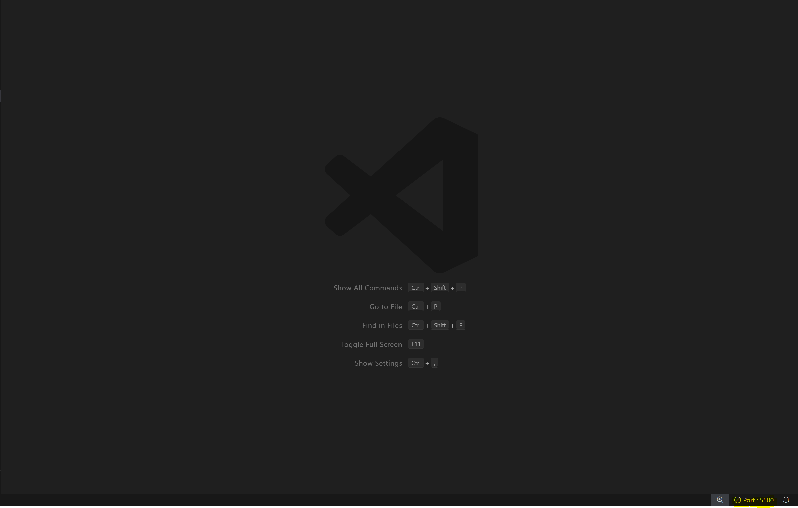

# IDE

In den folgenden Kapiteln sind alle Vorkehrungen aufgeführt, die man für das Entwickeln mit HTML und CSS durchführen muss.

## VS Code

Die Beispiele in diesem Modul werden anhand der Nutzung von Visual Studio Code erklärt. Visual Studio Code ist ein kostenloser Code-Editor, mit welchem du unkompliziert mit dem Entwickeln beginnen kannst. Du kannst Visual Studio Code verwenden, um in beinahe jeder Programmiersprache zu programmieren, ohne den Editor zu wechseln. Es werden viele Sprachen unterstützt, darunter sind JavaScript, Angular, Vue und viele mehr.
https://code.visualstudio.com/

### Extensions
Extensions sind, einfach gesagt, eine Möglichkeit, die Entwicklungsumgebung, welche man verwendet, zu erweitern. Es ist möglich, dass bestehende Funktionalitäten der Umgebung verbessert oder ausgearbeitet werden,
es ist aber ebenfalls möglich, dass komplett neue Funktionalitäten dazukommen. Um in VS Code eine Extension hinzuzufügen, musst du links auf den Tab "Extensions" klicken, im sich öffnenden Suchfeld nach der gewünschten
Extension suchen und diese zu installieren. Je nach Art der Extension musst du VS Code neu starten, damit die Anpassungen übernommen werden. 

Folgende Extensions sind praktisch für die Entwicklung von Webapps mit VS Code (Auf die Extension "Live Server" wird nachfolgend noch genauer eingegangen):

    VS-Code:
    - Code Spell Checker
    - ESLint
    - GitLens
    - Material Icon Theme
    - Path Intellisense
    - Prettier – Code formatter
    - Auto Rename Tag
    - Auto Close Tag
    - Better Comments
    - Template String Converter
    - Live Server

## IntelliJ

IntelliJ IDEA ist eine IDE für Softwareentwicklung, die von JetBrains entwickelt wurde. IntelliJ ist eine der beliebtesten IDEs für die Entwicklung von Java-Anwendungen, bietet jedoch ebenfalls Unterstützung für viele andere Programmiersprachen und Technologien wie Kotlin, Scala, Groovy, JavaScript, TypeScript, HTML, CSS, SQL etc.

IntelliJ lässt sich am besten über die JetBrains Toolbox installieren: https://www.jetbrains.com/lp/toolbox/

### Extensions (Plugins)

Folgende Extensions sind praktisch für die Entwicklung von Webapps mit IntelliJ:

    IntelliJ:
    - Prettier
    - Rainbow Bracket
    - Key Promoter X
    - ESLint (muss mittels npm instlliert werden, Anleitung befindet sich im Kapitel zu den Linter.)
    - LiveEdit

## Vim

Vim steht für "**V**i **IM**proved" und ist ein erweiterter Texteditor, der auf dem älteren vi-Editor basiert. Vim ist ein beliebter Texteditor unter Entwicklern und Systemadministratoren, der auf verschiedenen Betriebssystemen wie Linux, macOS und Windows verwendet werden kann. Vim zeichnet sich durch seine Effizienz, Flexibilität und Erweiterbarkeit aus.

Für VS-Code muss man das Plugin `Vim` und für IntelliJ das Plugin `IdeaVim` installieren, damit man diesen Editor verwenden kann.

## Live-Server

### Wozu braucht man den Live-Server?

Normalerweise verwendet der Browser das HTTP-Protokoll, um Websites und andere Ressourcen von einem Server zu laden. Beim lokalen Entwickeln greifen Entwickler jedoch häufig direkt über den Browser auf das Dateisystem zu. Es gibt jedoch bestimmte Technologien, wie beispielsweise JavaScript-Module, die Ressourcen nur über HTTP laden können. Aus diesem Grund müssen wir für bestimmte Funktionen auch lokal einen Webserver verwenden, der die Ressourcen über HTTP bereitstellt.

Die Live-Server-Erweiterung erfüllt genau diese Anforderungen: Sie ermöglicht es, Dateien in einem bestimmten Ordner (dem Projektverzeichnis) auf deiner Festplatte über HTTP verfügbar zu machen. Ein zusätzliches Feature besteht darin, dass deine Seite automatisch aktualisiert wird, sobald du Änderungen vornimmst.

### Live-Server in VS Code

Die Live-Server Extension ist eine beliebte Erweiterung für Visual Studio Code, die Entwicklern dabei hilft, Webanwendungen während der Entwicklung automatisch neu zu laden. Sie ermöglicht es, eine lokale Entwicklungsumgebung einzurichten und den Code in Echtzeit zu aktualisieren, ohne die Seite manuell neu laden zu müssen.

Live-Server erstellt einen einfachen Entwicklungsserver auf dem lokalen Rechner, der die Webanwendung unter einer lokalen Adresse (z.B. "http://localhost:5500") bereitstellt. Dadurch kann man die Anwendung in einer isolierten Umgebung testen und auf sie zugreifen.

Neben der Bereitstellung von HTML-, CSS- und JavaScript-Dateien unterstützt Live-Server auch das Laden von statischen Dateien wie Bildern, Schriftarten und anderen Ressourcen. Dadurch kann man die gesamte Webanwendung über den Entwicklungsserver verfügbar machen.

Um eine Datei (z.B. eine HTML-Datei) via Live Server im Browser zu öffnen, tätige einen Rechtsklick auf die gewünschte Datei und klicke auf "Open with Live Server". Nun geht die gewünschte Seite im Browser auf und ist im Browser erreichbar via "http://localhost:5500".

Ganz unten in VS Code siehst du nun einen Button mit der Aufschrift "Port 5500". Wenn du darauf klickst, beendest du den Live Server wieder.

### Live-Server in IntelliJ

Wenn man IntelliJ als seine IDE wählt, kann man ähnlich wie bei VS Code einen Live Server mittels Extension erhalten. Dazu muss man jedoch die Extension LiveEdit installieren. Nach dem man diese installiert hat, muss man die Extension noch konfigurieren. Dafür musst du in den Einstellungen auf "Build, Execution, Deployment -> Debugger -> Live Edit" navigieren.
Dort musst du die folgenden Einstellungen tätigen:

- "Update Node.js application on changes in" Checkbox anwählen und Millisekunden auf 300ms ändern.
- "Update application in Chrome on changes in" Checkbox anwählen und Millisekunden auf 300ms ändern.
- "JavaScript, HTML and CSS" auswählen.
- "Track changes in files compiled to JavaScript, HTML or CSS" Checkbox anwählen.
- "Restart if hotswap fails" Checkbox anwählen.

Diese Einstellungen musst du nun sichern, woraufhin du die Extension verwenden kannst. Dazu muss die Applikation über den Debugger gestartet werden, woraufhin sich ein Chromefenster öffnet. Die nun im Code getätigten Anpassungen werden direkt entsprechend im Browser angezeigt. 

 15' - Einzelarbeit

    Installiere die IDE, die genannten Extensions, und richte sie entsprechend deiner Präferenz ein.

## Git

Git ist dir bereits bekannt. Git ist ein Versionierungs-Tool für Code. 

 5' - Einzelarbeit

    Installiere Git. Hierfür gibt es zwei Möglichkeiten:

    1. Vielleicht klappt es unter Windows direkt mit diesem Kommandozeilenbefehl:

        winget install --id Git.Git -e --source winget

    2. Ansonsten lade es unter folgendem Link herunter: https://git-scm.com/.

        Bei der Installation sind keine Anpassungen zwingend. Vielleicht helfen dir in Zukunft die "Components" "Windows Explorer integration - Git Bash Here" und "Add a Git Bash Profile to Windows Terminal". Ansonsten kannst du dich einfach durchklicken.
